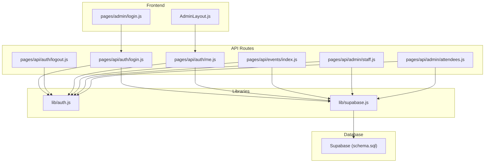
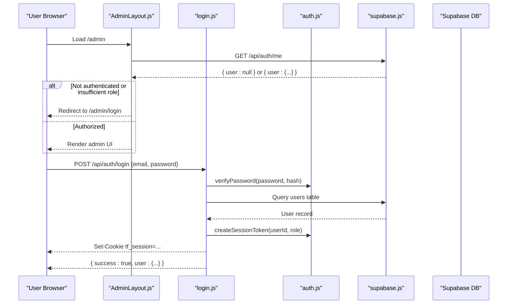
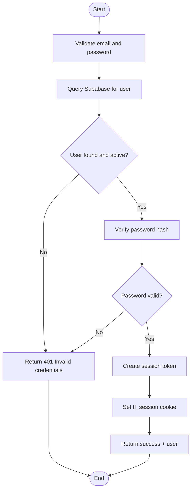
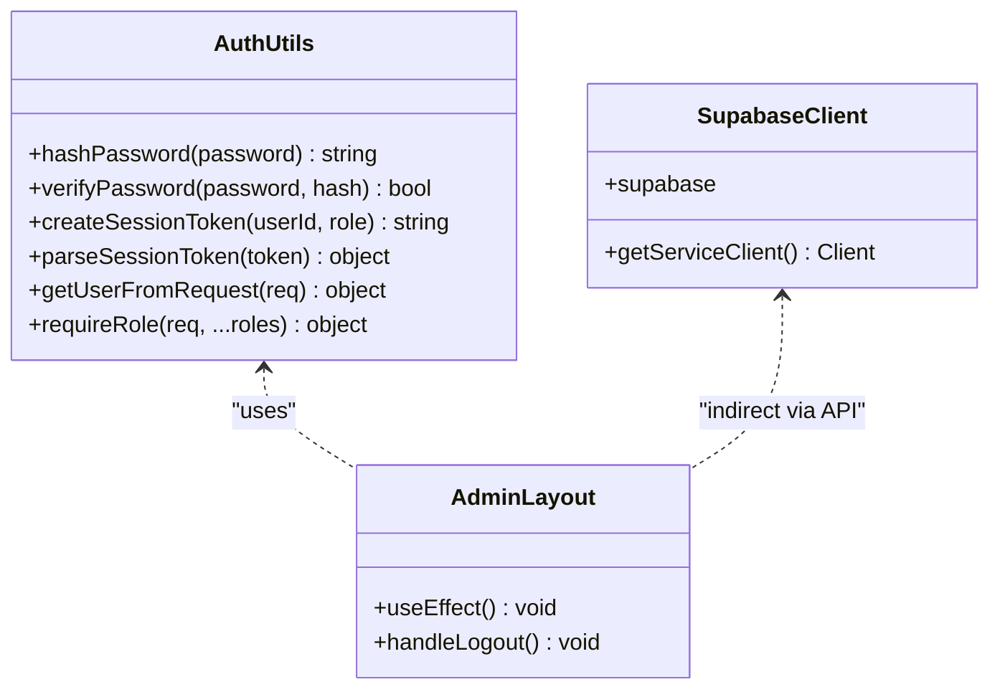
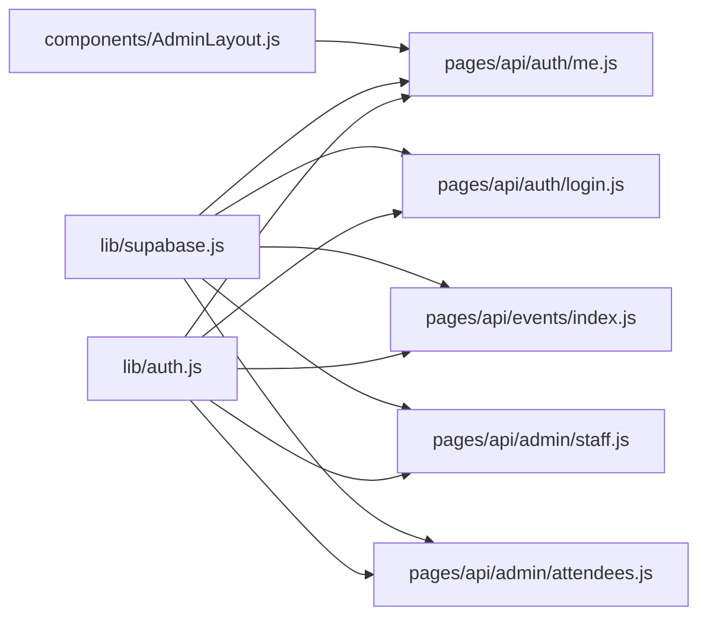

# Authentication & Authorization Debugging

<cite>
**Referenced Files in This Document**
- [lib/auth.js](file://lib/auth.js)
- [lib/supabase.js](file://lib/supabase.js)
- [pages/api/auth/login.js](file://pages/api/auth/login.js)
- [pages/api/auth/logout.js](file://pages/api/auth/logout.js)
- [pages/api/auth/me.js](file://pages/api/auth/me.js)
- [components/AdminLayout.js](file://components/AdminLayout.js)
- [pages/admin/login.js](file://pages/admin/login.js)
- [pages/api/admin/staff.js](file://pages/api/admin/staff.js)
- [pages/api/admin/attendees.js](file://pages/api/admin/attendees.js)
- [pages/api/events/index.js](file://pages/api/events/index.js)
- [supabase/schema.sql](file://supabase/schema.sql)
</cite>

## Table of Contents
1. Introduction
2. Project Structure
3. Core Components
4. Architecture Overview
5. Detailed Component Analysis
6. Dependency Analysis
7. Performance Considerations
8. Troubleshooting Guide
9. Conclusion

## Introduction
This document provides comprehensive troubleshooting guidance for authentication and authorization issues in TicketFlow. It focuses on common problems such as session cookie handling, role-based access control errors, password hashing mismatches, and Supabase integration pitfalls. It also includes debugging strategies for login/logout flows, permission denied errors, unauthorized API access, admin panel access problems, token expiration handling, multi-role conflicts, and security considerations. Diagnostic tools and logging techniques are provided to help you track and resolve authentication flow issues quickly.

## Project Structure
TicketFlow implements a custom session-based authentication using cookies and server-side validation. The key pieces include:
- Session token creation and parsing utilities
- Login/logout endpoints that manage the session cookie
- A client endpoint to fetch current user details
- Admin layout that enforces role checks on the frontend
- API routes protected by role-based middleware
- Supabase client configuration for database operations

**Diagram sources**
- [components/AdminLayout.js](file://components/AdminLayout.js)
- [pages/admin/login.js](file://pages/admin/login.js)
- [pages/api/auth/login.js](file://pages/api/auth/login.js)
- [pages/api/auth/logout.js](file://pages/api/auth/logout.js)
- [pages/api/auth/me.js](file://pages/api/auth/me.js)
- [pages/api/events/index.js](file://pages/api/events/index.js)
- [pages/api/admin/staff.js](file://pages/api/admin/staff.js)
- [pages/api/admin/attendees.js](file://pages/api/admin/attendees.js)
- [lib/auth.js](file://lib/auth.js)
- [lib/supabase.js](file://lib/supabase.js)
- [supabase/schema.sql](file://supabase/schema.sql)

**Section sources**
- [lib/auth.js](file://lib/auth.js)
- [lib/supabase.js](file://lib/supabase.js)
- [pages/api/auth/login.js](file://pages/api/auth/login.js)
- [pages/api/auth/logout.js](file://pages/api/auth/logout.js)
- [pages/api/auth/me.js](file://pages/api/auth/me.js)
- [components/AdminLayout.js](file://components/AdminLayout.js)
- [pages/admin/login.js](file://pages/admin/login.js)
- [pages/api/admin/staff.js](file://pages/api/admin/staff.js)
- [pages/api/admin/attendees.js](file://pages/api/admin/attendees.js)
- [pages/api/events/index.js](file://pages/api/events/index.js)
- [supabase/schema.sql](file://supabase/schema.sql)

## Core Components
- Session token utilities: createSessionToken, parseSessionToken, getUserFromRequest, requireRole
- Password hashing and verification: hashPassword, verifyPassword
- Supabase clients: anon client and service role client for server-side privileged operations
- Auth endpoints: login, logout, me
- Admin layout: role enforcement on page load and logout flow
- Protected API routes: events, staff, attendees with requireRole middleware

Key responsibilities:
- lib/auth.js centralizes session and role logic used across API routes
- lib/supabase.js configures Supabase clients and warns if environment variables are missing
- pages/api/auth/* handles authentication lifecycle
- components/AdminLayout.js ensures only authorized roles can access admin features
- API routes enforce RBAC via requireRole and use getServiceClient for privileged DB access

**Section sources**
- [lib/auth.js](file://lib/auth.js)
- [lib/supabase.js](file://lib/supabase.js)
- [pages/api/auth/login.js](file://pages/api/auth/login.js)
- [pages/api/auth/logout.js](file://pages/api/auth/logout.js)
- [pages/api/auth/me.js](file://pages/api/auth/me.js)
- [components/AdminLayout.js](file://components/AdminLayout.js)
- [pages/api/admin/staff.js](file://pages/api/admin/staff.js)
- [pages/api/admin/attendees.js](file://pages/api/admin/attendees.js)
- [pages/api/events/index.js](file://pages/api/events/index.js)

## Architecture Overview
The authentication architecture uses a simple base64-encoded JSON session stored in an HttpOnly cookie. On login, the server verifies credentials against Supabase, sets the session cookie, and returns user metadata. Subsequent requests carry the cookie; server-side middleware extracts and validates it. Role checks are enforced both on the frontend (AdminLayout) and backend (requireRole).

**Diagram sources**
- [components/AdminLayout.js](file://components/AdminLayout.js)
- [pages/api/auth/login.js](file://pages/api/auth/login.js)
- [lib/auth.js](file://lib/auth.js)
- [lib/supabase.js](file://lib/supabase.js)
- [supabase/schema.sql](file://supabase/schema.sql)

## Detailed Component Analysis

### Authentication Flow (Login/Logout/Me)
- Login: Validates email/password, queries Supabase, sets session cookie, returns user info
- Logout: Clears session cookie
- Me: Reads session cookie, returns user details from Supabase

Common issues:
- Missing or malformed session cookie
- Cookie not sent due to SameSite or path restrictions
- Incorrect role values causing authorization failures
- Supabase environment misconfiguration leading to failed queries

Debugging steps:
- Inspect browser cookies for tf_session presence and validity
- Verify Supabase URL and keys are set correctly
- Check server logs for query errors and exceptions
- Ensure email normalization matches stored records

**Diagram sources**
- [pages/api/auth/login.js](file://pages/api/auth/login.js)
- [lib/auth.js](file://lib/auth.js)
- [lib/supabase.js](file://lib/supabase.js)

**Section sources**
- [pages/api/auth/login.js](file://pages/api/auth/login.js)
- [pages/api/auth/logout.js](file://pages/api/auth/logout.js)
- [pages/api/auth/me.js](file://pages/api/auth/me.js)
- [lib/auth.js](file://lib/auth.js)
- [lib/supabase.js](file://lib/supabase.js)

### Role-Based Access Control (RBAC)
- requireRole extracts user from cookie and throws 401/403 based on role
- Frontend AdminLayout enforces allowed roles before rendering admin pages
- API routes protect sensitive operations with requireRole

Common issues:
- Role mismatch between stored user.role and expected roles
- Missing session cookie leads to 401
- Inconsistent role names (e.g., underscores vs spaces)

Debugging steps:
- Confirm user.role value in Supabase
- Log requireRole invocations and thrown errors
- Ensure AdminLayout checks match API route expectations

**Diagram sources**
- [lib/auth.js](file://lib/auth.js)
- [lib/supabase.js](file://lib/supabase.js)
- [components/AdminLayout.js](file://components/AdminLayout.js)

**Section sources**
- [lib/auth.js](file://lib/auth.js)
- [components/AdminLayout.js](file://components/AdminLayout.js)
- [pages/api/admin/staff.js](file://pages/api/admin/staff.js)
- [pages/api/admin/attendees.js](file://pages/api/admin/attendees.js)
- [pages/api/events/index.js](file://pages/api/events/index.js)

### Supabase Integration
- Anon client used for public reads where appropriate
- Service role client used for privileged operations in API routes
- Environment variables must be configured; otherwise warnings are logged

Common issues:
- Missing NEXT_PUBLIC_SUPABASE_URL or NEXT_PUBLIC_SUPABASE_ANON_KEY
- Missing SUPABASE_SERVICE_ROLE_KEY
- RLS policies blocking unintended access

Debugging steps:
- Verify environment variables in deployment
- Test service role client connectivity
- Review RLS policies and ensure they align with app behavior

**Section sources**
- [lib/supabase.js](file://lib/supabase.js)
- [supabase/schema.sql](file://supabase/schema.sql)

### Admin Panel Access
- AdminLayout calls /api/auth/me to validate session and role
- Allowed roles: super_admin, organiser
- Logout clears session and redirects to login

Common issues:
- Me endpoint returns null user due to expired or invalid cookie
- Role check fails due to unexpected role values
- Network errors prevent fetching user data

Debugging steps:
- Inspect /api/auth/me response
- Check cookie presence and validity
- Ensure AdminLayout role list matches backend requirements

**Section sources**
- [components/AdminLayout.js](file://components/AdminLayout.js)
- [pages/api/auth/me.js](file://pages/api/auth/me.js)
- [pages/admin/login.js](file://pages/admin/login.js)

## Dependency Analysis
Authentication and authorization depend on:
- lib/auth.js for session and role logic
- lib/supabase.js for database access
- API routes for enforcing RBAC and managing sessions
- AdminLayout for frontend role enforcement

**Diagram sources**
- [lib/auth.js](file://lib/auth.js)
- [lib/supabase.js](file://lib/supabase.js)
- [pages/api/auth/login.js](file://pages/api/auth/login.js)
- [pages/api/auth/me.js](file://pages/api/auth/me.js)
- [pages/api/events/index.js](file://pages/api/events/index.js)
- [pages/api/admin/staff.js](file://pages/api/admin/staff.js)
- [pages/api/admin/attendees.js](file://pages/api/admin/attendees.js)
- [components/AdminLayout.js](file://components/AdminLayout.js)

**Section sources**
- [lib/auth.js](file://lib/auth.js)
- [lib/supabase.js](file://lib/supabase.js)
- [pages/api/auth/login.js](file://pages/api/auth/login.js)
- [pages/api/auth/me.js](file://pages/api/auth/me.js)
- [pages/api/events/index.js](file://pages/api/events/index.js)
- [pages/api/admin/staff.js](file://pages/api/admin/staff.js)
- [pages/api/admin/attendees.js](file://pages/api/admin/attendees.js)
- [components/AdminLayout.js](file://components/AdminLayout.js)

## Performance Considerations
- Session token parsing is lightweight but should avoid unnecessary re-parsing on every request
- Supabase queries should be optimized with proper indexes (already defined in schema)
- Avoid excessive network calls in AdminLayout; cache user state locally after successful fetch
- Use service role client only when necessary to minimize overhead

[No sources needed since this section provides general guidance]

## Troubleshooting Guide

### Common Authentication Problems
- JWT token generation failures:
  - TicketFlow uses a base64-encoded JSON session, not JWT. If expecting JWT, adjust expectations accordingly.
  - Ensure createSessionToken payload includes userId, role, and exp fields.
- Session management issues:
  - Verify tf_session cookie is set with Path=/ and HttpOnly; check Max-Age and SameSite settings.
  - Ensure client sends cookies with requests (same-site and cross-origin considerations).
- Role-based access control errors:
  - Confirm user.role matches required roles in requireRole calls.
  - Check AdminLayout allowed roles list matches backend expectations.
- Supabase authentication integration problems:
  - Validate NEXT_PUBLIC_SUPABASE_URL and NEXT_PUBLIC_SUPABASE_ANON_KEY.
  - Ensure SUPABASE_SERVICE_ROLE_KEY is set for server-side privileged operations.

Debugging strategies:
- Inspect browser DevTools Network tab for Set-Cookie headers and request payloads.
- Log responses from /api/auth/me to confirm session validity.
- Add console logs around requireRole invocations to capture thrown status codes and messages.

**Section sources**
- [lib/auth.js](file://lib/auth.js)
- [lib/supabase.js](file://lib/supabase.js)
- [pages/api/auth/login.js](file://pages/api/auth/login.js)
- [pages/api/auth/logout.js](file://pages/api/auth/logout.js)
- [pages/api/auth/me.js](file://pages/api/auth/me.js)
- [components/AdminLayout.js](file://components/AdminLayout.js)

### Login/Logout Functionality
- Login failures:
  - Check email normalization and is_active flag in users table.
  - Verify password_hash matches bcrypt output.
- Logout issues:
  - Ensure Set-Cookie clears tf_session with Max-Age=0.
  - Confirm client navigates away from protected routes after logout.

Diagnostic tips:
- Print error responses from login endpoint.
- Verify cookie deletion in browser storage.

**Section sources**
- [pages/api/auth/login.js](file://pages/api/auth/login.js)
- [pages/api/auth/logout.js](file://pages/api/auth/logout.js)
- [pages/admin/login.js](file://pages/admin/login.js)

### Password Hashing Issues
- Ensure hashPassword uses consistent salt rounds.
- Verify verifyPassword compares plaintext with stored hash correctly.
- Seed default admin password hash matches schema.sql.

Troubleshooting:
- Re-hash passwords if migration changes salt parameters.
- Compare stored hash format with bcrypt output.

**Section sources**
- [lib/auth.js](file://lib/auth.js)
- [supabase/schema.sql](file://supabase/schema.sql)

### User Session Persistence
- Session expiration:
  - parseSessionToken checks exp timestamp; ensure exp is set correctly.
- Cookie transmission:
  - For cross-origin requests, configure credentials appropriately.
  - Validate SameSite policy does not block cookies in your deployment.

Diagnostics:
- Log parseSessionToken results to detect expired tokens.
- Inspect cookie attributes in browser DevTools.

**Section sources**
- [lib/auth.js](file://lib/auth.js)
- [pages/api/auth/me.js](file://pages/api/auth/me.js)

### Permission Denied Errors and Unauthorized API Access
- 401 errors indicate missing or invalid session.
- 403 errors indicate insufficient role for the requested resource.
- Ensure requireRole is called at the start of protected endpoints.

Resolution steps:
- Validate session cookie presence and content.
- Confirm user.role includes required roles.
- Review API route role lists.

**Section sources**
- [lib/auth.js](file://lib/auth.js)
- [pages/api/admin/staff.js](file://pages/api/admin/staff.js)
- [pages/api/admin/attendees.js](file://pages/api/admin/attendees.js)
- [pages/api/events/index.js](file://pages/api/events/index.js)

### Admin Panel Access Problems
- AdminLayout redirects to login if user is null or role not allowed.
- Me endpoint must return valid user data.

Fixes:
- Ensure /api/auth/me responds with user object containing id, email, full_name, role, phone.
- Update AdminLayout role checks if new roles are introduced.

**Section sources**
- [components/AdminLayout.js](file://components/AdminLayout.js)
- [pages/api/auth/me.js](file://pages/api/auth/me.js)

### Security-Related Authentication Vulnerabilities
- Session token is not cryptographically signed; consider signing or using a secure framework like NextAuth or Supabase Auth.
- Avoid exposing sensitive data in cookies beyond what is necessary.
- Enforce HTTPS in production to protect cookies in transit.
- Implement rate limiting on login attempts to mitigate brute-force attacks.

Recommendations:
- Replace custom session with a proven auth solution.
- Add CSRF protections for state-changing endpoints.
- Rotate service role keys regularly and restrict their scope.

[No sources needed since this section provides general guidance]

### Token Expiration Handling
- parseSessionToken returns null for expired tokens; treat as unauthenticated.
- Refresh strategy: prompt re-login or implement silent refresh if supported by chosen auth provider.

Diagnostics:
- Log expiration checks and redirect flows.
- Monitor user sessions for frequent expirations indicating misconfigured exp values.

**Section sources**
- [lib/auth.js](file://lib/auth.js)

### Multi-Role Authorization Conflicts
- Ensure role names are consistent across frontend and backend.
- Normalize role comparisons (case sensitivity, underscores vs spaces).
- Audit requireRole calls to avoid conflicting role requirements.

Resolution:
- Centralize role definitions and reuse them in both AdminLayout and API routes.
- Add tests to validate role mappings.

**Section sources**
- [lib/auth.js](file://lib/auth.js)
- [components/AdminLayout.js](file://components/AdminLayout.js)

### Diagnostic Tools and Logging Techniques
- Add structured logs around critical points:
  - Login attempt inputs (sanitized), verification results, token creation, cookie setting.
  - requireRole invocations, thrown errors, and user context.
  - Supabase client initialization and query outcomes.
- Use browser DevTools to inspect cookies, network requests, and responses.
- Implement error boundaries in AdminLayout to catch and log fetch failures.

Best practices:
- Avoid logging secrets or sensitive payloads.
- Correlate logs with request IDs for traceability.

[No sources needed since this section provides general guidance]

## Conclusion
TicketFlow’s authentication relies on a simple session cookie and role-based checks. Most issues stem from misconfigured cookies, incorrect role values, or Supabase environment setup. By validating session integrity, ensuring consistent role definitions, and leveraging structured logging, you can quickly diagnose and resolve authentication and authorization problems. For production environments, consider adopting a robust authentication framework to enhance security and maintainability.

[No sources needed since this section summarizes without analyzing specific files]