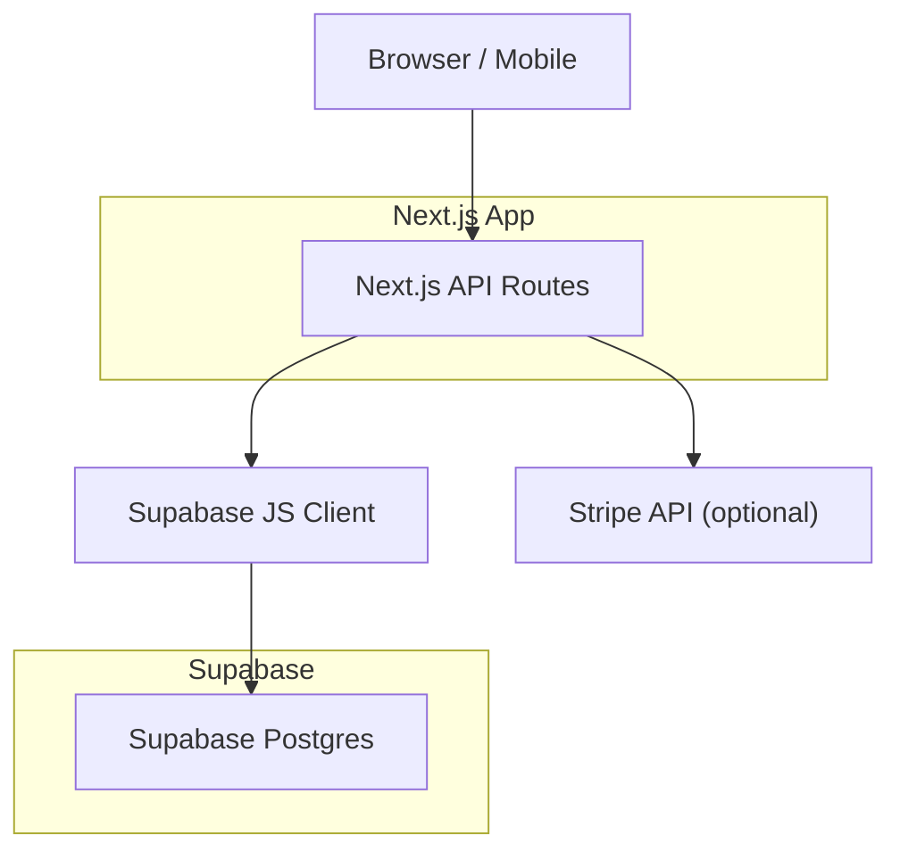
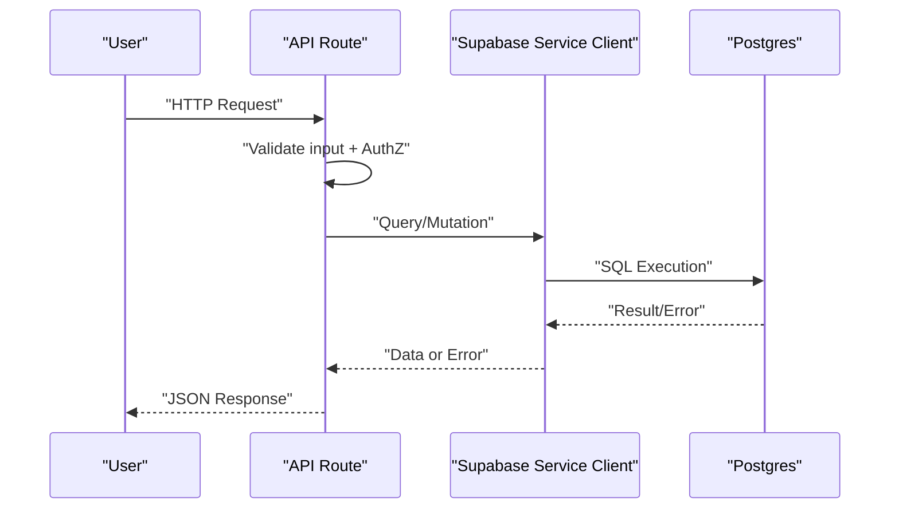
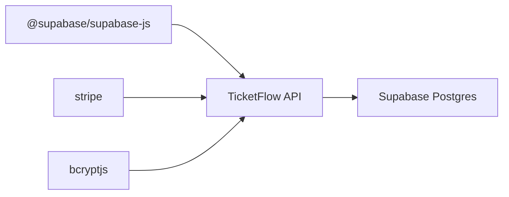

# Database Connection & Query Issues

<cite>
**Referenced Files in This Document**
- [lib/supabase.js](file://lib/supabase.js)
- [supabase/schema.sql](file://supabase/schema.sql)
- [lib/auth.js](file://lib/auth.js)
- [pages/api/auth/login.js](file://pages/api/auth/login.js)
- [pages/api/events/index.js](file://pages/api/events/index.js)
- [pages/api/tickets/purchase.js](file://pages/api/tickets/purchase.js)
- [pages/api/tickets/stripe-success.js](file://pages/api/tickets/stripe-success.js)
- [pages/api/checkin/scan.js](file://pages/api/checkin/scan.js)
- [pages/api/admin/stats.js](file://pages/api/admin/stats.js)
- [pages/api/promo/validate.js](file://pages/api/promo/validate.js)
- [next.config.js](file://next.config.js)
- [package.json](file://package.json)
</cite>

## Table of Contents
1. Introduction
2. Project Structure
3. Core Components
4. Architecture Overview
5. Detailed Component Analysis
6. Dependency Analysis
7. Performance Considerations
8. Troubleshooting Guide
9. Conclusion
10. Appendices

## Introduction
This document provides comprehensive troubleshooting guidance for database connection and query issues in TicketFlow, focusing on Supabase connectivity, authentication flows, network problems, schema migrations, constraints, data integrity, performance tuning, row-level security (RLS), backup and recovery, monitoring, and alerting. It is designed to be accessible to both developers and operators.

## Project Structure
TicketFlow uses Next.js API routes to interact with Supabase via the Supabase JavaScript client. The database schema and RLS policies are defined in a SQL file that should be executed in the Supabase SQL editor. Authentication is handled server-side using cookies and role checks before database access.

[No sources needed since this diagram shows conceptual workflow, not actual code structure]

**Section sources**
- [package.json:1-24](file://package.json#L1-L24)
- [next.config.js:1-14](file://next.config.js#L1-L14)

## Core Components
- Supabase client initialization and service-role client creation
- Authentication helpers and session token handling
- API routes performing CRUD operations and business logic
- Database schema, indexes, and RLS policies

Key responsibilities:
- lib/supabase.js: Creates public and service-role clients; warns if environment variables are missing.
- lib/auth.js: Password hashing/verification, session token creation/validation, and role enforcement.
- pages/api/*: Endpoints that enforce roles, validate inputs, and perform DB operations.
- supabase/schema.sql: Defines tables, constraints, indexes, and RLS policies.

**Section sources**
- [lib/supabase.js:1-23](file://lib/supabase.js#L1-L23)
- [lib/auth.js:1-47](file://lib/auth.js#L1-L47)
- [supabase/schema.sql:1-166](file://supabase/schema.sql#L1-L166)

## Architecture Overview
The application follows a clear separation between API endpoints and data access. All privileged operations use a service-role client to bypass RLS where appropriate, while public reads may rely on RLS policies.

**Diagram sources**
- [pages/api/auth/login.js:1-31](file://pages/api/auth/login.js#L1-L31)
- [pages/api/events/index.js:1-42](file://pages/api/events/index.js#L1-L42)
- [pages/api/tickets/purchase.js:1-123](file://pages/api/tickets/purchase.js#L1-L123)
- [pages/api/checkin/scan.js:1-44](file://pages/api/checkin/scan.js#L1-L44)
- [pages/api/admin/stats.js:1-41](file://pages/api/admin/stats.js#L1-L41)
- [pages/api/promo/validate.js:1-27](file://pages/api/promo/validate.js#L1-L27)

## Detailed Component Analysis

### Supabase Client Configuration
- Public client created with NEXT_PUBLIC_SUPABASE_URL and NEXT_PUBLIC_SUPABASE_ANON_KEY.
- Service-role client created with SUPABASE_SERVICE_ROLE_KEY for server-only operations.
- Missing env vars trigger a console warning but still create clients with placeholder values.

Common issues:
- Empty or incorrect NEXT_PUBLIC_SUPABASE_URL/NEXT_PUBLIC_SUPABASE_ANON_KEY leads to failed requests.
- Missing SUPABASE_SERVICE_ROLE_KEY causes service-role queries to fail or behave unexpectedly.

Mitigations:
- Validate env vars at startup and fail fast in production.
- Centralize error logging and expose user-friendly messages from API routes.

**Section sources**
- [lib/supabase.js:1-23](file://lib/supabase.js#L1-L23)

### Authentication Flow and Role Enforcement
- Login endpoint verifies credentials against users table and sets an HttpOnly cookie-based session token.
- requireRole enforces allowed roles per endpoint.

Common issues:
- Invalid credentials or inactive users return 401.
- Missing or malformed session cookie returns 401.
- Insufficient role returns 403.

Mitigations:
- Ensure email normalization and active status checks.
- Log failures without sensitive details.
- Add rate limiting around login attempts.

**Section sources**
- [pages/api/auth/login.js:1-31](file://pages/api/auth/login.js#L1-L31)
- [lib/auth.js:1-47](file://lib/auth.js#L1-L47)

### Event Management Endpoint
- GET lists published events with ticket types.
- POST creates draft events after role validation.

Common issues:
- Missing fields cause 400 errors.
- Duplicate slug or constraint violations return 400.
- Network or Supabase errors propagate as 500.

Mitigations:
- Pre-validate inputs on the client side.
- Return detailed error messages from Supabase when safe.

**Section sources**
- [pages/api/events/index.js:1-42](file://pages/api/events/index.js#L1-L42)

### Ticket Purchase Flow
- Validates ticket type availability and applies promo codes.
- For Stripe payments, creates a checkout session and persists tickets on success callback.
- For other payment methods, inserts tickets immediately and records payments.

Common issues:
- Availability race conditions leading to overselling.
- Promo code misuse or concurrency causing inconsistent counts.
- Payment webhook/callback delays leaving transactions pending.

Mitigations:
- Use database transactions to atomically reserve and update quantities.
- Implement idempotency keys for payment callbacks.
- Add retries and dead-letter queues for failed updates.

**Section sources**
- [pages/api/tickets/purchase.js:1-123](file://pages/api/tickets/purchase.js#L1-L123)
- [pages/api/tickets/stripe-success.js:1-55](file://pages/api/tickets/stripe-success.js#L1-L55)

### Check-in Scanning Endpoint
- Validates ticket existence, event match, and status.
- Marks ticket as checked in and logs check-in record.

Common issues:
- Concurrent scans causing duplicate check-ins.
- Incorrect event_id mismatch.

Mitigations:
- Enforce uniqueness with a transactional update and guard against already-checked-in state.
- Add device fingerprinting and audit logs.

**Section sources**
- [pages/api/checkin/scan.js:1-44](file://pages/api/checkin/scan.js#L1-L44)

### Admin Stats Endpoint
- Aggregates revenue and ticket sales across events with optional filtering by organizer.

Common issues:
- Large datasets causing slow responses.
- Inconsistent aggregation due to concurrent updates.

Mitigations:
- Materialized views or summary tables updated asynchronously.
- Pagination and caching for dashboards.

**Section sources**
- [pages/api/admin/stats.js:1-41](file://pages/api/admin/stats.js#L1-L41)

### Promo Code Validation Endpoint
- Validates promo code presence, activity, usage limits, and expiration.

Common issues:
- Race conditions on times_used increments.
- Expired or overused codes accepted due to timing.

Mitigations:
- Atomic updates with database constraints and triggers.
- Cache hot promo validations briefly with invalidation on updates.

**Section sources**
- [pages/api/promo/validate.js:1-27](file://pages/api/promo/validate.js#L1-L27)

### Schema, Constraints, and RLS Policies
- Tables: users, events, ticket_types, tickets, check_ins, payments, promo_codes.
- Constraints: unique slugs, tokens, foreign keys, check constraints for enums.
- Indexes: optimized lookups for slug, status, qr_code_token, buyer_email, event_id, payments.
- RLS enabled on all tables; public read policies for published events and related ticket types.

Common issues:
- Migration failures due to existing data or missing extensions.
- Constraint violations from bad input or concurrency.
- RLS policy misconfigurations blocking legitimate access.

Mitigations:
- Run migrations in a controlled environment first.
- Use upserts and conflict handling where applicable.
- Review and test RLS policies with different roles.

**Section sources**
- [supabase/schema.sql:1-166](file://supabase/schema.sql#L1-L166)

## Dependency Analysis
External dependencies relevant to database and networking:
- @supabase/supabase-js: Client library for Supabase Postgres and Auth.
- stripe: Used for payment processing in purchase flow.
- bcryptjs: Password hashing used in auth flow.

**Diagram sources**
- [package.json:1-24](file://package.json#L1-L24)

**Section sources**
- [package.json:1-24](file://package.json#L1-L24)

## Performance Considerations
- Connection pooling: Supabase client manages connections; ensure proper reuse and avoid creating new clients per request unnecessarily.
- Query optimization: Leverage existing indexes; avoid SELECT * in high-throughput paths; prefer specific columns.
- Concurrency: Use transactions for multi-step updates (e.g., reserving tickets).
- Caching: Cache static or semi-static data (event listings) with short TTLs.
- Monitoring: Track latency and error rates per endpoint; set alerts for spikes.

[No sources needed since this section provides general guidance]

## Troubleshooting Guide

### Supabase Connection Problems
Symptoms:
- Requests time out or return network errors.
- Console warnings about missing environment variables.

Checklist:
- Verify NEXT_PUBLIC_SUPABASE_URL and NEXT_PUBLIC_SUPABASE_ANON_KEY are set correctly.
- Confirm SUPABASE_SERVICE_ROLE_KEY is present for server-side operations.
- Ensure DNS resolves and firewall allows outbound HTTPS to Supabase domains.
- Test connectivity from the deployment environment (Vercel) using health checks.

Remediation:
- Add startup validation for env vars and fail fast in production.
- Configure retry logic with exponential backoff for transient network errors.
- Monitor connection errors and alert on sustained failure rates.

**Section sources**
- [lib/supabase.js:1-23](file://lib/supabase.js#L1-L23)

### Authentication Failures
Symptoms:
- 401 Unauthorized on login or protected endpoints.
- 403 Forbidden due to insufficient permissions.

Checklist:
- Ensure email matches exactly and user is active.
- Validate password hash comparison succeeds.
- Confirm session cookie tf_session is present and valid.
- Verify required roles for each endpoint.

Remediation:
- Normalize emails and add explicit inactive-user checks.
- Log non-sensitive error reasons and implement rate limiting.
- Rotate session secrets and enforce secure cookie settings.

**Section sources**
- [pages/api/auth/login.js:1-31](file://pages/api/auth/login.js#L1-L31)
- [lib/auth.js:1-47](file://lib/auth.js#L1-L47)

### Network Connectivity Issues
Symptoms:
- Intermittent timeouts or DNS resolution failures.
- CORS or image remote pattern restrictions.

Checklist:
- Confirm Next.js images.remotePatterns include Supabase hostnames.
- Validate proxy settings and corporate firewalls.
- Check Vercel region egress rules.

Remediation:
- Update next.config.js remotePatterns as needed.
- Use CDN caching for static assets.
- Implement circuit breakers for external services like Stripe.

**Section sources**
- [next.config.js:1-14](file://next.config.js#L1-L14)

### Schema Migration Errors
Symptoms:
- Migration fails due to existing objects or missing extensions.
- Data conflicts during upserts.

Checklist:
- Enable uuid-ossp extension before creating UUID defaults.
- Use CREATE TABLE IF NOT EXISTS and ALTER TABLE ADD COLUMN IF NOT EXISTS patterns.
- Handle conflicts with ON CONFLICT clauses.

Remediation:
- Run migrations in a staging environment first.
- Version control schema changes and apply incrementally.
- Provide rollback scripts for critical changes.

**Section sources**
- [supabase/schema.sql:1-166](file://supabase/schema.sql#L1-L166)

### Constraint Violations and Data Integrity Problems
Symptoms:
- 400 errors indicating unique constraint or foreign key violations.
- Inconsistent counts (e.g., quantity_sold vs available).

Checklist:
- Validate inputs before insertion.
- Ensure referential integrity (event_id, ticket_type_id).
- Use transactions for multi-table updates.

Remediation:
- Add pre-insert checks and atomic updates.
- Implement database-level constraints and triggers to enforce business rules.
- Audit data anomalies with periodic reconciliation jobs.

**Section sources**
- [supabase/schema.sql:1-166](file://supabase/schema.sql#L1-L166)
- [pages/api/tickets/purchase.js:1-123](file://pages/api/tickets/purchase.js#L1-L123)

### Slow Queries and Connection Pool Exhaustion
Symptoms:
- High latency on stats or attendee endpoints.
- Timeouts under load.

Checklist:
- Identify missing indexes or inefficient joins.
- Avoid SELECT * in hot paths.
- Monitor connection pool metrics.

Remediation:
- Add targeted indexes for frequent filters (already present for key fields).
- Paginate large result sets.
- Use materialized views for heavy aggregations.
- Tune Supabase connection limits and implement request throttling.

**Section sources**
- [pages/api/admin/stats.js:1-41](file://pages/api/admin/stats.js#L1-L41)
- [pages/api/admin/attendees.js:1-29](file://pages/api/admin/attendees.js#L1-L29)
- [supabase/schema.sql:1-166](file://supabase/schema.sql#L1-L166)

### Row-Level Security Policy Violations
Symptoms:
- Access denied despite correct credentials.
- Public endpoints failing to fetch expected data.

Checklist:
- Verify RLS policies allow intended operations.
- Ensure service-role client is used where necessary.
- Test policies with different roles.

Remediation:
- Refine policies to grant minimal necessary access.
- Add explicit policies for admin and staff roles.
- Log policy denials for debugging.

**Section sources**
- [supabase/schema.sql:1-166](file://supabase/schema.sql#L1-L166)

### Backup and Recovery Procedures
Recommendations:
- Schedule automated backups using Supabase’s built-in backup features.
- Export critical tables periodically (events, tickets, payments).
- Maintain restore runbooks and test restores regularly.
- Encrypt backups and store them securely.

[No sources needed since this section provides general guidance]

### Data Corruption Scenarios
Scenarios:
- Inconsistent ticket counts after partial failures.
- Orphaned payments without corresponding tickets.

Mitigations:
- Use transactions to ensure consistency across tables.
- Implement reconciliation jobs to detect and fix inconsistencies.
- Add checksums or audit trails for critical records.

[No sources needed since this section provides general guidance]

### Performance Tuning Strategies
- Indexing: Ensure indexes exist for frequently filtered columns (already present).
- Query shaping: Select only needed columns; avoid deep nested selects.
- Caching: Cache event listings and promo validations with short TTLs.
- Asynchronous work: Offload heavy computations to background jobs.

[No sources needed since this section provides general guidance]

### Monitoring Tools and Alerting Setup
- Metrics: Track request latency, error rates, and DB query durations per endpoint.
- Alerts: Set thresholds for 5xx errors, timeouts, and slow queries.
- Logs: Centralize logs with structured fields (endpoint, userId, eventId, duration).
- Health checks: Expose /health endpoints to monitor service readiness.

[No sources needed since this section provides general guidance]

## Conclusion
By validating environment configuration, enforcing robust authentication and authorization, designing resilient database interactions, and implementing strong monitoring and alerting, TicketFlow can reliably handle high-volume ticketing workflows. Focus on transactions, indexing, and RLS correctness to prevent data integrity issues and performance regressions.

[No sources needed since this section summarizes without analyzing specific files]

## Appendices

### Common Error Responses Reference
- 400 Bad Request: Missing fields, validation failures, constraint violations.
- 401 Unauthorized: Invalid credentials, missing/expired session.
- 403 Forbidden: Insufficient permissions.
- 404 Not Found: Resource not found.
- 500 Internal Server Error: Unexpected server or database errors.

[No sources needed since this section provides general guidance]