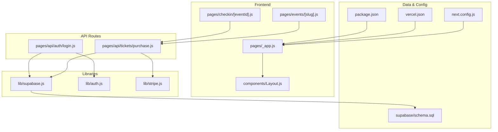
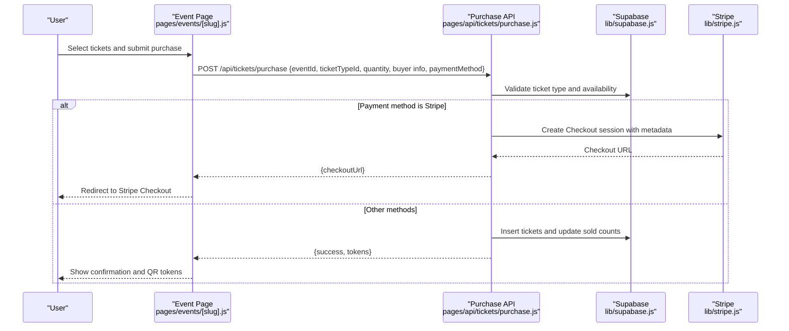
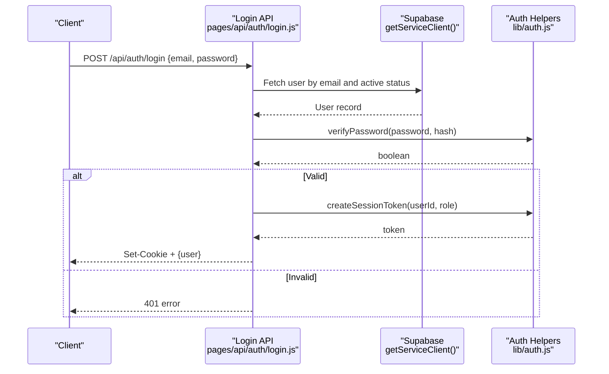
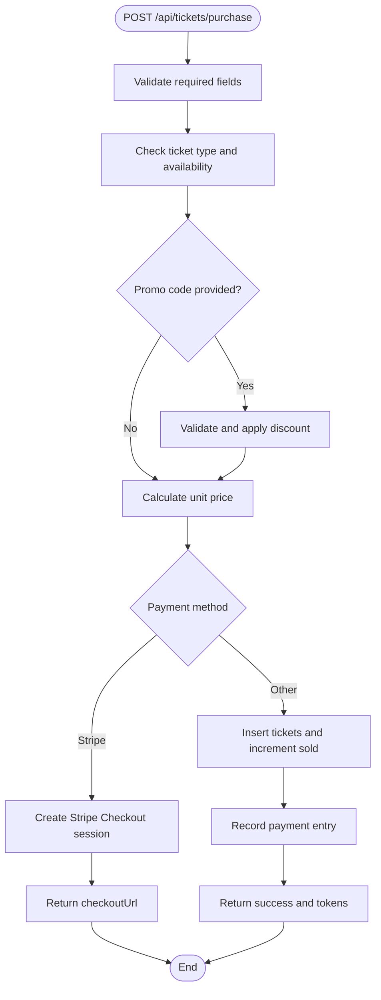
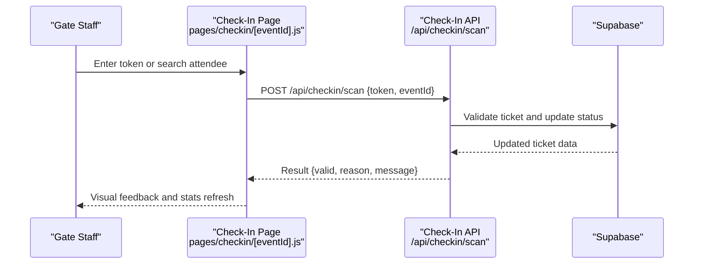
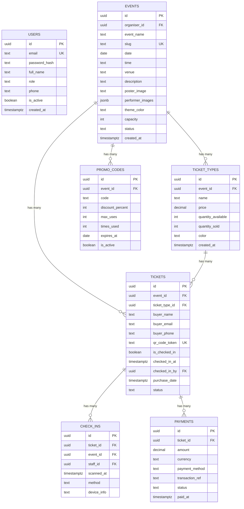
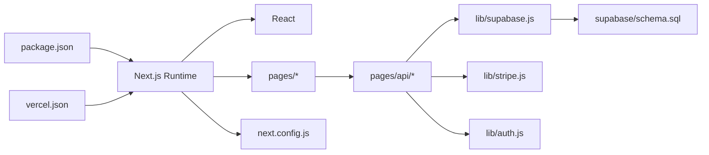

# Frequently Asked Questions

<cite>
**Referenced Files in This Document**
- [package.json](file://package.json)
- [next.config.js](file://next.config.js)
- [vercel.json](file://vercel.json)
- [pages/_app.js](file://pages/_app.js)
- [components/Layout.js](file://components/Layout.js)
- [lib/supabase.js](file://lib/supabase.js)
- [lib/auth.js](file://lib/auth.js)
- [lib/stripe.js](file://lib/stripe.js)
- [supabase/schema.sql](file://supabase/schema.sql)
- [pages/api/auth/login.js](file://pages/api/auth/login.js)
- [pages/api/tickets/purchase.js](file://pages/api/tickets/purchase.js)
- [pages/events/[slug].js](file://pages/events/[slug].js)
- [pages/checkin/[eventId].js](file://pages/checkin/[eventId].js)
</cite>

## Table of Contents
1. [Introduction](#introduction)
2. [Project Structure](#project-structure)
3. [Core Components](#core-components)
4. [Architecture Overview](#architecture-overview)
5. [Detailed Component Analysis](#detailed-component-analysis)
6. [Dependency Analysis](#dependency-analysis)
7. [Performance Considerations](#performance-considerations)
8. [Troubleshooting Guide](#troubleshooting-guide)
9. [Conclusion](#conclusion)
10. [Appendices](#appendices)

## Introduction
This FAQ covers common questions for TicketFlow users and developers, including setup, feature usage, customization, deployment, architecture decisions, integrations, operations, troubleshooting, best practices, and known limitations. It is designed to be accessible to both non-technical and technical readers.

## Project Structure
TicketFlow is a Next.js application with:
- Pages for public event browsing, admin dashboard, and gate check-in
- API routes for authentication, ticket purchase, promo validation, and check-in
- Shared libraries for Supabase client, Stripe integration, and auth utilities
- A Supabase schema defining core entities and security policies
- Vercel configuration for deployment and security headers

**Diagram sources**
- [pages/_app.js:1-14](file://pages/_app.js#L1-L14)
- [components/Layout.js:1-281](file://components/Layout.js#L1-L281)
- [pages/events/[slug].js](file://pages/events/[slug].js#L1-L800)
- [pages/checkin/[eventId].js](file://pages/checkin/[eventId].js#L1-L800)
- [pages/api/auth/login.js:1-31](file://pages/api/auth/login.js#L1-L31)
- [pages/api/tickets/purchase.js:1-123](file://pages/api/tickets/purchase.js#L1-L123)
- [lib/supabase.js:1-23](file://lib/supabase.js#L1-L23)
- [lib/auth.js:1-47](file://lib/auth.js#L1-L47)
- [lib/stripe.js:1-6](file://lib/stripe.js#L1-L6)
- [supabase/schema.sql:1-166](file://supabase/schema.sql#L1-L166)
- [next.config.js:1-14](file://next.config.js#L1-L14)
- [vercel.json:1-18](file://vercel.json#L1-L18)
- [package.json:1-24](file://package.json#L1-L24)

**Section sources**
- [package.json:1-24](file://package.json#L1-L24)
- [next.config.js:1-14](file://next.config.js#L1-L14)
- [vercel.json:1-18](file://vercel.json#L1-L18)
- [pages/_app.js:1-14](file://pages/_app.js#L1-L14)
- [components/Layout.js:1-281](file://components/Layout.js#L1-L281)

## Core Components
- Authentication: Cookie-based session tokens created on login; role checks via helper functions.
- Database: Supabase client with anon and service-role clients; RLS policies defined in schema.
- Payments: Stripe Checkout for card payments; other methods create tickets immediately (placeholder).
- UI: Global layout with theme switching and toast provider; reusable UI components.

Key implementation references:
- Session creation and cookie handling: [login route:1-31](file://pages/api/auth/login.js#L1-L31), [auth helpers:1-47](file://lib/auth.js#L1-L47)
- Supabase clients: [client setup:1-23](file://lib/supabase.js#L1-L23)
- Stripe initialization: [stripe client:1-6](file://lib/stripe.js#L1-L6)
- App shell and providers: [_app entry:1-14](file://pages/_app.js#L1-L14), [Layout:1-281](file://components/Layout.js#L1-L281)

**Section sources**
- [pages/api/auth/login.js:1-31](file://pages/api/auth/login.js#L1-L31)
- [lib/auth.js:1-47](file://lib/auth.js#L1-L47)
- [lib/supabase.js:1-23](file://lib/supabase.js#L1-L23)
- [lib/stripe.js:1-6](file://lib/stripe.js#L1-L6)
- [pages/_app.js:1-14](file://pages/_app.js#L1-L14)
- [components/Layout.js:1-281](file://components/Layout.js#L1-L281)

## Architecture Overview
TicketFlow follows a Next.js pages-and-API structure:
- Public pages render event details and checkout flows
- API routes handle secure server-side logic (auth, purchases, promo codes)
- Supabase provides the database and row-level security
- Stripe Checkout handles payment processing securely off-site

**Diagram sources**
- [pages/events/[slug].js](file://pages/events/[slug].js#L185-L238)
- [pages/api/tickets/purchase.js:1-123](file://pages/api/tickets/purchase.js#L1-L123)
- [lib/supabase.js:1-23](file://lib/supabase.js#L1-L23)
- [lib/stripe.js:1-6](file://lib/stripe.js#L1-L6)

## Detailed Component Analysis

### Authentication Flow
- Users log in via email/password; credentials are verified against hashed storage
- On success, a session cookie is set with an expiration
- Role-based access can be enforced using helper functions

**Diagram sources**
- [pages/api/auth/login.js:1-31](file://pages/api/auth/login.js#L1-L31)
- [lib/auth.js:1-47](file://lib/auth.js#L1-L47)
- [lib/supabase.js:16-22](file://lib/supabase.js#L16-L22)

**Section sources**
- [pages/api/auth/login.js:1-31](file://pages/api/auth/login.js#L1-L31)
- [lib/auth.js:1-47](file://lib/auth.js#L1-L47)

### Ticket Purchase Flow
- Validates inputs and availability
- Applies promo code if provided
- For Stripe, creates a Checkout session and redirects
- For other methods, creates tickets immediately and records payment placeholder

**Diagram sources**
- [pages/api/tickets/purchase.js:1-123](file://pages/api/tickets/purchase.js#L1-L123)

**Section sources**
- [pages/api/tickets/purchase.js:1-123](file://pages/api/tickets/purchase.js#L1-L123)

### Check-In Workflow
- Gate staff scan or search tickets
- System validates ticket status and marks checked-in
- Stats refresh periodically for real-time feedback

**Diagram sources**
- [pages/checkin/[eventId].js](file://pages/checkin/[eventId].js#L38-L52)

**Section sources**
- [pages/checkin/[eventId].js](file://pages/checkin/[eventId].js#L1-L800)

### Data Model and Security
- Core tables include users, events, ticket_types, tickets, check_ins, payments, promo_codes
- Row-Level Security enabled across tables
- Public read policies allow viewing published events and their ticket types
- Indexes optimize lookups for tokens, emails, and event IDs

**Diagram sources**
- [supabase/schema.sql:1-166](file://supabase/schema.sql#L1-L166)

**Section sources**
- [supabase/schema.sql:1-166](file://supabase/schema.sql#L1-L166)

## Dependency Analysis
- Frontend depends on Next.js runtime and React
- API routes depend on Supabase client and optional Stripe SDK
- Configuration files define image domains, build commands, and security headers

**Diagram sources**
- [package.json:1-24](file://package.json#L1-L24)
- [next.config.js:1-14](file://next.config.js#L1-L14)
- [vercel.json:1-18](file://vercel.json#L1-L18)
- [lib/supabase.js:1-23](file://lib/supabase.js#L1-L23)
- [lib/stripe.js:1-6](file://lib/stripe.js#L1-L6)
- [lib/auth.js:1-47](file://lib/auth.js#L1-L47)
- [supabase/schema.sql:1-166](file://supabase/schema.sql#L1-L166)

**Section sources**
- [package.json:1-24](file://package.json#L1-L24)
- [next.config.js:1-14](file://next.config.js#L1-L14)
- [vercel.json:1-18](file://vercel.json#L1-L18)

## Performance Considerations
- Use Supabase indexes already defined for frequent queries (tokens, emails, event IDs)
- Prefer service-role client only on server-side API routes to avoid exposing sensitive keys
- Minimize client-side heavy animations on low-power devices; consider battery-friendly modes in check-in UI
- Cache static assets and images via CDN; configure allowed remote image domains explicitly

[No sources needed since this section provides general guidance]

## Troubleshooting Guide
Common issues and resolutions:
- Supabase environment variables not set
  - Ensure NEXT_PUBLIC_SUPABASE_URL and NEXT_PUBLIC_SUPABASE_ANON_KEY are configured
  - Service-role key must be set for server-side operations
  - Reference: [Supabase client setup:1-23](file://lib/supabase.js#L1-L23)
- Login fails with invalid credentials
  - Verify user exists and is active; ensure password hashing matches
  - Reference: [Login route:1-31](file://pages/api/auth/login.js#L1-L31), [Auth helpers:1-47](file://lib/auth.js#L1-L47)
- Stripe Checkout redirect not working
  - Confirm STRIPE_SECRET_KEY is set and valid
  - Ensure success_url and cancel_url are correctly configured
  - Reference: [Stripe client:1-6](file://lib/stripe.js#L1-L6), [Purchase route:47-76](file://pages/api/tickets/purchase.js#L47-L76)
- Images not loading
  - Add hostnames to next.config.js remotePatterns
  - Reference: [Next config:4-10](file://next.config.js#L4-L10)
- Deployment header errors
  - Review vercel.json headers for API routes
  - Reference: [Vercel config:7-16](file://vercel.json#L7-L16)

**Section sources**
- [lib/supabase.js:1-23](file://lib/supabase.js#L1-L23)
- [pages/api/auth/login.js:1-31](file://pages/api/auth/login.js#L1-L31)
- [lib/auth.js:1-47](file://lib/auth.js#L1-L47)
- [lib/stripe.js:1-6](file://lib/stripe.js#L1-L6)
- [pages/api/tickets/purchase.js:47-76](file://pages/api/tickets/purchase.js#L47-L76)
- [next.config.js:4-10](file://next.config.js#L4-L10)
- [vercel.json:7-16](file://vercel.json#L7-L16)

## Conclusion
TicketFlow provides a modern, secure ticketing platform built with Next.js, Supabase, and Stripe. The FAQ above addresses typical setup, usage, customization, deployment, and operational concerns. For advanced scenarios, consult the referenced source files and adjust configurations accordingly.

[No sources needed since this section summarizes without analyzing specific files]

## Appendices

### Setup and Installation
- Install dependencies and run development server
  - Reference: [Scripts:5-9](file://package.json#L5-L9)
- Configure environment variables
  - NEXT_PUBLIC_SUPABASE_URL, NEXT_PUBLIC_SUPABASE_ANON_KEY, SUPABASE_SERVICE_ROLE_KEY, STRIPE_SECRET_KEY
  - Reference: [Supabase client:3-8](file://lib/supabase.js#L3-L8), [Stripe client:3-5](file://lib/stripe.js#L3-L5)
- Initialize database schema
  - Run SQL in Supabase editor
  - Reference: [Schema:1-166](file://supabase/schema.sql#L1-L166)

**Section sources**
- [package.json:5-9](file://package.json#L5-L9)
- [lib/supabase.js:3-8](file://lib/supabase.js#L3-L8)
- [lib/stripe.js:3-5](file://lib/stripe.js#L3-L5)
- [supabase/schema.sql:1-166](file://supabase/schema.sql#L1-L166)

### Feature Usage
- Browse and purchase tickets
  - Reference: [Event page flow:185-238](file://pages/events/[slug].js#L185-L238)
- Admin dashboard and reports
  - Reference: [Admin index:1-585](file://pages/admin/index.js#L1-L585)
- Gate check-in
  - Reference: [Check-in page:1-800](file://pages/checkin/[eventId].js#L1-L800)

**Section sources**
- [pages/events/[slug].js](file://pages/events/[slug].js#L185-L238)
- [pages/admin/index.js:1-585](file://pages/admin/index.js#L1-L585)
- [pages/checkin/[eventId].js](file://pages/checkin/[eventId].js#L1-L800)

### Customization Options
- Themes and branding
  - Reference: [Layout themes:5-11](file://components/Layout.js#L5-L11)
- Image domains and security headers
  - Reference: [Next config:4-10](file://next.config.js#L4-L10), [Vercel headers:7-16](file://vercel.json#L7-L16)

**Section sources**
- [components/Layout.js:5-11](file://components/Layout.js#L5-L11)
- [next.config.js:4-10](file://next.config.js#L4-L10)
- [vercel.json:7-16](file://vercel.json#L7-L16)

### Deployment Procedures
- Deploy to Vercel
  - Framework detection and build commands
  - Reference: [Vercel config:1-6](file://vercel.json#L1-L6)
- Environment variables on Vercel
  - Set all required env vars in project settings

**Section sources**
- [vercel.json:1-6](file://vercel.json#L1-L6)

### Best Practices
- Always use service-role client on server-side API routes
- Enforce input validation and availability checks before creating tickets
- Store secrets securely and never commit .env files
- Enable Row-Level Security and review policies regularly

[No sources needed since this section provides general guidance]

### Known Limitations
- Non-Stripe payment methods currently create tickets immediately without external verification
- Promo code validation is basic; consider adding stricter constraints
- Live visitor count is simulated; replace with analytics integration for production

[No sources needed since this section provides general guidance]

### External Resources and Support
- Supabase documentation: https://supabase.com/docs
- Stripe documentation: https://stripe.com/docs
- Next.js documentation: https://nextjs.org/docs
- Community support channels: Refer to repository README or organization site for links

[No sources needed since this section provides general guidance]