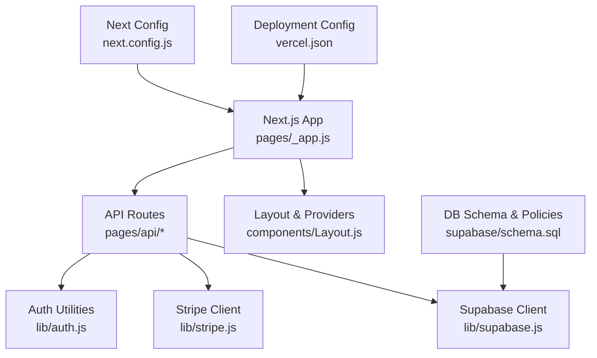
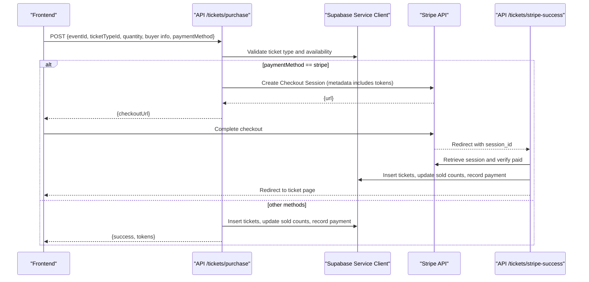
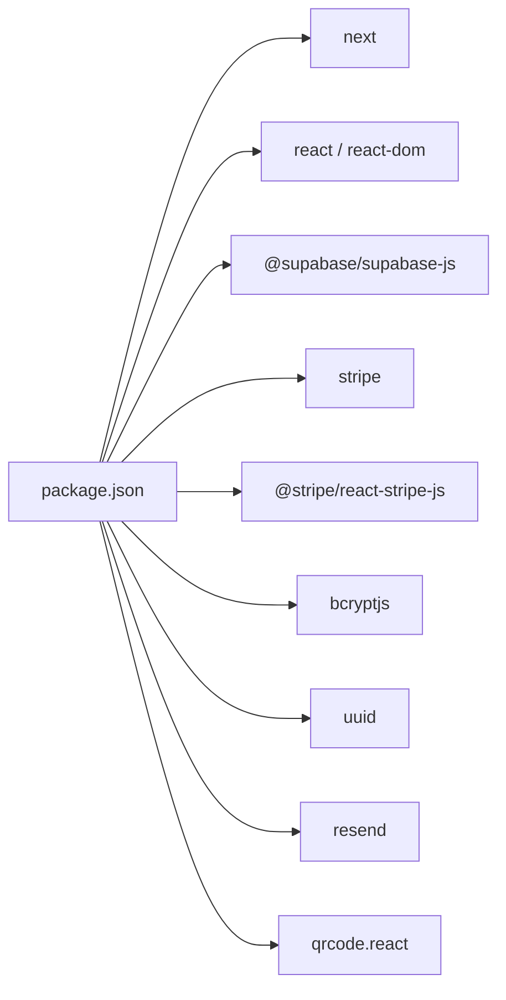

# Migration & Upgrade Guides

<cite>
**Referenced Files in This Document**
- [package.json](file://package.json)
- [next.config.js](file://next.config.js)
- [vercel.json](file://vercel.json)
- [supabase/schema.sql](file://supabase/schema.sql)
- [lib/supabase.js](file://lib/supabase.js)
- [lib/stripe.js](file://lib/stripe.js)
- [lib/auth.js](file://lib/auth.js)
- [pages/_app.js](file://pages/_app.js)
- [pages/api/tickets/purchase.js](file://pages/api/tickets/purchase.js)
- [pages/api/tickets/stripe-success.js](file://pages/api/tickets/stripe-success.js)
- [pages/api/auth/login.js](file://pages/api/auth/login.js)
</cite>

## Table of Contents
1. Introduction
2. Project Structure
3. Core Components
4. Architecture Overview
5. Detailed Component Analysis
6. Dependency Analysis
7. Performance Considerations
8. Troubleshooting Guide
9. Conclusion
10. Appendices

## Introduction
This document provides comprehensive migration and upgrade guidance for TicketFlow, covering:
- Next.js and React upgrades
- Dependency migrations (Stripe, Supabase, email, utilities)
- Database schema migrations and RLS policy updates
- API changes and deprecations
- Environment-specific considerations (development, staging, production)
- Testing strategies for upgrades
- Post-migration validation procedures
- Third-party service integration updates and credential rotation
- Automated and manual migration steps with rollback procedures

The goal is to ensure safe, repeatable, and auditable upgrades across environments with minimal downtime and risk.

## Project Structure
TicketFlow is a Next.js application with serverless API routes, Supabase as the database, Stripe for payments, and a set of UI components. The key configuration files define runtime behavior, image allowlists, and deployment settings.

**Diagram sources**
- [pages/_app.js:1-14](file://pages/_app.js#L1-L14)
- [next.config.js:1-14](file://next.config.js#L1-L14)
- [vercel.json:1-18](file://vercel.json#L1-L18)
- [lib/supabase.js:1-23](file://lib/supabase.js#L1-L23)
- [lib/stripe.js:1-6](file://lib/stripe.js#L1-L6)
- [lib/auth.js:1-47](file://lib/auth.js#L1-L47)
- [supabase/schema.sql:1-166](file://supabase/schema.sql#L1-L166)

**Section sources**
- [package.json:1-24](file://package.json#L1-L24)
- [next.config.js:1-14](file://next.config.js#L1-L14)
- [vercel.json:1-18](file://vercel.json#L1-L18)

## Core Components
- Next.js Application Entry: Wraps pages with providers and layout.
- Supabase Client: Provides anon and service role clients via environment variables.
- Stripe Integration: Initializes Stripe client with explicit API versioning.
- Auth Utilities: Password hashing/verification and session token handling.
- API Routes: Purchase flow, Stripe success handler, and authentication endpoints.
- Database Schema: Tables, indexes, policies, and seed data.

Key responsibilities:
- Securely manage secrets and enforce least privilege via service role client on the server.
- Centralize third-party SDK initialization to simplify version upgrades.
- Enforce DB constraints and RLS policies for security and consistency.

**Section sources**
- [pages/_app.js:1-14](file://pages/_app.js#L1-L14)
- [lib/supabase.js:1-23](file://lib/supabase.js#L1-L23)
- [lib/stripe.js:1-6](file://lib/stripe.js#L1-L6)
- [lib/auth.js:1-47](file://lib/auth.js#L1-L47)
- [supabase/schema.sql:1-166](file://supabase/schema.sql#L1-L166)

## Architecture Overview
The purchase flow demonstrates how frontend triggers an API route that coordinates Supabase and Stripe operations.

**Diagram sources**
- [pages/api/tickets/purchase.js:1-123](file://pages/api/tickets/purchase.js#L1-L123)
- [pages/api/tickets/stripe-success.js:1-55](file://pages/api/tickets/stripe-success.js#L1-L55)
- [lib/supabase.js:1-23](file://lib/supabase.js#L1-L23)
- [lib/stripe.js:1-6](file://lib/stripe.js#L1-L6)

**Section sources**
- [pages/api/tickets/purchase.js:1-123](file://pages/api/tickets/purchase.js#L1-L123)
- [pages/api/tickets/stripe-success.js:1-55](file://pages/api/tickets/stripe-success.js#L1-L55)

## Detailed Component Analysis

### Next.js and React Upgrades
- Current versions are defined in package.json. Major framework upgrades require:
  - Reviewing Next.js release notes for breaking changes (e.g., config options, routing, image optimization).
  - Updating react and react-dom together to avoid peer dependency conflicts.
  - Validating strict mode and any new defaults.

Recommended steps:
- Pin major versions and run tests locally before upgrading.
- Update next.config.js if any options change or become deprecated.
- Rebuild and validate images remotePatterns if hostnames change.

Rollback:
- Keep previous versions in package-lock.json; revert package.json and reinstall.

**Section sources**
- [package.json:1-24](file://package.json#L1-L24)
- [next.config.js:1-14](file://next.config.js#L1-L14)

### Supabase Client and RLS Policy Migrations
- Client initialization uses environment variables for URL and keys.
- Service role client is used in API routes for privileged operations.
- Schema includes tables, indexes, RLS policies, and seed data.

Upgrade considerations:
- If adding new tables or columns, create idempotent migration scripts.
- Ensure RLS policies cover new fields and roles.
- Verify indexes support query patterns after schema changes.

Migration checklist:
- Back up the database before running migrations.
- Run schema changes in a staging environment first.
- Validate RLS policies using service role and anon contexts.

**Section sources**
- [lib/supabase.js:1-23](file://lib/supabase.js#L1-L23)
- [supabase/schema.sql:1-166](file://supabase/schema.sql#L1-L166)

### Stripe Integration and API Versioning
- Stripe client is initialized with a specific API version.
- Purchase flow creates a Checkout session with metadata containing ticket details and tokens.
- Success handler verifies payment and persists tickets and payments.

Upgrade considerations:
- When updating Stripe SDK version, align apiVersion string with supported versions.
- Check for deprecated APIs in Checkout or Payment Intents usage.
- Validate metadata payload size limits and field names.

Credential rotation:
- Rotate STRIPE_SECRET_KEY in environment variables.
- Test webhook/callback flows post-rotation.

**Section sources**
- [lib/stripe.js:1-6](file://lib/stripe.js#L1-L6)
- [pages/api/tickets/purchase.js:1-123](file://pages/api/tickets/purchase.js#L1-L123)
- [pages/api/tickets/stripe-success.js:1-55](file://pages/api/tickets/stripe-success.js#L1-L55)

### Authentication Flow and Session Handling
- Login endpoint validates credentials against Supabase users table.
- Session token is created and stored in an HttpOnly cookie.
- Role-based access control is enforced via requireRole utility.

Upgrade considerations:
- If migrating to a different auth provider, ensure cookie naming and parsing remain compatible or update consumers.
- Validate password hashing algorithm compatibility when changing bcrypt parameters.

Security notes:
- Ensure cookies use secure flags in production.
- Rotate session secret if switching to a more robust signing mechanism.

**Section sources**
- [pages/api/auth/login.js:1-31](file://pages/api/auth/login.js#L1-L31)
- [lib/auth.js:1-47](file://lib/auth.js#L1-L47)

### Image Optimization and Remote Patterns
- next.config.js defines allowed remote image hosts.
- Supabase storage domains are whitelisted for dynamic content.

Upgrade considerations:
- Add new hostnames if integrating additional CDNs or storage buckets.
- Validate protocol and hostname patterns to prevent misconfiguration.

**Section sources**
- [next.config.js:1-14](file://next.config.js#L1-L14)

### Deployment Configuration
- vercel.json sets framework, build commands, regions, and security headers.

Upgrade considerations:
- Update regions or build commands if platform features change.
- Add or adjust headers for security compliance.

**Section sources**
- [vercel.json:1-18](file://vercel.json#L1-L18)

## Dependency Analysis
Current dependencies include Next.js, React, Supabase JS, Stripe, bcryptjs, uuid, resend, and QR code generation.

**Diagram sources**
- [package.json:1-24](file://package.json#L1-L24)

**Section sources**
- [package.json:1-24](file://package.json#L1-L24)

## Performance Considerations
- Use Supabase indexes effectively; avoid unnecessary full-table scans.
- Cache expensive queries where appropriate and invalidate caches on writes.
- Minimize payload sizes in Stripe metadata; keep only essential identifiers.
- Prefer streaming responses for large exports or reports.

[No sources needed since this section provides general guidance]

## Troubleshooting Guide
Common issues and resolutions:
- Missing environment variables:
  - Ensure NEXT_PUBLIC_SUPABASE_URL, NEXT_PUBLIC_SUPABASE_ANON_KEY, SUPABASE_SERVICE_ROLE_KEY, and STRIPE_SECRET_KEY are set.
- Supabase connection warnings:
  - Confirm URLs and keys; verify network access and CORS if applicable.
- Stripe API errors:
  - Validate apiVersion matches SDK expectations; check secret key permissions.
- Authentication failures:
  - Verify user is active and password hash matches current algorithm.
- Image loading failures:
  - Add required hostnames to next.config.js remotePatterns.

**Section sources**
- [lib/supabase.js:1-23](file://lib/supabase.js#L1-L23)
- [lib/stripe.js:1-6](file://lib/stripe.js#L1-L6)
- [pages/api/auth/login.js:1-31](file://pages/api/auth/login.js#L1-L31)
- [next.config.js:1-14](file://next.config.js#L1-L14)

## Conclusion
By following the structured upgrade procedures, validating schema and API changes, and rotating credentials securely, TicketFlow can be upgraded safely across environments. Maintain backups, test thoroughly, and perform post-migration validations to ensure stability and performance.

[No sources needed since this section summarizes without analyzing specific files]

## Appendices

### Upgrade Procedures

#### Next.js and React Upgrade Steps
- Backup repository and database.
- Update package.json versions for next, react, react-dom.
- Review next.config.js for deprecated options.
- Run local builds and tests; fix breaking changes.
- Deploy to staging; validate functionality and performance.
- Promote to production after sign-off.

**Section sources**
- [package.json:1-24](file://package.json#L1-L24)
- [next.config.js:1-14](file://next.config.js#L1-L14)

#### Supabase Schema Migration Steps
- Export current schema and data.
- Apply incremental SQL migrations in staging.
- Validate RLS policies and indexes.
- Run smoke tests against API routes.
- Apply to production during maintenance window.

**Section sources**
- [supabase/schema.sql:1-166](file://supabase/schema.sql#L1-L166)

#### Stripe API Version Updates
- Update apiVersion in lib/stripe.js and inline initializations.
- Review Stripe changelog for deprecated endpoints.
- Test checkout and success flows end-to-end.
- Rotate keys if required by Stripe policy.

**Section sources**
- [lib/stripe.js:1-6](file://lib/stripe.js#L1-L6)
- [pages/api/tickets/purchase.js:1-123](file://pages/api/tickets/purchase.js#L1-L123)
- [pages/api/tickets/stripe-success.js:1-55](file://pages/api/tickets/stripe-success.js#L1-L55)

### Breaking API Changes and Deprecated Feature Replacements
- If Supabase client methods change, centralize calls in lib/supabase.js and update consumers.
- If Stripe Checkout metadata structure changes, update purchase and success handlers accordingly.
- If Next.js routing or config options change, update pages and next.config.js.

**Section sources**
- [lib/supabase.js:1-23](file://lib/supabase.js#L1-L23)
- [pages/api/tickets/purchase.js:1-123](file://pages/api/tickets/purchase.js#L1-L123)
- [pages/api/tickets/stripe-success.js:1-55](file://pages/api/tickets/stripe-success.js#L1-L55)
- [next.config.js:1-14](file://next.config.js#L1-L14)

### Rollback Procedures
- Code rollback: revert package.json and commit; redeploy previous version.
- Database rollback: restore from pre-upgrade backup; re-run index and policy checks.
- Stripe rollback: revert apiVersion and SDK version; ensure webhooks and callbacks still function.

**Section sources**
- [package.json:1-24](file://package.json#L1-L24)
- [supabase/schema.sql:1-166](file://supabase/schema.sql#L1-L166)

### Data Backup Strategies
- Schedule automated snapshots for Supabase database.
- Export critical tables (users, events, tickets, payments) before migrations.
- Store backups securely with access controls and retention policies.

[No sources needed since this section provides general guidance]

### Compatibility Matrices
- Next.js: Align with supported Node.js versions; verify React peer dependencies.
- Stripe SDK: Match apiVersion to supported ranges; confirm endpoint compatibility.
- Supabase JS: Ensure client version supports current server features and RLS syntax.

[No sources needed since this section provides general guidance]

### Environment-Specific Upgrade Considerations
- Development: Use placeholder keys for non-sensitive testing; enable verbose logging.
- Staging: Mirror production configurations; run full integration tests.
- Production: Perform maintenance windows; monitor logs and metrics closely.

**Section sources**
- [vercel.json:1-18](file://vercel.json#L1-L18)
- [lib/supabase.js:1-23](file://lib/supabase.js#L1-L23)

### Testing Strategies for Upgrades
- Unit tests for auth utilities and helpers.
- Integration tests for API routes against Supabase and Stripe sandbox.
- End-to-end tests for purchase flow and ticket issuance.
- Regression tests for image loading and remote patterns.

[No sources needed since this section provides general guidance]

### Post-Migration Validation Procedures
- Verify all API endpoints respond correctly under load.
- Confirm RLS policies restrict access as expected.
- Validate Stripe checkout and success callbacks.
- Check image loading and CDN allowlists.
- Monitor error rates and latency metrics.

**Section sources**
- [pages/api/auth/login.js:1-31](file://pages/api/auth/login.js#L1-L31)
- [pages/api/tickets/purchase.js:1-123](file://pages/api/tickets/purchase.js#L1-L123)
- [pages/api/tickets/stripe-success.js:1-55](file://pages/api/tickets/stripe-success.js#L1-L55)
- [next.config.js:1-14](file://next.config.js#L1-L14)

### Third-Party Service Integration Updates
- Supabase: Update client version and verify RLS policies.
- Stripe: Update SDK and apiVersion; test payment flows.
- Email (Resend): If used, rotate API keys and test delivery.

**Section sources**
- [lib/supabase.js:1-23](file://lib/supabase.js#L1-L23)
- [lib/stripe.js:1-6](file://lib/stripe.js#L1-L6)
- [package.json:1-24](file://package.json#L1-L24)

### Credential Rotation Procedures
- Generate new STRIPE_SECRET_KEY and Supabase keys.
- Update environment variables in deployment platform.
- Restart services and validate integrations.
- Revoke old keys after confirming stability.

**Section sources**
- [lib/supabase.js:1-23](file://lib/supabase.js#L1-L23)
- [lib/stripe.js:1-6](file://lib/stripe.js#L1-L6)

### Automated Migration Scripts
- Create idempotent SQL migration files for schema changes.
- Implement a migration runner that tracks applied versions.
- Include pre/post hooks for data validation and cleanup.

[No sources needed since this section provides general guidance]

### Manual Intervention Requirements
- Review and approve schema migrations before production apply.
- Validate RLS policies and indexes manually.
- Confirm Stripe metadata payloads and redirect URLs.

**Section sources**
- [supabase/schema.sql:1-166](file://supabase/schema.sql#L1-L166)
- [pages/api/tickets/purchase.js:1-123](file://pages/api/tickets/purchase.js#L1-L123)
- [pages/api/tickets/stripe-success.js:1-55](file://pages/api/tickets/stripe-success.js#L1-L55)