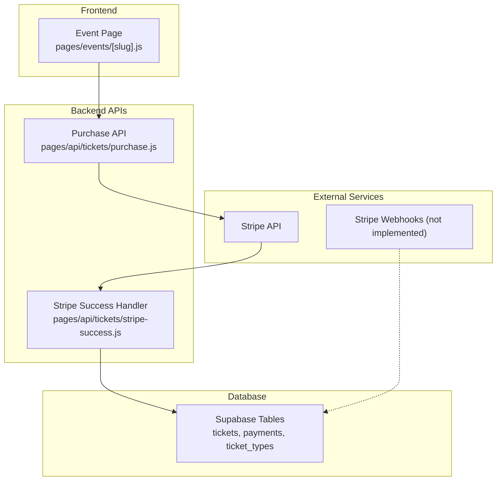
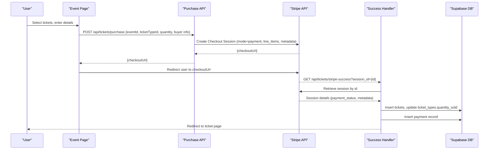
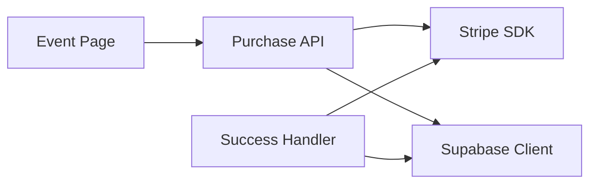
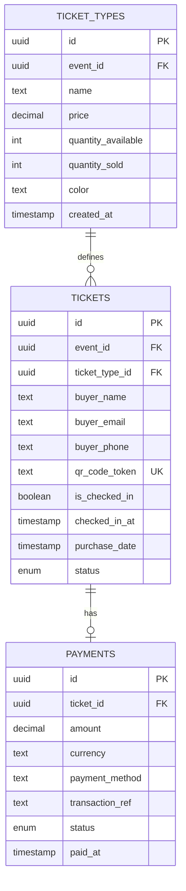

# Payment Integration Troubleshooting

<cite>
**Referenced Files in This Document**
- [stripe.js](file://lib/stripe.js)
- [purchase.js](file://pages/api/tickets/purchase.js)
- [stripe-success.js](file://pages/api/tickets/stripe-success.js)
- [schema.sql](file://supabase/schema.sql)
- [package.json](file://package.json)
- [events page (slug).js](file://pages/events/[slug].js)
</cite>

## Table of Contents
1. [Introduction](#introduction)
2. [Project Structure](#project-structure)
3. [Core Components](#core-components)
4. [Architecture Overview](#architecture-overview)
5. [Detailed Component Analysis](#detailed-component-analysis)
6. [Dependency Analysis](#dependency-analysis)
7. [Performance Considerations](#performance-considerations)
8. [Troubleshooting Guide](#troubleshooting-guide)
9. [Conclusion](#conclusion)
10. [Appendices](#appendices)

## Introduction
This document provides comprehensive troubleshooting guidance for Stripe payment integration issues in TicketFlow. It focuses on common problems such as webhook delivery failures, payment confirmation inconsistencies, and transaction state synchronization between Stripe and the application database. It also covers Stripe API rate limiting, invalid card numbers, insufficient funds, payment method restrictions, checkout session creation failures, payment intent errors, refund processing issues, currency conversion problems, tax calculation errors, international payment restrictions, error handling strategies, retry mechanisms, fallback payment methods, and monitoring/alerting setup for payment system health.

## Project Structure
TicketFlow uses a Next.js serverless API approach to integrate with Stripe Checkout. The key files involved in payments are:
- lib/stripe.js: Initializes the Stripe client with environment configuration.
- pages/api/tickets/purchase.js: Creates Stripe Checkout sessions and handles non-Stripe payment flows.
- pages/api/tickets/stripe-success.js: Confirms payment via Stripe and persists tickets and payments.
- supabase/schema.sql: Defines the database schema including payments and tickets tables.
- package.json: Declares dependencies including Stripe SDKs.
- pages/events/[slug].js: Frontend event page that collects buyer information and triggers purchase requests.

**Diagram sources**
- [purchase.js:1-123](file://pages/api/tickets/purchase.js#L1-L123)
- [stripe-success.js:1-55](file://pages/api/tickets/stripe-success.js#L1-L55)
- [schema.sql:45-103](file://supabase/schema.sql#L45-L103)

**Section sources**
- [stripe.js:1-6](file://lib/stripe.js#L1-L6)
- [purchase.js:1-123](file://pages/api/tickets/purchase.js#L1-L123)
- [stripe-success.js:1-55](file://pages/api/tickets/stripe-success.js#L1-L55)
- [schema.sql:45-103](file://supabase/schema.sql#L45-L103)
- [package.json:1-24](file://package.json#L1-L24)
- [events page (slug).js:1-200](file://pages/events/[slug].js#L1-L200)

## Core Components
- Stripe Client Initialization: A centralized Stripe client is created using an environment secret key and a specific API version.
- Purchase Flow: The purchase endpoint validates inputs, checks ticket availability, applies promo codes, and creates a Stripe Checkout session when Stripe is selected.
- Success Handler: The success endpoint retrieves the Stripe session, verifies payment status, creates tickets, updates sold quantities, and records payments.

Key responsibilities:
- Validation and business rules in purchase flow.
- Idempotent ticket creation and payment recording in success handler.
- Consistent currency handling and metadata propagation.

**Section sources**
- [stripe.js:1-6](file://lib/stripe.js#L1-L6)
- [purchase.js:1-123](file://pages/api/tickets/purchase.js#L1-L123)
- [stripe-success.js:1-55](file://pages/api/tickets/stripe-success.js#L1-L55)

## Architecture Overview
The payment architecture relies on Stripe Checkout for secure card payments. The frontend calls the purchase API to create a Checkout session, which returns a URL for Stripe-hosted payment. After successful payment, Stripe redirects to the success endpoint, which confirms payment and persists data.

**Diagram sources**
- [purchase.js:46-76](file://pages/api/tickets/purchase.js#L46-L76)
- [stripe-success.js:8-46](file://pages/api/tickets/stripe-success.js#L8-L46)

## Detailed Component Analysis

### Stripe Client Initialization
- Purpose: Centralize Stripe SDK initialization with environment variables and API version.
- Risk: Using placeholder keys in development can mask misconfiguration; ensure production secrets are set.

**Section sources**
- [stripe.js:1-6](file://lib/stripe.js#L1-L6)

### Purchase API (/api/tickets/purchase)
- Responsibilities:
  - Validate required fields.
  - Verify ticket type and availability.
  - Apply promo code if provided.
  - Create Stripe Checkout session with metadata containing buyer info, tokens, and discount.
  - For non-Stripe methods, create tickets immediately and record payments.
- Error Handling: Returns appropriate HTTP status codes and JSON error messages.

Common issues:
- Missing required fields cause 400 responses.
- Insufficient tickets lead to 400 responses.
- Promo code validation affects discount calculation.
- Stripe session creation may fail due to network or API errors.

**Section sources**
- [purchase.js:1-123](file://pages/api/tickets/purchase.js#L1-L123)

### Stripe Success Handler (/api/tickets/stripe-success)
- Responsibilities:
  - Retrieve session by session_id.
  - Confirm payment_status is 'paid'.
  - Parse metadata to create tickets and compute final price.
  - Persist tickets and update ticket_types.quantity_sold.
  - Record payment with transaction reference from Stripe.
  - Redirect to ticket page.

Common issues:
- Missing session_id leads to redirect without processing.
- Non-paid status results in failure redirect.
- Database insert/update failures must be handled gracefully.

**Section sources**
- [stripe-success.js:1-55](file://pages/api/tickets/stripe-success.js#L1-L55)

### Database Schema (Payments and Tickets)
- Payments table includes amount, currency, payment_method, transaction_ref, status, and paid_at.
- Tickets table includes buyer info, qr_code_token, status, and timestamps.
- Ticket types track quantity_available and quantity_sold.

Implications:
- Currency defaults to USD; changes require schema and logic updates.
- Status constraints enforce valid states for payments and tickets.

**Section sources**
- [schema.sql:45-103](file://supabase/schema.sql#L45-L103)

## Dependency Analysis
- Dependencies:
  - Stripe SDK used in both purchase and success endpoints.
  - Supabase client used for database operations.
  - UUID library for generating unique tokens.
- External Integrations:
  - Stripe Checkout hosted payment page.
  - Potential webhooks (not currently implemented).

**Diagram sources**
- [purchase.js:1-123](file://pages/api/tickets/purchase.js#L1-L123)
- [stripe-success.js:1-55](file://pages/api/tickets/stripe-success.js#L1-L55)
- [package.json:10-22](file://package.json#L10-L22)

**Section sources**
- [package.json:10-22](file://package.json#L10-L22)

## Performance Considerations
- Avoid repeated Stripe SDK instantiation per request; consider reusing a singleton instance where possible.
- Batch database inserts for multiple tickets to reduce round-trips.
- Use idempotency keys for critical operations to prevent duplicate charges or ticket creation.
- Monitor latency of Stripe API calls and implement timeouts.

[No sources needed since this section provides general guidance]

## Troubleshooting Guide

### Webhook Delivery Failures
- Symptom: Payment confirmed in Stripe but tickets not created or payments not recorded.
- Root Cause: No webhook endpoint exists; reliance on client-side redirect only.
- Solution:
  - Implement a dedicated webhook endpoint to handle events like checkout.session.completed, payment_intent.succeeded, and charge.refunded.
  - Verify webhook signatures using standard libraries.
  - Ensure idempotent processing by tracking event IDs.

**Section sources**
- [stripe-success.js:1-55](file://pages/api/tickets/stripe-success.js#L1-L55)

### Payment Confirmation Issues
- Symptom: Redirect occurs but payment_status is not 'paid' or metadata missing.
- Root Cause: Early redirect before payment completion or incorrect session retrieval.
- Solution:
  - Always retrieve session and verify payment_status before creating tickets.
  - Log session details for debugging.
  - Handle cases where metadata parsing fails.

**Section sources**
- [stripe-success.js:8-24](file://pages/api/tickets/stripe-success.js#L8-L24)

### Transaction State Synchronization Problems
- Symptom: Tickets created but payment record missing or vice versa.
- Root Cause: Partial failures during database writes.
- Solution:
  - Wrap database operations in transactions.
  - Implement compensating actions to rollback or reconcile state.
  - Add reconciliation jobs to detect mismatches.

**Section sources**
- [schema.sql:91-102](file://supabase/schema.sql#L91-L102)

### Stripe API Rate Limiting
- Symptom: Errors indicating too many requests or throttling.
- Root Cause: High volume of requests exceeding Stripe limits.
- Solution:
  - Implement exponential backoff with jitter.
  - Queue requests and process in batches.
  - Monitor rate limit headers and adjust concurrency.

[No sources needed since this section provides general guidance]

### Invalid Card Numbers
- Symptom: Payment declines due to invalid card number format.
- Root Cause: Frontend validation allows malformed input.
- Solution:
  - Enforce Luhn algorithm validation on card numbers.
  - Use Stripe Elements for robust input formatting and validation.
  - Provide clear error messages to users.

**Section sources**
- [events page (slug).js:191-200](file://pages/events/[slug].js#L191-L200)

### Insufficient Funds
- Symptom: Payment declines due to bank rejection.
- Root Cause: Customer’s account lacks sufficient funds.
- Solution:
  - Display generic decline message without exposing bank details.
  - Suggest alternative payment methods.
  - Log decline reasons for analytics.

[No sources needed since this section provides general guidance]

### Payment Method Restrictions
- Symptom: Certain cards or regions rejected.
- Root Cause: Stripe configuration or issuer restrictions.
- Solution:
  - Review Stripe dashboard settings for accepted payment methods.
  - Enable additional methods based on target markets.
  - Test with test cards for various scenarios.

[No sources needed since this section provides general guidance]

### Checkout Session Creation Failures
- Symptom: Purchase API returns error when creating session.
- Root Cause: Missing environment variables, invalid parameters, or network issues.
- Solution:
  - Validate all required fields before calling Stripe.
  - Ensure STRIPE_SECRET_KEY is set correctly.
  - Log full error responses from Stripe.

**Section sources**
- [purchase.js:46-76](file://pages/api/tickets/purchase.js#L46-L76)

### Payment Intent Errors
- Symptom: Payment intent fails after session completion.
- Root Cause: Misconfigured payment intent or unsupported features.
- Solution:
  - Use mode='payment' for simple purchases.
  - Verify line items and currency match Stripe configuration.
  - Check payment_intent logs in Stripe dashboard.

[No sources needed since this section provides general guidance]

### Refund Processing Issues
- Symptom: Refunds not processed or partially refunded.
- Root Cause: Missing webhook handling for refund events.
- Solution:
  - Implement webhook handlers for charge.refunded and payment_intent.refund_succeeded.
  - Update payment status to 'refunded' and ticket status accordingly.
  - Notify customers about refund status.

**Section sources**
- [schema.sql:91-102](file://supabase/schema.sql#L91-L102)

### Currency Conversion Problems
- Symptom: Incorrect amounts charged or displayed.
- Root Cause: Hardcoded currency or mismatched decimal handling.
- Solution:
  - Standardize currency to cents for Stripe API calls.
  - Support multi-currency if needed by updating schema and logic.
  - Display accurate currency symbols and formats.

**Section sources**
- [purchase.js:57-63](file://pages/api/tickets/purchase.js#L57-L63)
- [schema.sql:94-95](file://supabase/schema.sql#L94-L95)

### Tax Calculation Errors
- Symptom: Taxes not applied or incorrectly calculated.
- Root Cause: No tax calculation logic implemented.
- Solution:
  - Integrate Stripe Tax for automatic tax computation.
  - Pass tax rates based on customer location.
  - Reflect taxes in line items or totals.

[No sources needed since this section provides general guidance]

### International Payment Restrictions
- Symptom: Cross-border payments declined.
- Root Cause: Issuer blocks or regional restrictions.
- Solution:
  - Enable international payments in Stripe.
  - Use localized payment methods where available.
  - Provide fallback options for failed international transactions.

[No sources needed since this section provides general guidance]

### Error Handling Strategies
- Best Practices:
  - Return consistent error formats with descriptive messages.
  - Log errors with context (user ID, session ID, payload).
  - Implement retry logic for transient failures.

**Section sources**
- [purchase.js:118-122](file://pages/api/tickets/purchase.js#L118-L122)
- [stripe-success.js:50-54](file://pages/api/tickets/stripe-success.js#L50-L54)

### Retry Mechanisms
- Implementation:
  - Use exponential backoff for API retries.
  - Set maximum retry attempts and timeouts.
  - Track retry counts in logs for analysis.

[No sources needed since this section provides general guidance]

### Fallback Payment Methods
- Strategy:
  - Offer alternative payment methods if primary fails.
  - Allow switching methods within the same checkout flow.
  - Store user preferences for future purchases.

**Section sources**
- [events page (slug).js:981-1023](file://pages/events/[slug].js#L981-L1023)

### Monitoring and Alerting Setup
- Recommendations:
  - Monitor Stripe API response times and error rates.
  - Alert on failed webhook deliveries or payment discrepancies.
  - Track revenue metrics and anomaly detection.

[No sources needed since this section provides general guidance]

## Conclusion
Effective troubleshooting of Stripe payment integration in TicketFlow requires understanding the checkout flow, ensuring robust error handling, implementing webhooks for reliability, and maintaining consistent state between Stripe and the database. By addressing common issues such as rate limiting, invalid inputs, and synchronization problems, you can improve payment success rates and user experience.

[No sources needed since this section summarizes without analyzing specific files]

## Appendices

### Data Models Diagram

**Diagram sources**
- [schema.sql:45-103](file://supabase/schema.sql#L45-L103)