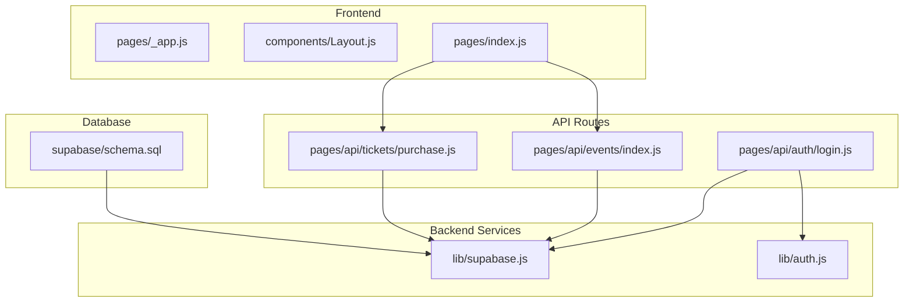
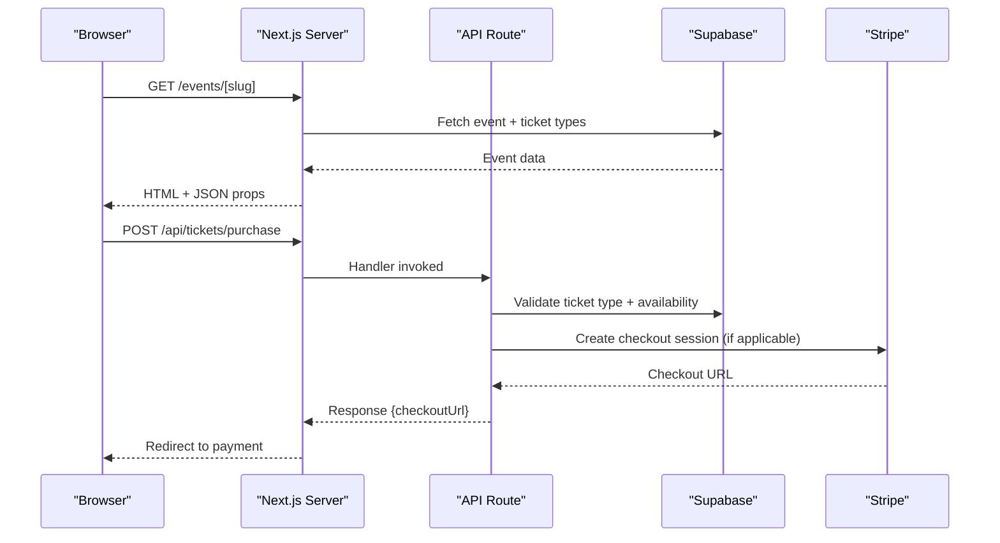
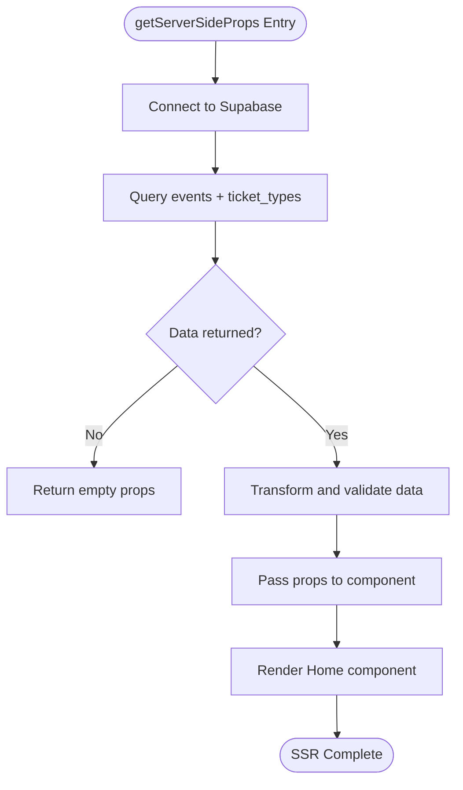
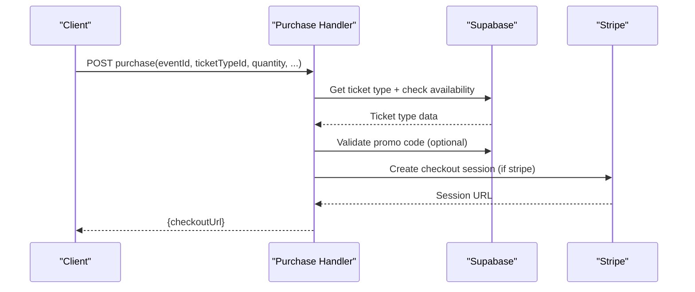
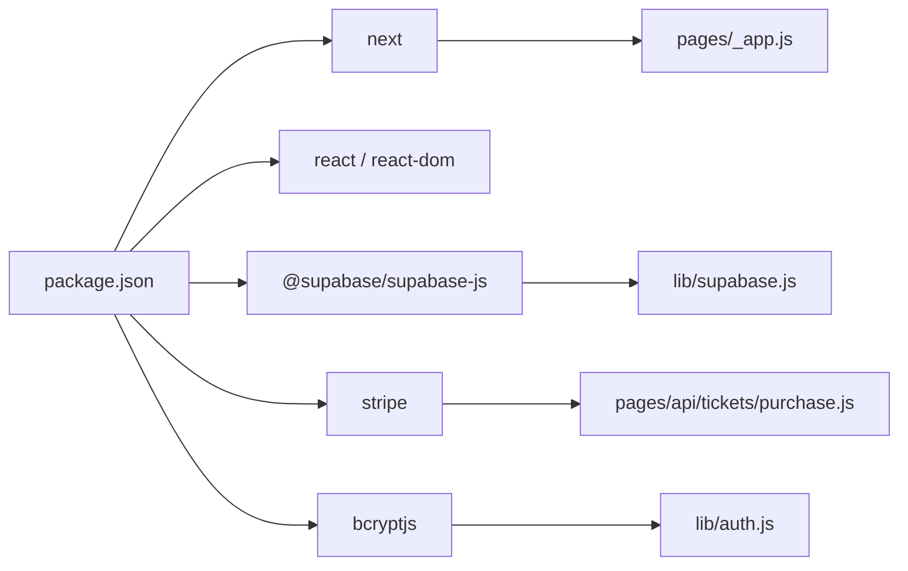

# Performance Optimization & Bottleneck Detection

<cite>
**Referenced Files in This Document**
- [package.json](file://package.json)
- [next.config.js](file://next.config.js)
- [pages/_app.js](file://pages/_app.js)
- [components/Layout.js](file://components/Layout.js)
- [lib/supabase.js](file://lib/supabase.js)
- [supabase/schema.sql](file://supabase/schema.sql)
- [pages/index.js](file://pages/index.js)
- [pages/api/events/index.js](file://pages/api/events/index.js)
- [pages/api/tickets/purchase.js](file://pages/api/tickets/purchase.js)
- [pages/api/auth/login.js](file://pages/api/auth/login.js)
- [lib/auth.js](file://lib/auth.js)
- [vercel.json](file://vercel.json)
</cite>

## Table of Contents
1. [Introduction](#introduction)
2. [Project Structure](#project-structure)
3. [Core Components](#core-components)
4. [Architecture Overview](#architecture-overview)
5. [Detailed Component Analysis](#detailed-component-analysis)
6. [Dependency Analysis](#dependency-analysis)
7. [Performance Considerations](#performance-considerations)
8. [Troubleshooting Guide](#troubleshooting-guide)
9. [Conclusion](#conclusion)
10. [Appendices](#appendices)

## Introduction
This document provides a comprehensive performance optimization and bottleneck detection guide for TicketFlow, a Next.js application with Supabase-backed APIs and Stripe integration. It focuses on identifying and resolving slow page loads, memory leaks, inefficient database queries, and API latency. It also includes profiling techniques using browser developer tools, Node.js performance monitoring, and database query analysis, along with solutions for image optimization, bundle size reduction, caching strategies, server-side rendering (SSR) performance, client-side hydration issues, and API response time optimization. Finally, it covers load testing methodologies, stress testing procedures, scalability considerations, and monitoring setup for application performance metrics, error tracking, and user experience measurement.

## Project Structure
TicketFlow is organized as a Next.js app with:
- Pages and API routes under pages/
- Shared UI components under components/
- Database client and utilities under lib/
- Database schema and indexes under supabase/
- Build and deployment configuration via next.config.js and vercel.json

**Diagram sources**
- [pages/_app.js:1-14](file://pages/_app.js#L1-L14)
- [components/Layout.js:1-281](file://components/Layout.js#L1-L281)
- [pages/index.js:1-753](file://pages/index.js#L1-L753)
- [pages/api/events/index.js:1-42](file://pages/api/events/index.js#L1-L42)
- [pages/api/tickets/purchase.js:1-123](file://pages/api/tickets/purchase.js#L1-L123)
- [pages/api/auth/login.js:1-31](file://pages/api/auth/login.js#L1-L31)
- [lib/supabase.js:1-23](file://lib/supabase.js#L1-L23)
- [lib/auth.js:1-47](file://lib/auth.js#L1-L47)
- [supabase/schema.sql:1-166](file://supabase/schema.sql#L1-L166)

**Section sources**
- [package.json:1-24](file://package.json#L1-L24)
- [next.config.js:1-14](file://next.config.js#L1-L14)
- [vercel.json:1-18](file://vercel.json#L1-L18)

## Core Components
Key runtime components that impact performance:
- App shell and layout: _app.js wraps the app with global providers; Layout.js manages navigation, theme switching, and heavy UI elements.
- Data fetching: index.js uses SSR via getServerSideProps to fetch events from Supabase; API routes handle business logic and DB operations.
- Database client: lib/supabase.js initializes clients for anon and service roles.
- Auth utilities: lib/auth.js handles password hashing, session token creation, and role-based access control.

Common performance concerns:
- Heavy client-side state and animations in Layout.js can cause re-renders and jank.
- SSR data fetching in index.js may be slow if DB queries are unoptimized or network latency is high.
- API routes perform multiple DB calls and external calls (Stripe), which can increase latency.

**Section sources**
- [pages/_app.js:1-14](file://pages/_app.js#L1-L14)
- [components/Layout.js:1-281](file://components/Layout.js#L1-L281)
- [pages/index.js:726-753](file://pages/index.js#L726-L753)
- [lib/supabase.js:1-23](file://lib/supabase.js#L1-L23)
- [lib/auth.js:1-47](file://lib/auth.js#L1-L47)

## Architecture Overview
The system follows a typical Next.js + Supabase architecture:
- Client renders pages with SSR where needed and hydrates on the browser.
- API routes enforce authentication and orchestrate business logic.
- Supabase provides relational data with RLS policies and indexes.
- Stripe integration handles payments asynchronously.

**Diagram sources**
- [pages/index.js:726-753](file://pages/index.js#L726-L753)
- [pages/api/tickets/purchase.js:1-123](file://pages/api/tickets/purchase.js#L1-L123)
- [lib/supabase.js:1-23](file://lib/supabase.js#L1-L23)

## Detailed Component Analysis

### SSR Page Rendering (Home)
- The home page performs SSR by fetching published events and ticket types from Supabase.
- Potential bottlenecks:
  - Large payload due to nested ticket_types selection.
  - Network latency to Supabase during SSR.
  - Client-side filtering and sorting computed on each render.

Optimization recommendations:
- Select only necessary fields and limit results.
- Cache SSR responses at CDN or edge layer when possible.
- Defer non-critical computations to client after initial paint.

**Diagram sources**
- [pages/index.js:726-753](file://pages/index.js#L726-L753)

**Section sources**
- [pages/index.js:1-753](file://pages/index.js#L1-L753)

### API Events Listing
- Lists published events with nested ticket types.
- Uses service role client for server-side access.
- Potential bottlenecks:
  - Nested selects can be expensive.
  - Lack of pagination for large datasets.

Optimization recommendations:
- Add pagination and cursor-based loading.
- Precompute derived fields (e.g., sold percentage) server-side.
- Use projections to minimize payload size.

**Section sources**
- [pages/api/events/index.js:1-42](file://pages/api/events/index.js#L1-L42)

### Ticket Purchase Flow
- Validates ticket availability, applies promo codes, and integrates with Stripe.
- Potential bottlenecks:
  - Multiple sequential DB calls.
  - External Stripe API call adds latency.
  - Non-atomic updates for quantity_sold could lead to race conditions.

Optimization recommendations:
- Batch updates and use transactions where supported.
- Cache frequently accessed ticket type data.
- Implement idempotency keys for purchase requests.

**Diagram sources**
- [pages/api/tickets/purchase.js:1-123](file://pages/api/tickets/purchase.js#L1-L123)
- [lib/supabase.js:1-23](file://lib/supabase.js#L1-L23)

**Section sources**
- [pages/api/tickets/purchase.js:1-123](file://pages/api/tickets/purchase.js#L1-L123)

### Authentication Login
- Verifies credentials against Supabase users table and sets a session cookie.
- Potential bottlenecks:
  - Password hashing cost per login.
  - Unindexed email lookups without proper constraints.

Optimization recommendations:
- Ensure email column is indexed.
- Rate-limit login attempts to prevent brute-force attacks.
- Consider short-lived tokens and refresh mechanisms.

**Section sources**
- [pages/api/auth/login.js:1-31](file://pages/api/auth/login.js#L1-L31)
- [lib/auth.js:1-47](file://lib/auth.js#L1-L47)

### Database Schema and Indexes
- Defines core tables: users, events, ticket_types, tickets, check_ins, payments, promo_codes.
- Includes Row Level Security policies and indexes for performance.
- Key indexes:
  - events(slug), events(status)
  - tickets(qr_code_token), tickets(buyer_email), tickets(event_id)
  - check_ins(event_id), payments(ticket_id)

Optimization recommendations:
- Monitor index usage and remove unused indexes.
- Consider composite indexes for frequent multi-column queries.
- Use EXPLAIN ANALYZE to validate query plans.

**Section sources**
- [supabase/schema.sql:1-166](file://supabase/schema.sql#L1-L166)

## Dependency Analysis
External dependencies impacting performance:
- @supabase/supabase-js: Database client used across API routes and SSR.
- stripe: Payment processing introduces external latency.
- bcryptjs: Password hashing overhead on auth endpoints.
- react/react-dom: UI rendering and hydration costs.

**Diagram sources**
- [package.json:1-24](file://package.json#L1-L24)
- [lib/supabase.js:1-23](file://lib/supabase.js#L1-L23)
- [pages/api/tickets/purchase.js:1-123](file://pages/api/tickets/purchase.js#L1-L123)
- [lib/auth.js:1-47](file://lib/auth.js#L1-L47)

**Section sources**
- [package.json:1-24](file://package.json#L1-L24)

## Performance Considerations

### Slow Page Loads
- Causes:
  - Large SSR payloads and heavy client-side components.
  - Unoptimized images and assets.
  - Excessive client-side state updates and animations.
- Solutions:
  - Minimize selected fields in SSR queries.
  - Use Next.js Image optimization and configure remotePatterns.
  - Code-split heavy components and defer non-critical JS.
  - Reduce animation complexity and use passive listeners.

**Section sources**
- [next.config.js:1-14](file://next.config.js#L1-L14)
- [components/Layout.js:1-281](file://components/Layout.js#L1-L281)
- [pages/index.js:1-753](file://pages/index.js#L1-L753)

### Memory Leaks
- Causes:
  - Event listeners not cleaned up.
  - Long-lived closures capturing large objects.
  - Unbounded caches or arrays in client state.
- Solutions:
  - Ensure useEffect cleanup removes listeners and timers.
  - Avoid storing large datasets in component state; prefer memoization or server-side caching.
  - Profile heap snapshots in Chrome DevTools to detect retained objects.

**Section sources**
- [components/Layout.js:1-281](file://components/Layout.js#L1-L281)

### Inefficient Database Queries
- Causes:
  - Missing or suboptimal indexes.
  - N+1 queries and excessive joins.
  - Fetching unnecessary columns.
- Solutions:
  - Use EXPLAIN ANALYZE to analyze query plans.
  - Add composite indexes for frequent filters.
  - Prefer projections and limit result sets.

**Section sources**
- [supabase/schema.sql:147-154](file://supabase/schema.sql#L147-L154)

### Image Optimization
- Configure allowed remote patterns for Next.js Image optimization.
- Use appropriate formats (WebP/AVIF) and sizes.
- Lazy-load offscreen images and avoid oversized posters.

**Section sources**
- [next.config.js:4-10](file://next.config.js#L4-L10)

### Bundle Size Reduction
- Analyze bundle with Next.js build reports.
- Remove unused dependencies and tree-shake libraries.
- Prefer dynamic imports for heavy features (e.g., Stripe SDK).

**Section sources**
- [package.json:1-24](file://package.json#L1-L24)

### Caching Strategies
- Cache SSR responses at CDN/edge where feasible.
- Implement client-side caching for static data (categories, sponsors).
- Use optimistic UI updates for better perceived performance.

### Server-Side Rendering Performance
- Optimize getServerSideProps to reduce payload and latency.
- Cache frequently accessed data server-side.
- Consider Incremental Static Regeneration (ISR) for less-frequently updated pages.

**Section sources**
- [pages/index.js:726-753](file://pages/index.js#L726-L753)

### Client-Side Hydration Issues
- Minimize differences between server-rendered HTML and client hydration.
- Avoid waterfalls of async data fetching post-hydration.
- Use Suspense boundaries to improve perceived loading.

### API Response Time Optimization
- Batch DB operations and use transactions.
- Cache hot reads (ticket types, event metadata).
- Implement rate limiting and request validation early.

**Section sources**
- [pages/api/tickets/purchase.js:1-123](file://pages/api/tickets/purchase.js#L1-L123)

## Troubleshooting Guide

### Profiling Techniques
- Browser Developer Tools:
  - Use Performance tab to record timelines and identify long tasks.
  - Use Memory tab to capture heap snapshots and detect leaks.
  - Use Network tab to inspect request/response sizes and waterfall.
- Node.js Performance Monitoring:
  - Use --prof flag to generate V8 profiler output.
  - Utilize built-in performance hooks and process.memoryUsage().
- Database Query Analysis:
  - Run EXPLAIN ANALYZE on critical queries.
  - Monitor Supabase logs for slow queries and errors.

**Section sources**
- [pages/index.js:726-753](file://pages/index.js#L726-L753)
- [pages/api/tickets/purchase.js:1-123](file://pages/api/tickets/purchase.js#L1-L123)

### Common Errors and Mitigations
- Missing environment variables for Supabase or Stripe keys.
- Invalid credentials leading to repeated failed login attempts.
- Race conditions in ticket availability checks.

Mitigations:
- Validate environment variables at startup.
- Implement rate limiting and account lockout policies.
- Use atomic updates and idempotency keys for purchases.

**Section sources**
- [lib/supabase.js:1-23](file://lib/supabase.js#L1-L23)
- [pages/api/auth/login.js:1-31](file://pages/api/auth/login.js#L1-L31)
- [lib/auth.js:1-47](file://lib/auth.js#L1-L47)

## Conclusion
TicketFlow’s performance hinges on efficient SSR, optimized DB queries, and careful client-side rendering. By applying the profiling techniques and optimizations outlined here—image optimization, bundle reduction, caching, SSR tuning, and robust API design—you can significantly improve load times, reduce memory usage, and enhance user experience. Continuous monitoring and load testing will help maintain scalability and reliability under varying traffic conditions.

## Appendices

### Load Testing Methodologies
- Use tools like k6 or Artillery to simulate concurrent users.
- Define realistic scenarios: browsing events, purchasing tickets, checking in.
- Measure key metrics: TTFB, TTI, FCP, LCP, error rates, throughput.

### Stress Testing Procedures
- Gradually increase load until thresholds are reached.
- Monitor CPU, memory, and DB connection pools.
- Identify bottlenecks and scale horizontally or optimize queries.

### Scalability Considerations
- Deploy API routes close to users via edge regions.
- Use connection pooling and read replicas for Supabase.
- Implement caching layers (Redis) for hot data.

### Monitoring Setup
- Application Performance Metrics:
  - Track API latencies, error rates, and DB query durations.
- Error Tracking:
  - Integrate Sentry or similar for frontend and backend errors.
- User Experience Measurement:
  - Capture Core Web Vitals and custom UX metrics.

[No sources needed since this section provides general guidance]