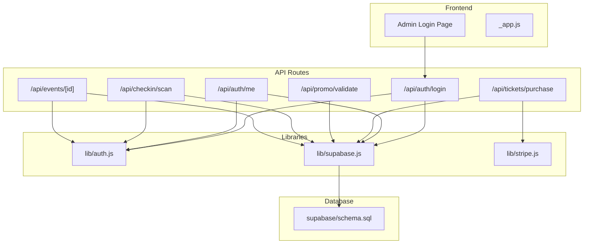
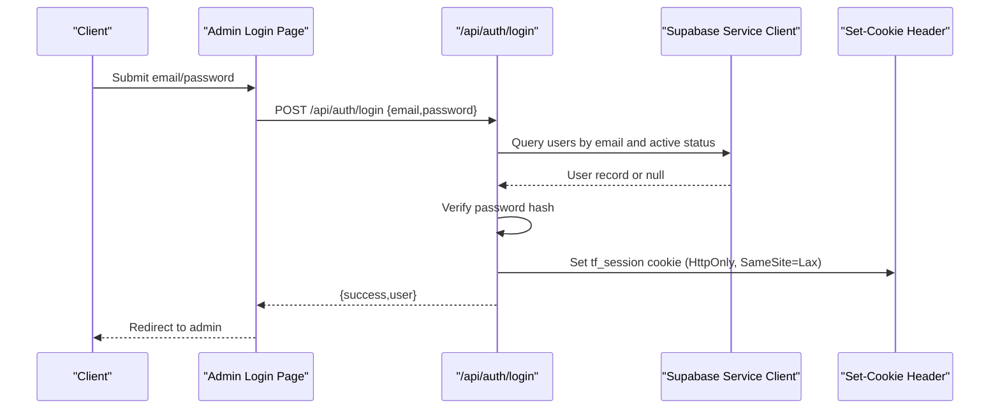
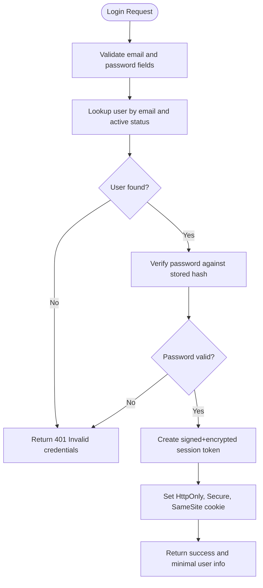
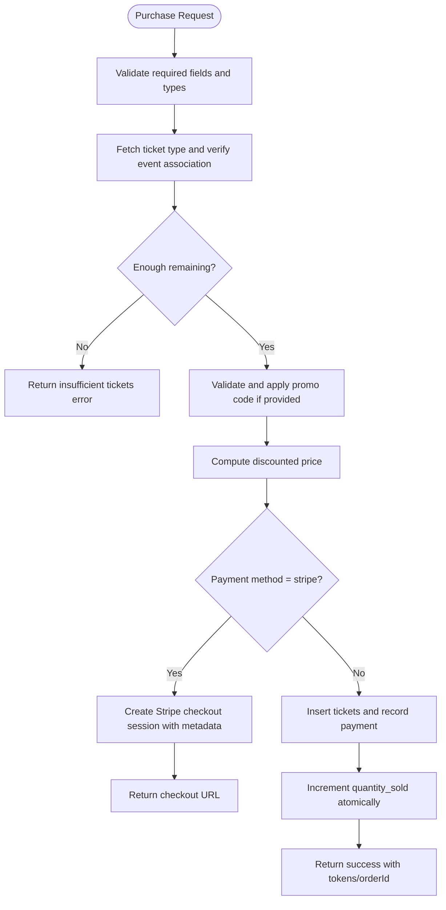
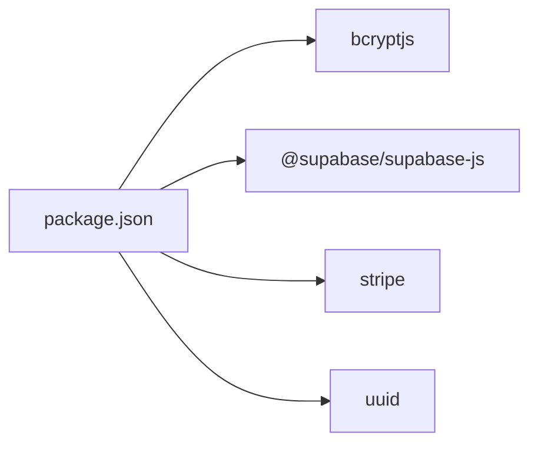

# Security Vulnerabilities & Mitigation

<cite>
**Referenced Files in This Document**
- [lib/auth.js](file://lib/auth.js)
- [lib/supabase.js](file://lib/supabase.js)
- [lib/stripe.js](file://lib/stripe.js)
- [supabase/schema.sql](file://supabase/schema.sql)
- [pages/api/auth/login.js](file://pages/api/auth/login.js)
- [pages/api/auth/me.js](file://pages/api/auth/me.js)
- [pages/api/tickets/purchase.js](file://pages/api/tickets/purchase.js)
- [pages/api/promo/validate.js](file://pages/api/promo/validate.js)
- [pages/api/checkin/scan.js](file://pages/api/checkin/scan.js)
- [pages/api/events/[id].js](file://pages/api/events/[id].js)
- [pages/admin/login.js](file://pages/admin/login.js)
- [next.config.js](file://next.config.js)
- [package.json](file://package.json)
</cite>

## Table of Contents
1. Introduction
2. Project Structure
3. Core Components
4. Architecture Overview
5. Detailed Component Analysis
6. Dependency Analysis
7. Performance Considerations
8. Troubleshooting Guide
9. Conclusion
10. Appendices

## Introduction
This document provides comprehensive security troubleshooting guidance for TicketFlow, focusing on common vulnerabilities such as SQL injection, cross-site scripting (XSS), cross-site request forgery (CSRF), and authentication bypass attempts. It includes mitigation strategies for input validation, output encoding, secure coding practices, API security, rate limiting, request validation, data encryption, secure storage, sensitive data handling, audit procedures, vulnerability scanning, penetration testing, incident response, security monitoring, and compliance considerations for payment data handling.

## Project Structure
TicketFlow is a Next.js application with serverless API routes under pages/api, shared libraries under lib, and database schema defined in supabase/schema.sql. Authentication and session management are implemented via custom cookies and Supabase clients. Payments integrate with Stripe.

**Diagram sources**
- [pages/admin/login.js:1-67](file://pages/admin/login.js#L1-L67)
- [pages/_app.js:1-14](file://pages/_app.js#L1-L14)
- [pages/api/auth/login.js:1-31](file://pages/api/auth/login.js#L1-L31)
- [pages/api/auth/me.js:1-19](file://pages/api/auth/me.js#L1-L19)
- [pages/api/tickets/purchase.js:1-123](file://pages/api/tickets/purchase.js#L1-L123)
- [pages/api/promo/validate.js:1-27](file://pages/api/promo/validate.js#L1-L27)
- [pages/api/checkin/scan.js:1-44](file://pages/api/checkin/scan.js#L1-L44)
- [pages/api/events/[id].js](file://pages/api/events/[id].js#L1-L42)
- [lib/auth.js:1-47](file://lib/auth.js#L1-L47)
- [lib/supabase.js:1-23](file://lib/supabase.js#L1-L23)
- [lib/stripe.js:1-6](file://lib/stripe.js#L1-L6)
- [supabase/schema.sql:1-166](file://supabase/schema.sql#L1-L166)

**Section sources**
- [pages/admin/login.js:1-67](file://pages/admin/login.js#L1-L67)
- [pages/_app.js:1-14](file://pages/_app.js#L1-L14)
- [pages/api/auth/login.js:1-31](file://pages/api/auth/login.js#L1-L31)
- [pages/api/auth/me.js:1-19](file://pages/api/auth/me.js#L1-L19)
- [pages/api/tickets/purchase.js:1-123](file://pages/api/tickets/purchase.js#L1-L123)
- [pages/api/promo/validate.js:1-27](file://pages/api/promo/validate.js#L1-L27)
- [pages/api/checkin/scan.js:1-44](file://pages/api/checkin/scan.js#L1-L44)
- [pages/api/events/[id].js:1-L42](file://pages/api/events/[id].js#L1-L42)
- [lib/auth.js:1-47](file://lib/auth.js#L1-L47)
- [lib/supabase.js:1-23](file://lib/supabase.js#L1-L23)
- [lib/stripe.js:1-6](file://lib/stripe.js#L1-L6)
- [supabase/schema.sql:1-166](file://supabase/schema.sql#L1-L166)

## Core Components
- Authentication and Authorization: Custom cookie-based sessions using base64-encoded payloads; role checks via requireRole; password hashing and verification with bcryptjs.
- Database Access: Supabase client initialization with environment variables; service role client used server-side for privileged operations.
- Payment Integration: Stripe SDK configured with secret key; checkout sessions created server-side.
- API Endpoints: Login, user info, ticket purchase, promo validation, check-in scanning, event CRUD.

Key security concerns to address:
- Session token integrity and signing
- Input validation and sanitization across all endpoints
- CSRF protection for state-changing requests
- Rate limiting and brute-force protection
- Secure configuration and secrets management
- Data minimization and encryption at rest and in transit
- Audit logging and monitoring

**Section sources**
- [lib/auth.js:1-47](file://lib/auth.js#L1-L47)
- [lib/supabase.js:1-23](file://lib/supabase.js#L1-L23)
- [lib/stripe.js:1-6](file://lib/stripe.js#L1-L6)
- [pages/api/auth/login.js:1-31](file://pages/api/auth/login.js#L1-L31)
- [pages/api/auth/me.js:1-19](file://pages/api/auth/me.js#L1-L19)
- [pages/api/tickets/purchase.js:1-123](file://pages/api/tickets/purchase.js#L1-L123)
- [pages/api/promo/validate.js:1-27](file://pages/api/promo/validate.js#L1-L27)
- [pages/api/checkin/scan.js:1-44](file://pages/api/checkin/scan.js#L1-L44)
- [pages/api/events/[id].js:1-L42](file://pages/api/events/[id].js#L1-L44)

## Architecture Overview
The system uses Next.js API routes to handle business logic and interact with Supabase for data access and Stripe for payments. Authentication is cookie-based with role enforcement. The database enforces row-level security policies and constraints.

**Diagram sources**
- [pages/admin/login.js:1-67](file://pages/admin/login.js#L1-L67)
- [pages/api/auth/login.js:1-31](file://pages/api/auth/login.js#L1-L31)
- [lib/auth.js:1-47](file://lib/auth.js#L1-L47)
- [lib/supabase.js:1-23](file://lib/supabase.js#L1-L23)

## Detailed Component Analysis

### Authentication and Session Management
- Password hashing and verification use bcryptjs with appropriate work factor.
- Session tokens are base64-encoded JSON payloads containing userId, role, and expiration; stored in an HttpOnly, SameSite=Lax cookie.
- Role enforcement is centralized via requireRole, which validates presence and role membership.

Security risks and mitigations:
- Risk: Session tampering due to lack of cryptographic signature.
  - Mitigation: Sign and encrypt the session payload using a secure library (e.g., jose or crypto) and store only the signed token in the cookie. Validate signature before parsing.
- Risk: Brute-force login attempts.
  - Mitigation: Implement rate limiting per IP and account; add exponential backoff and CAPTCHA after repeated failures.
- Risk: Insufficient cookie security flags.
  - Mitigation: Ensure Secure flag is set when using HTTPS; consider SameSite=Strict for stricter CSRF protection where feasible.

**Diagram sources**
- [pages/api/auth/login.js:1-31](file://pages/api/auth/login.js#L1-L31)
- [lib/auth.js:1-47](file://lib/auth.js#L1-L47)

**Section sources**
- [lib/auth.js:1-47](file://lib/auth.js#L1-L47)
- [pages/api/auth/login.js:1-31](file://pages/api/auth/login.js#L1-L31)

### API Endpoint: User Info (/api/auth/me)
- Retrieves current user from cookie and returns minimal profile data.

Security considerations:
- Ensure no sensitive fields are returned beyond what is necessary.
- Validate that the session is present and not expired before querying the database.

**Section sources**
- [pages/api/auth/me.js:1-19](file://pages/api/auth/me.js#L1-L19)
- [lib/auth.js:1-47](file://lib/auth.js#L1-L47)

### API Endpoint: Ticket Purchase (/api/tickets/purchase)
- Validates required fields, checks availability, applies promo codes, creates Stripe checkout session or records tickets directly for other payment methods.

Security risks and mitigations:
- Risk: Missing input validation allows malformed or malicious payloads.
  - Mitigation: Add strict schema validation for all inputs (eventId, ticketTypeId, quantity, buyerName, buyerEmail, buyerPhone, paymentMethod, promoCode). Enforce types and ranges.
- Risk: Race conditions on ticket availability.
  - Mitigation: Use database transactions and atomic updates to prevent overselling; lock rows or use optimistic concurrency control.
- Risk: Promo code abuse and enumeration.
  - Mitigation: Rate limit promo validation and usage; enforce max_uses atomically; avoid leaking internal details in error messages.
- Risk: Insecure direct object references (IDOR).
  - Mitigation: Ensure eventId and ticketTypeId belong to the same event context; validate ownership or permissions before processing.
- Risk: Sensitive data exposure in logs or responses.
  - Mitigation: Sanitize logs; do not log secrets or PII; return minimal error details.

**Diagram sources**
- [pages/api/tickets/purchase.js:1-123](file://pages/api/tickets/purchase.js#L1-L123)
- [pages/api/promo/validate.js:1-27](file://pages/api/promo/validate.js#L1-L27)
- [lib/stripe.js:1-6](file://lib/stripe.js#L1-L6)

**Section sources**
- [pages/api/tickets/purchase.js:1-123](file://pages/api/tickets/purchase.js#L1-L123)
- [pages/api/promo/validate.js:1-27](file://pages/api/promo/validate.js#L1-L27)
- [lib/stripe.js:1-6](file://lib/stripe.js#L1-L6)

### API Endpoint: Promo Validation (/api/promo/validate)
- Validates promo code existence, activity, usage limits, and expiration.

Security considerations:
- Normalize inputs (trim, uppercase) consistently.
- Avoid timing attacks by ensuring constant-time comparisons where applicable.
- Rate limit this endpoint to prevent brute-force enumeration.

**Section sources**
- [pages/api/promo/validate.js:1-27](file://pages/api/promo/validate.js#L1-L27)

### API Endpoint: Check-in Scanning (/api/checkin/scan)
- Requires staff role; verifies ticket validity, prevents double-check-in, records check-in events.

Security considerations:
- Enforce role checks strictly; ensure staff cannot scan arbitrary tickets outside their assigned event.
- Prevent replay attacks by validating ticket status and timestamps.
- Log device info securely without capturing sensitive data.

**Section sources**
- [pages/api/checkin/scan.js:1-44](file://pages/api/checkin/scan.js#L1-L44)
- [lib/auth.js:1-47](file://lib/auth.js#L1-L47)

### API Endpoint: Event CRUD (/api/events/[id])
- GET retrieves event details; PUT/DELETE require role authorization.

Security considerations:
- Validate that updates do not include immutable fields (id, organiser_id, created_at).
- Sanitize slug generation to prevent path traversal or injection.
- Enforce authorization checks for write operations.

**Section sources**
- [pages/api/events/[id].js:1-L42](file://pages/api/events/[id].js#L1-L42)

### Database Schema and Row-Level Security
- Defines tables for users, events, ticket_types, tickets, check_ins, payments, promo_codes.
- Enables row-level security policies; public read for published events and associated ticket types.
- Includes indexes for performance and constraints for data integrity.

Security considerations:
- Ensure RLS policies are comprehensive and restrict writes to authenticated roles.
- Avoid exposing sensitive columns through queries; select only needed fields.
- Use UUIDs and unique constraints to mitigate IDOR and collisions.

**Section sources**
- [supabase/schema.sql:1-166](file://supabase/schema.sql#L1-L166)

### Configuration and Secrets
- Supabase client initialized with environment variables; fallback placeholders warn about missing config.
- Stripe SDK configured with secret key.
- Next.js images allowlist configured for remote patterns.

Security considerations:
- Never commit secrets; use environment variables and platform secret managers.
- Remove placeholder keys in production builds.
- Restrict allowed image domains to reduce SSRF risks.

**Section sources**
- [lib/supabase.js:1-23](file://lib/supabase.js#L1-L23)
- [lib/stripe.js:1-6](file://lib/stripe.js#L1-L6)
- [next.config.js:1-14](file://next.config.js#L1-L14)

## Dependency Analysis
External dependencies relevant to security:
- bcryptjs for password hashing
- @supabase/supabase-js for database access
- stripe for payment processing
- uuid for generating identifiers

**Diagram sources**
- [package.json:1-24](file://package.json#L1-L24)

**Section sources**
- [package.json:1-24](file://package.json#L1-L24)

## Performance Considerations
- Use database indexes effectively (already defined for frequent queries).
- Minimize N+1 queries by selecting related data efficiently.
- Cache frequently accessed, non-sensitive data where appropriate.
- Implement connection pooling and timeouts for external services (Supabase, Stripe).

[No sources needed since this section provides general guidance]

## Troubleshooting Guide

Common vulnerabilities and mitigations:

- SQL Injection
  - Symptoms: Unexpected query behavior, errors indicating syntax issues, unauthorized data access.
  - Mitigations:
    - Use parameterized queries and ORM-safe methods (Supabase client already does this).
    - Validate and sanitize all inputs; avoid string concatenation for queries.
    - Apply least privilege principles for database accounts.
  - Section sources
    - [supabase/schema.sql:1-166](file://supabase/schema.sql#L1-L166)
    - [pages/api/tickets/purchase.js:1-123](file://pages/api/tickets/purchase.js#L1-L123)

- Cross-Site Scripting (XSS)
  - Symptoms: Scripts executing in browser contexts, unexpected DOM modifications.
  - Mitigations:
    - Encode outputs rendered in React (React auto-escapes JSX).
    - Avoid dangerouslySetInnerHTML unless absolutely necessary; sanitize content with a trusted sanitizer.
    - Set Content-Security-Policy headers to restrict script sources.
  - Section sources
    - [pages/_app.js:1-14](file://pages/_app.js#L1-L14)

- Cross-Site Request Forgery (CSRF)
  - Symptoms: Unauthorized state changes via forged requests from other sites.
  - Mitigations:
    - Use SameSite cookies (currently Lax); consider Strict where feasible.
    - Implement CSRF tokens for state-changing APIs when cookies are used.
    - Validate Origin and Referer headers for sensitive endpoints.
  - Section sources
    - [pages/api/auth/login.js:1-31](file://pages/api/auth/login.js#L1-L31)

- Authentication Bypass
  - Symptoms: Accessing protected resources without valid credentials or roles.
  - Mitigations:
    - Sign and encrypt session tokens; validate signatures server-side.
    - Enforce role checks on every protected route.
    - Invalidate sessions on sensitive actions and implement logout properly.
  - Section sources
    - [lib/auth.js:1-47](file://lib/auth.js#L1-L47)
    - [pages/api/auth/me.js:1-19](file://pages/api/auth/me.js#L1-L19)

- API Security Issues
  - Symptoms: Excessive data exposure, missing validation, insecure defaults.
  - Mitigations:
    - Validate all inputs with strict schemas; reject unknown fields.
    - Limit response payloads to minimum necessary data.
    - Implement rate limiting and throttling on all endpoints.
  - Section sources
    - [pages/api/tickets/purchase.js:1-123](file://pages/api/tickets/purchase.js#L1-L123)
    - [pages/api/promo/validate.js:1-27](file://pages/api/promo/validate.js#L1-L27)

- Rate Limiting Implementation
  - Recommendations:
    - Use middleware or platform-level rate limiting (Vercel, API gateway).
    - Track requests per IP and per user; enforce exponential backoff.
    - Monitor and alert on abnormal spikes.
  - Section sources
    - [pages/api/auth/login.js:1-31](file://pages/api/auth/login.js#L1-L31)
    - [pages/api/promo/validate.js:1-27](file://pages/api/promo/validate.js#L1-L27)

- Request Validation
  - Recommendations:
    - Centralize validation logic; use libraries like zod or joi.
    - Normalize inputs (trim, case normalization) consistently.
    - Reject malformed or out-of-range values early.
  - Section sources
    - [pages/api/tickets/purchase.js:1-123](file://pages/api/tickets/purchase.js#L1-L123)

- Data Encryption and Secure Storage
  - Recommendations:
    - Encrypt sensitive fields at rest (e.g., phone numbers, IDs) using strong algorithms.
    - Use TLS for all communications; enforce HTTPS everywhere.
    - Rotate encryption keys regularly; manage keys securely.
  - Section sources
    - [supabase/schema.sql:1-166](file://supabase/schema.sql#L1-L166)

- Sensitive Data Handling
  - Recommendations:
    - Minimize collection and retention of PII.
    - Mask or redact logs; avoid logging secrets or tokens.
    - Implement data retention policies and deletion workflows.
  - Section sources
    - [pages/api/auth/me.js:1-19](file://pages/api/auth/me.js#L1-L19)

- Security Audit Procedures
  - Steps:
    - Review code for OWASP Top 10 vulnerabilities.
    - Validate configuration and secrets management.
    - Test RLS policies and authorization logic.
  - Section sources
    - [supabase/schema.sql:1-166](file://supabase/schema.sql#L1-L166)

- Vulnerability Scanning Tools
  - Tools:
    - Static analysis (SAST): ESLint security plugins, Semgrep.
    - Dynamic analysis (DAST): OWASP ZAP, Burp Suite.
    - Dependency scanning: npm audit, Snyk.
  - Section sources
    - [package.json:1-24](file://package.json#L1-L24)

- Penetration Testing Approaches
  - Focus areas:
    - Authentication flows, session handling, role enforcement.
    - Input validation and output encoding.
    - API endpoints for purchase, promo validation, check-in.
  - Section sources
    - [pages/api/tickets/purchase.js:1-123](file://pages/api/tickets/purchase.js#L1-L123)
    - [pages/api/promo/validate.js:1-27](file://pages/api/promo/validate.js#L1-L27)
    - [pages/api/checkin/scan.js:1-44](file://pages/api/checkin/scan.js#L1-L44)

- Incident Response Procedures
  - Steps:
    - Detect anomalies via monitoring and alerts.
    - Contain affected systems; rotate secrets and invalidate sessions.
    - Investigate root cause; patch vulnerabilities; notify stakeholders.
  - Section sources
    - [lib/auth.js:1-47](file://lib/auth.js#L1-L47)

- Security Monitoring Setup
  - Recommendations:
    - Enable structured logging with correlation IDs.
    - Monitor failed login attempts, rate limit breaches, and unusual API usage.
    - Integrate with SIEM for centralized alerting.
  - Section sources
    - [pages/api/auth/login.js:1-31](file://pages/api/auth/login.js#L1-L31)

- Compliance Considerations for Payment Data
  - Guidelines:
    - Use Stripe Checkout to avoid handling raw card data.
    - Comply with PCI DSS requirements; minimize scope by offloading payment processing.
    - Maintain audit trails for financial transactions.
  - Section sources
    - [lib/stripe.js:1-6](file://lib/stripe.js#L1-L6)
    - [pages/api/tickets/purchase.js:1-123](file://pages/api/tickets/purchase.js#L1-L123)

## Conclusion
TicketFlow’s architecture leverages modern tools but requires strengthening in several security areas: signed and encrypted sessions, robust input validation, CSRF protections, rate limiting, and comprehensive monitoring. By applying the mitigations outlined above, you can significantly reduce risk and improve resilience against common attack vectors.

[No sources needed since this section summarizes without analyzing specific files]

## Appendices

### Recommended Security Checklist
- Enforce HTTPS and secure cookie flags (Secure, HttpOnly, SameSite).
- Sign and encrypt session tokens; validate signatures server-side.
- Implement strict input validation and output encoding.
- Add CSRF tokens for state-changing requests.
- Apply rate limiting and brute-force protections.
- Use least privilege for database access and RLS policies.
- Centralize logging with sensitive data redaction.
- Regularly scan dependencies and perform penetration tests.
- Follow PCI DSS guidelines for payment data handling.

[No sources needed since this section provides general guidance]