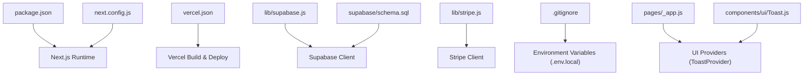
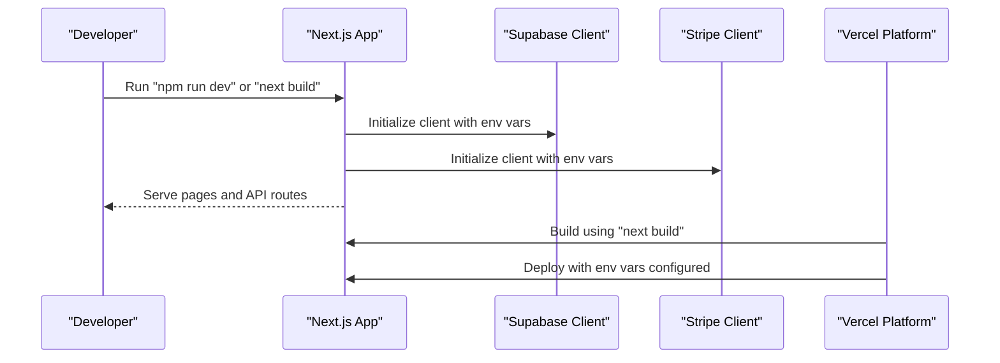

# Setup & Installation Issues

<cite>
**Referenced Files in This Document**
- [package.json](file://package.json)
- [next.config.js](file://next.config.js)
- [vercel.json](file://vercel.json)
- [lib/supabase.js](file://lib/supabase.js)
- [lib/stripe.js](file://lib/stripe.js)
- [supabase/schema.sql](file://supabase/schema.sql)
- [.gitignore](file://.gitignore)
- [pages/_app.js](file://pages/_app.js)
- [components/ui/Toast.js](file://components/ui/Toast.js)
- [pages/api/auth/login.js](file://pages/api/auth/login.js)
- [pages/api/tickets/purchase.js](file://pages/api/tickets/purchase.js)
</cite>

## Table of Contents
1. [Introduction](#introduction)
2. [Project Structure](#project-structure)
3. [Core Components](#core-components)
4. [Architecture Overview](#architecture-overview)
5. [Detailed Component Analysis](#detailed-component-analysis)
6. [Dependency Analysis](#dependency-analysis)
7. [Performance Considerations](#performance-considerations)
8. [Troubleshooting Guide](#troubleshooting-guide)
9. [Conclusion](#conclusion)
10. [Appendices](#appendices)

## Introduction
This document provides a comprehensive troubleshooting guide for setting up and installing TicketFlow. It focuses on common issues during initial setup, including Node.js version compatibility, npm/yarn dependency conflicts, environment variable configuration errors, Supabase connection problems, build process errors, and deployment configuration issues on Vercel. It also includes debugging techniques for Next.js compilation errors, React version mismatches, missing dependencies, database migration problems, and verification steps to ensure proper installation and basic functionality testing.

## Project Structure
TicketFlow is a Next.js application with serverless API routes, Supabase integration, Stripe payment processing, and a set of UI components. The key files relevant to setup and installation include:
- package.json: Defines scripts, dependencies, and peer requirements.
- next.config.js: Configures Next.js behavior, including image domains.
- vercel.json: Configures Vercel build and runtime settings.
- lib/supabase.js: Initializes Supabase clients using environment variables.
- lib/stripe.js: Initializes Stripe client using environment variables.
- supabase/schema.sql: Database schema and policies for Supabase.
- .gitignore: Excludes sensitive files like .env.local.
- pages/_app.js: Application entry point wrapping the app with providers.
- components/ui/Toast.js: Toast notification provider used by the app.

**Diagram sources**
- [package.json:1-24](file://package.json#L1-L24)
- [next.config.js:1-14](file://next.config.js#L1-L14)
- [vercel.json:1-18](file://vercel.json#L1-L18)
- [lib/supabase.js:1-23](file://lib/supabase.js#L1-L23)
- [lib/stripe.js:1-6](file://lib/stripe.js#L1-L6)
- [supabase/schema.sql:1-166](file://supabase/schema.sql#L1-L166)
- [.gitignore:1-33](file://.gitignore#L1-L33)
- [pages/_app.js:1-14](file://pages/_app.js#L1-L14)
- [components/ui/Toast.js:1-84](file://components/ui/Toast.js#L1-L84)

**Section sources**
- [package.json:1-24](file://package.json#L1-L24)
- [next.config.js:1-14](file://next.config.js#L1-L14)
- [vercel.json:1-18](file://vercel.json#L1-L18)
- [lib/supabase.js:1-23](file://lib/supabase.js#L1-L23)
- [lib/stripe.js:1-6](file://lib/stripe.js#L1-L6)
- [supabase/schema.sql:1-166](file://supabase/schema.sql#L1-L166)
- [.gitignore:1-33](file://.gitignore#L1-L33)
- [pages/_app.js:1-14](file://pages/_app.js#L1-L14)
- [components/ui/Toast.js:1-84](file://components/ui/Toast.js#L1-L84)

## Core Components
- Environment Configuration:
  - Supabase client initialization uses NEXT_PUBLIC_SUPABASE_URL and NEXT_PUBLIC_SUPABASE_ANON_KEY; service role client uses SUPABASE_SERVICE_ROLE_KEY.
  - Stripe client initialization uses STRIPE_SECRET_KEY.
  - Site URL NEXT_PUBLIC_SITE_URL is used for redirect URLs in Stripe checkout.
- Next.js Configuration:
  - reactStrictMode enabled; images configured to allow remote patterns from Unsplash and Supabase domains.
- Vercel Configuration:
  - Framework set to nextjs; build and dev commands defined; install command uses npm install; security headers applied to API routes.
- Database Schema:
  - SQL schema defines tables, policies, indexes, and seed data for users.

**Section sources**
- [lib/supabase.js:1-23](file://lib/supabase.js#L1-L23)
- [lib/stripe.js:1-6](file://lib/stripe.js#L1-L6)
- [next.config.js:1-14](file://next.config.js#L1-L14)
- [vercel.json:1-18](file://vercel.json#L1-L18)
- [supabase/schema.sql:1-166](file://supabase/schema.sql#L1-L166)

## Architecture Overview
The application initializes clients for Supabase and Stripe based on environment variables. Next.js serves pages and API routes, while Vercel orchestrates builds and deployments. The database schema must be applied to Supabase before running the app.

**Diagram sources**
- [package.json:1-24](file://package.json#L1-L24)
- [lib/supabase.js:1-23](file://lib/supabase.js#L1-L23)
- [lib/stripe.js:1-6](file://lib/stripe.js#L1-L6)
- [vercel.json:1-18](file://vercel.json#L1-L18)

## Detailed Component Analysis

### Environment Variables and Clients
- Supabase client:
  - Uses NEXT_PUBLIC_SUPABASE_URL and NEXT_PUBLIC_SUPABASE_ANON_KEY for public access.
  - Uses SUPABASE_SERVICE_ROLE_KEY for admin operations in API routes.
  - Warns if environment variables are not set and falls back to placeholder values.
- Stripe client:
  - Uses STRIPE_SECRET_KEY; falls back to a placeholder test key if not set.
- Site URL:
  - NEXT_PUBLIC_SITE_URL is required for Stripe success/cancel redirects.

Common issues:
- Missing or incorrect environment variables cause warnings or fallback placeholders.
- Incorrect NEXT_PUBLIC_SITE_URL leads to Stripe redirect failures.

**Section sources**
- [lib/supabase.js:1-23](file://lib/supabase.js#L1-L23)
- [lib/stripe.js:1-6](file://lib/stripe.js#L1-L6)
- [pages/api/tickets/purchase.js:47-76](file://pages/api/tickets/purchase.js#L47-L76)

### Next.js Configuration and Image Domains
- reactStrictMode enabled for stricter checks.
- images.remotePatterns allows loading images from Unsplash and Supabase domains.

Common issues:
- Images failing to load due to missing domain allowances.
- Strict mode highlighting potential runtime issues earlier.

**Section sources**
- [next.config.js:1-14](file://next.config.js#L1-L14)

### Vercel Deployment Configuration
- Framework set to nextjs; build/dev/install commands defined.
- Security headers applied to API routes.
- Regions specified for deployment.

Common issues:
- Build failures due to missing environment variables on Vercel.
- API route security headers misconfiguration.

**Section sources**
- [vercel.json:1-18](file://vercel.json#L1-L18)

### Database Schema and Migration
- SQL schema defines core tables: users, events, ticket_types, tickets, check_ins, payments, promo_codes.
- Enables Row Level Security and creates policies for public read access to published events.
- Includes indexes for performance and a seed user.

Common issues:
- Schema not applied results in API route failures when querying tables.
- Policies too restrictive may block expected reads/writes.

**Section sources**
- [supabase/schema.sql:1-166](file://supabase/schema.sql#L1-L166)

### Authentication and Session Handling
- Login API route verifies credentials against Supabase users table and sets a session cookie.
- Auth utilities provide password hashing/verification and session token parsing.

Common issues:
- Invalid credentials or inactive users lead to authentication failures.
- Cookie handling issues if environment or headers are misconfigured.

**Section sources**
- [pages/api/auth/login.js:1-31](file://pages/api/auth/login.js#L1-L31)
- [lib/auth.js:1-47](file://lib/auth.js#L1-L47)

### Ticket Purchase Flow
- Purchase API validates inputs, checks availability, applies promo codes, and handles Stripe checkout or direct ticket creation.
- Uses NEXT_PUBLIC_SITE_URL for redirect URLs and STRIPE_SECRET_KEY for payment processing.

Common issues:
- Missing fields or insufficient ticket availability cause validation errors.
- Stripe integration fails without correct secret key or site URL.

**Section sources**
- [pages/api/tickets/purchase.js:1-123](file://pages/api/tickets/purchase.js#L1-L123)

## Dependency Analysis
Key dependencies and their roles:
- next: Core framework requiring Node.js >= 18.18.0 or compatible versions.
- react/react-dom: Peer dependencies aligned with Next.js expectations.
- @supabase/supabase-js: Client library for Supabase.
- stripe: Payment processing library.
- bcryptjs: Password hashing utility.
- qrcode.react: QR code generation for tickets.
- resend: Email sending capability.
- uuid: Unique identifier generation.

Potential conflicts:
- Node.js version mismatch causing build failures.
- React version incompatibility with Next.js peer dependencies.
- Native module installations (e.g., sharp) failing on certain platforms.

**Section sources**
- [package.json:1-24](file://package.json#L1-L24)

## Performance Considerations
- Use appropriate Node.js versions to avoid native module rebuilds.
- Ensure Supabase indexes are created to optimize queries.
- Avoid unnecessary re-renders by leveraging React best practices within components.

[No sources needed since this section provides general guidance]

## Troubleshooting Guide

### Node.js Version Compatibility
Symptoms:
- Build errors related to engines or incompatible binaries.
- Sharp or other native modules failing to compile.

Solutions:
- Install a supported Node.js version (>= 18.18.0 recommended).
- Clear node_modules and reinstall dependencies.
- Use nvm to manage multiple Node.js versions.

Verification:
- Run node -v to confirm version.
- Attempt npm run build to validate compatibility.

**Section sources**
- [package.json:1-24](file://package.json#L1-L24)

### npm/yarn Dependency Conflicts
Symptoms:
- Errors during npm install or yarn install.
- Peer dependency warnings or resolution failures.

Solutions:
- Delete lock files and reinstall dependencies.
- Use npm ci for clean installs in CI environments.
- Pin specific versions if conflicts persist.

Verification:
- Run npm ls to inspect dependency tree.
- Check for missing or conflicting packages.

**Section sources**
- [package.json:1-24](file://package.json#L1-L24)

### Environment Variable Configuration Errors
Symptoms:
- Console warnings about missing Supabase environment variables.
- Stripe checkout redirect failures.
- API routes returning errors due to missing keys.

Solutions:
- Create .env.local with NEXT_PUBLIC_SUPABASE_URL, NEXT_PUBLIC_SUPABASE_ANON_KEY, SUPABASE_SERVICE_ROLE_KEY, STRIPE_SECRET_KEY, NEXT_PUBLIC_SITE_URL.
- Ensure .env.local is not committed to version control.
- Restart development server after adding variables.

Verification:
- Check console for absence of Supabase warnings.
- Test login and purchase flows.

**Section sources**
- [lib/supabase.js:1-23](file://lib/supabase.js#L1-L23)
- [lib/stripe.js:1-6](file://lib/stripe.js#L1-L6)
- [pages/api/tickets/purchase.js:47-76](file://pages/api/tickets/purchase.js#L47-L76)
- [.gitignore:1-33](file://.gitignore#L1-L33)

### Supabase Connection Issues
Symptoms:
- API routes fail to fetch or insert data.
- Row-level security policies blocking access.

Solutions:
- Verify Supabase project URL and anon key are correct.
- Apply schema.sql in Supabase SQL editor.
- Review RLS policies to ensure appropriate access.

Verification:
- Query tables directly in Supabase dashboard.
- Test API endpoints with valid payloads.

**Section sources**
- [lib/supabase.js:1-23](file://lib/supabase.js#L1-L23)
- [supabase/schema.sql:1-166](file://supabase/schema.sql#L1-L166)

### Package Installation Failures
Symptoms:
- npm install fails with native module errors.
- Permission issues during installation.

Solutions:
- Run installer with elevated permissions if necessary.
- Reinstall Python and build tools for native modules.
- Use --ignore-scripts if optional dependencies are not critical.

Verification:
- Confirm node_modules exists and contains required packages.
- Run npm run dev to ensure app starts.

**Section sources**
- [package.json:1-24](file://package.json#L1-L24)

### Build Process Errors
Symptoms:
- next build fails with compilation errors.
- Missing dependencies or TypeScript errors.

Solutions:
- Ensure all dependencies are installed.
- Fix import paths and component usage.
- Clear .next directory and retry build.

Verification:
- Run npm run build and check for successful output.
- Inspect error logs for specific fixes.

**Section sources**
- [package.json:1-24](file://package.json#L1-L24)

### Next.js Compilation Errors
Symptoms:
- React version mismatch warnings.
- Strict mode errors surfacing early.

Solutions:
- Align React versions with Next.js peer dependencies.
- Address strict mode violations in components.

Verification:
- Run npm run dev and monitor console for warnings.
- Validate component rendering.

**Section sources**
- [next.config.js:1-14](file://next.config.js#L1-L14)
- [package.json:1-24](file://package.json#L1-L24)

### React Version Mismatches
Symptoms:
- Peer dependency errors during install or build.
- Runtime errors due to incompatible React versions.

Solutions:
- Update react and react-dom to versions compatible with Next.js.
- Remove duplicate React installations.

Verification:
- Check react and react-dom versions in package.json.
- Run npm run build to confirm no peer dependency errors.

**Section sources**
- [package.json:1-24](file://package.json#L1-L24)

### Missing Dependencies
Symptoms:
- Module not found errors during development or build.
- Components failing to render due to missing libraries.

Solutions:
- Install missing packages via npm or yarn.
- Verify import statements match installed packages.

Verification:
- Run npm list to identify missing dependencies.
- Start development server to confirm resolution.

**Section sources**
- [package.json:1-24](file://package.json#L1-L24)

### Vercel Deployment Issues
Symptoms:
- Build failures on Vercel due to missing environment variables.
- API routes failing post-deployment.

Solutions:
- Configure environment variables in Vercel dashboard.
- Ensure vercel.json is correctly set.
- Redeploy after updating variables.

Verification:
- Check Vercel build logs for errors.
- Test deployed endpoints.

**Section sources**
- [vercel.json:1-18](file://vercel.json#L1-L18)

### Environment Variable Setup on Vercel
Symptoms:
- Production app cannot connect to Supabase or Stripe.
- Redirect URLs incorrect in Stripe checkout.

Solutions:
- Add NEXT_PUBLIC_SUPABASE_URL, NEXT_PUBLIC_SUPABASE_ANON_KEY, SUPABASE_SERVICE_ROLE_KEY, STRIPE_SECRET_KEY, NEXT_PUBLIC_SITE_URL in Vercel environment settings.
- Redeploy to apply changes.

Verification:
- Inspect deployed app logs for warnings.
- Test authentication and payment flows.

**Section sources**
- [lib/supabase.js:1-23](file://lib/supabase.js#L1-L23)
- [lib/stripe.js:1-6](file://lib/stripe.js#L1-L6)
- [pages/api/tickets/purchase.js:47-76](file://pages/api/tickets/purchase.js#L47-L76)

### Database Migration Problems
Symptoms:
- API routes return errors indicating missing tables or columns.
- Seed data not present.

Solutions:
- Execute supabase/schema.sql in Supabase SQL editor.
- Verify tables and policies are created.
- Confirm seed user exists.

Verification:
- Query tables in Supabase dashboard.
- Test login with seed credentials.

**Section sources**
- [supabase/schema.sql:1-166](file://supabase/schema.sql#L1-L166)

### Verification Steps for Proper Installation
Steps:
- Install dependencies with npm install.
- Set up .env.local with required environment variables.
- Apply database schema in Supabase.
- Run npm run dev to start development server.
- Access http://localhost:3000 and verify UI loads.
- Test login flow and ticket purchase.

**Section sources**
- [package.json:1-24](file://package.json#L1-L24)
- [pages/_app.js:1-14](file://pages/_app.js#L1-L14)
- [components/ui/Toast.js:1-84](file://components/ui/Toast.js#L1-L84)

## Conclusion
This troubleshooting guide addresses common setup and installation issues in TicketFlow, covering Node.js compatibility, dependency conflicts, environment variables, Supabase connections, build errors, and Vercel deployment problems. By following the provided solutions and verification steps, developers can ensure a smooth setup and functional application.

[No sources needed since this section summarizes without analyzing specific files]

## Appendices
- Additional debugging tips:
  - Use browser developer tools to inspect network requests and responses.
  - Enable detailed logging in API routes for error diagnosis.
  - Monitor Supabase dashboard for query performance and errors.

[No sources needed since this section provides general guidance]