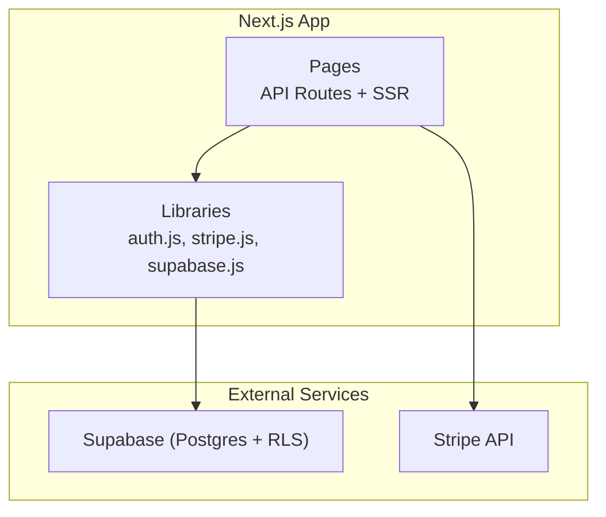
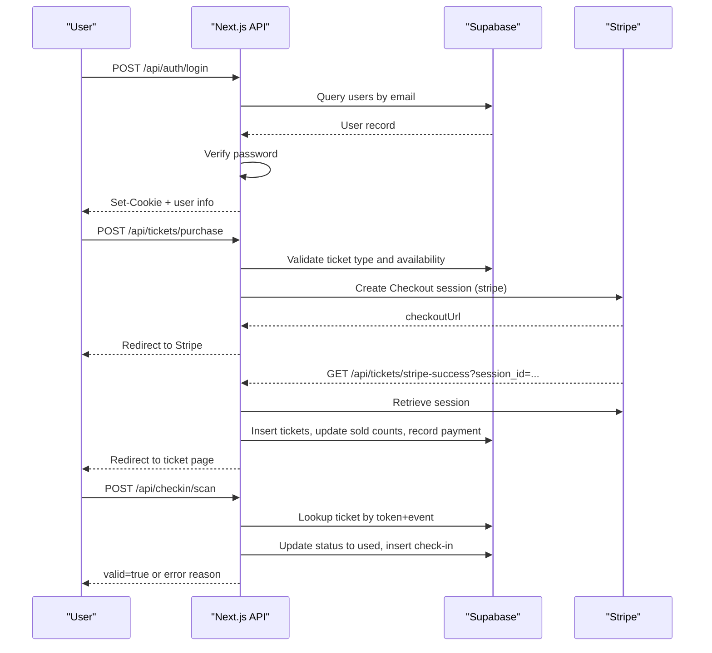
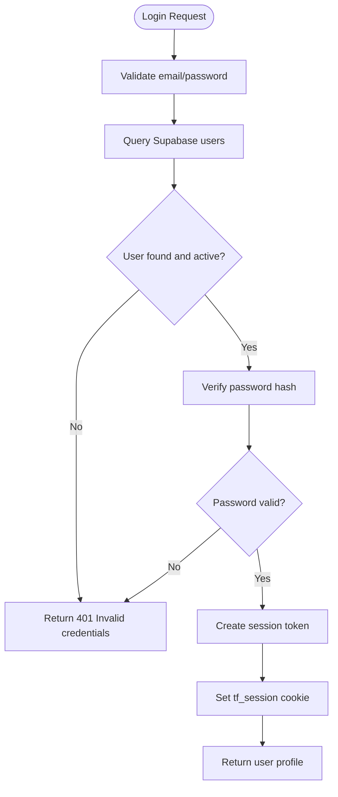
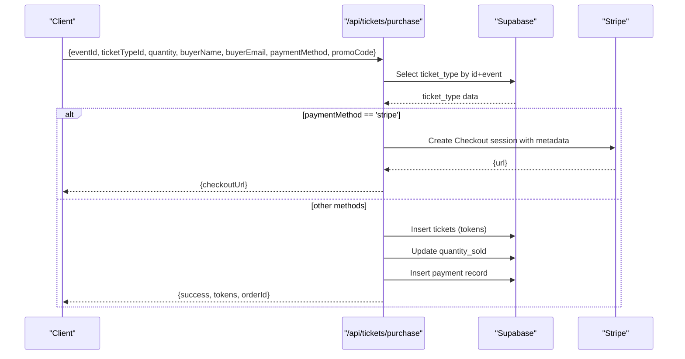
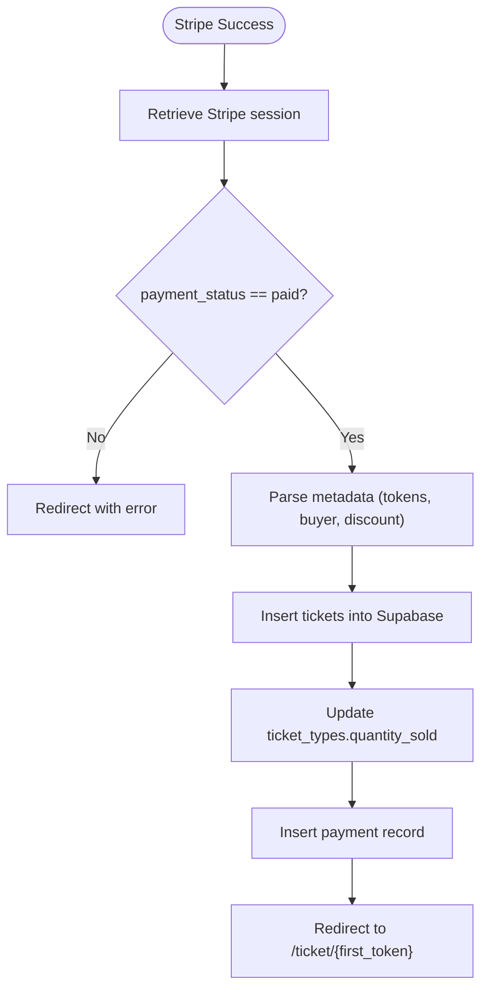
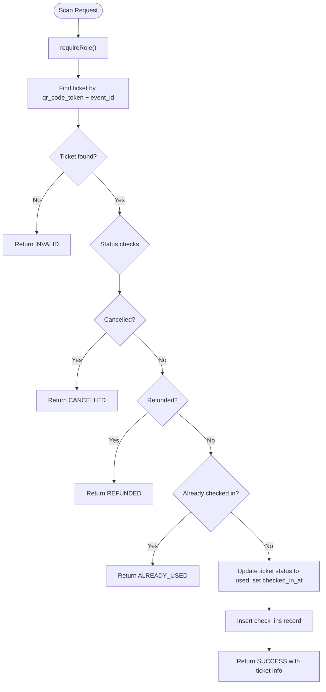
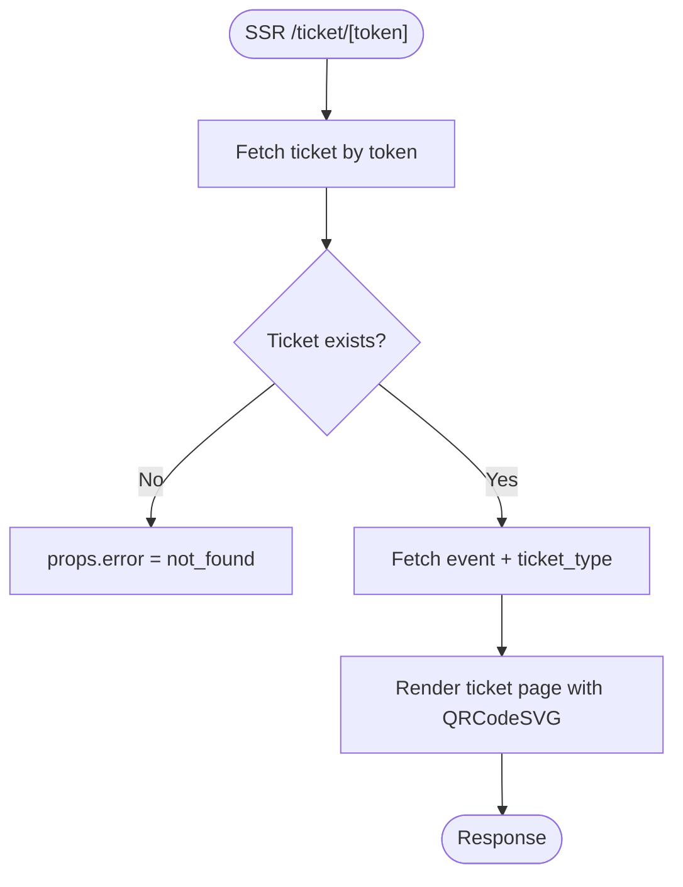
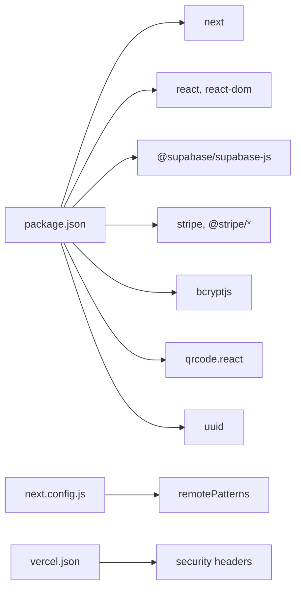

# Troubleshooting & FAQ

<cite>
**Referenced Files in This Document**
- [package.json](file://package.json)
- [next.config.js](file://next.config.js)
- [vercel.json](file://vercel.json)
- [lib/supabase.js](file://lib/supabase.js)
- [lib/stripe.js](file://lib/stripe.js)
- [lib/auth.js](file://lib/auth.js)
- [supabase/schema.sql](file://supabase/schema.sql)
- [pages/api/auth/login.js](file://pages/api/auth/login.js)
- [pages/api/tickets/purchase.js](file://pages/api/tickets/purchase.js)
- [pages/api/tickets/stripe-success.js](file://pages/api/tickets/stripe-success.js)
- [pages/api/checkin/scan.js](file://pages/api/checkin/scan.js)
- [pages/ticket/[token].js](file://pages/ticket/[token].js)
</cite>

## Table of Contents
1. Introduction
2. Project Structure
3. Core Components
4. Architecture Overview
5. Detailed Component Analysis
6. Dependency Analysis
7. Performance Considerations
8. Troubleshooting Guide
9. Conclusion
10. Appendices

## Introduction
This document is a comprehensive troubleshooting and FAQ guide for TicketFlow, covering setup, development, and production deployment issues. It includes debugging techniques for authentication, database connectivity, Stripe payments, and QR code generation; performance optimization tips; memory leak detection; bottleneck identification strategies; security hardening; migration guides; monitoring and alerting; log analysis; incident response procedures; and frequently asked questions with direct references to the relevant source files.

## Project Structure
TicketFlow is a Next.js application with:
- API routes for authentication, ticket purchase, Stripe success callback, and check-in scanning
- Server-side rendering pages for ticket display and QR code generation
- Supabase client configuration for database access
- Stripe integration for payment processing
- A SQL schema for Supabase tables, indexes, and policies

**Diagram sources**
- [next.config.js:1-14](file://next.config.js#L1-L14)
- [lib/supabase.js:1-23](file://lib/supabase.js#L1-L23)
- [lib/stripe.js:1-6](file://lib/stripe.js#L1-L6)
- [pages/api/auth/login.js:1-31](file://pages/api/auth/login.js#L1-L31)
- [pages/api/tickets/purchase.js:1-123](file://pages/api/tickets/purchase.js#L1-L123)
- [pages/api/tickets/stripe-success.js:1-55](file://pages/api/tickets/stripe-success.js#L1-L55)
- [pages/api/checkin/scan.js:1-44](file://pages/api/checkin/scan.js#L1-L44)
- [pages/ticket/[token].js:1-126](file://pages/ticket/[token].js#L1-L126)

**Section sources**
- [package.json:1-24](file://package.json#L1-L24)
- [next.config.js:1-14](file://next.config.js#L1-L14)
- [vercel.json:1-18](file://vercel.json#L1-L18)

## Core Components
- Authentication: Password hashing/verification, session token creation/parsing, role-based authorization middleware
- Database: Supabase clients (anon and service role), environment-driven configuration
- Payments: Stripe Checkout session creation and success handler
- Check-in: Secure QR scan validation and state transitions
- Ticket Display: Server-rendered ticket page with QR code generation

Key implementation references:
- Auth utilities and session handling: [lib/auth.js:1-47](file://lib/auth.js#L1-L47)
- Supabase clients: [lib/supabase.js:1-23](file://lib/supabase.js#L1-L23)
- Stripe client initialization: [lib/stripe.js:1-6](file://lib/stripe.js#L1-L6)
- Login flow: [pages/api/auth/login.js:1-31](file://pages/api/auth/login.js#L1-L31)
- Purchase flow: [pages/api/tickets/purchase.js:1-123](file://pages/api/tickets/purchase.js#L1-L123)
- Stripe success callback: [pages/api/tickets/stripe-success.js:1-55](file://pages/api/tickets/stripe-success.js#L1-L55)
- Check-in scanning: [pages/api/checkin/scan.js:1-44](file://pages/api/checkin/scan.js#L1-L44)
- Ticket page and QR generation: [pages/ticket/[token].js](file://pages/ticket/[token].js#L1-L126)

**Section sources**
- [lib/auth.js:1-47](file://lib/auth.js#L1-L47)
- [lib/supabase.js:1-23](file://lib/supabase.js#L1-L23)
- [lib/stripe.js:1-6](file://lib/stripe.js#L1-L6)
- [pages/api/auth/login.js:1-31](file://pages/api/auth/login.js#L1-L31)
- [pages/api/tickets/purchase.js:1-123](file://pages/api/tickets/purchase.js#L1-L123)
- [pages/api/tickets/stripe-success.js:1-55](file://pages/api/tickets/stripe-success.js#L1-L55)
- [pages/api/checkin/scan.js:1-44](file://pages/api/checkin/scan.js#L1-L44)
- [pages/ticket/[token].js:1-126](file://pages/ticket/[token].js#L1-L126)

## Architecture Overview
The system follows a server-centric model:
- Client requests hit Next.js API routes
- API routes validate inputs, enforce roles, and call Supabase via service-role client
- Stripe Checkout is used for secure payments; success callback finalizes ticket creation and records payments
- QR codes are generated on the server-rendered ticket page using qrcode.react

**Diagram sources**
- [pages/api/auth/login.js:1-31](file://pages/api/auth/login.js#L1-L31)
- [pages/api/tickets/purchase.js:1-123](file://pages/api/tickets/purchase.js#L1-L123)
- [pages/api/tickets/stripe-success.js:1-55](file://pages/api/tickets/stripe-success.js#L1-L55)
- [pages/api/checkin/scan.js:1-44](file://pages/api/checkin/scan.js#L1-L44)
- [lib/supabase.js:1-23](file://lib/supabase.js#L1-L23)
- [lib/stripe.js:1-6](file://lib/stripe.js#L1-L6)

## Detailed Component Analysis

### Authentication Flow
- Validates credentials against Supabase users table
- Creates a base64-encoded session token stored in an HttpOnly cookie
- Enforces role-based access via requireRole middleware

**Diagram sources**
- [pages/api/auth/login.js:1-31](file://pages/api/auth/login.js#L1-L31)
- [lib/auth.js:1-47](file://lib/auth.js#L1-L47)
- [lib/supabase.js:1-23](file://lib/supabase.js#L1-L23)

**Section sources**
- [pages/api/auth/login.js:1-31](file://pages/api/auth/login.js#L1-L31)
- [lib/auth.js:1-47](file://lib/auth.js#L1-L47)

### Ticket Purchase Flow
- Validates required fields and ticket availability
- Applies promo codes when provided
- For Stripe: creates a Checkout session with metadata containing tokens and buyer details
- For other methods: creates tickets immediately and records payment

**Diagram sources**
- [pages/api/tickets/purchase.js:1-123](file://pages/api/tickets/purchase.js#L1-L123)
- [lib/supabase.js:1-23](file://lib/supabase.js#L1-L23)

**Section sources**
- [pages/api/tickets/purchase.js:1-123](file://pages/api/tickets/purchase.js#L1-L123)

### Stripe Success Callback
- Retrieves the Stripe session and verifies payment_status
- Uses metadata to create tickets, update sold counts, and record payment
- Redirects to the first ticket page

**Diagram sources**
- [pages/api/tickets/stripe-success.js:1-55](file://pages/api/tickets/stripe-success.js#L1-L55)
- [lib/supabase.js:1-23](file://lib/supabase.js#L1-L23)

**Section sources**
- [pages/api/tickets/stripe-success.js:1-55](file://pages/api/tickets/stripe-success.js#L1-L55)

### Check-In Scanning
- Requires authenticated staff with appropriate roles
- Validates ticket existence, event match, and status
- Marks ticket as used and logs check-in

**Diagram sources**
- [pages/api/checkin/scan.js:1-44](file://pages/api/checkin/scan.js#L1-L44)
- [lib/auth.js:1-47](file://lib/auth.js#L1-L47)
- [lib/supabase.js:1-23](file://lib/supabase.js#L1-L23)

**Section sources**
- [pages/api/checkin/scan.js:1-44](file://pages/api/checkin/scan.js#L1-L44)

### Ticket Page and QR Code Generation
- Server-side fetches ticket and related event/ticket type
- Generates QR code value from site URL and token
- Displays ticket details and status overlay if used

**Diagram sources**
- [pages/ticket/[token].js:1-126](file://pages/ticket/[token].js#L1-L126)
- [lib/supabase.js:1-23](file://lib/supabase.js#L1-L23)

**Section sources**
- [pages/ticket/[token].js:1-126](file://pages/ticket/[token].js#L1-L126)

## Dependency Analysis
- External dependencies include Next.js, React, Supabase JS SDK, Stripe SDK, bcryptjs, qrcode.react, uuid, resend
- Environment variables drive runtime behavior for Supabase and Stripe clients
- Vercel headers provide basic security headers for API routes

**Diagram sources**
- [package.json:1-24](file://package.json#L1-L24)
- [next.config.js:1-14](file://next.config.js#L1-L14)
- [vercel.json:1-18](file://vercel.json#L1-L18)

**Section sources**
- [package.json:1-24](file://package.json#L1-L24)
- [next.config.js:1-14](file://next.config.js#L1-L14)
- [vercel.json:1-18](file://vercel.json#L1-L18)

## Performance Considerations
- Use Supabase indexes defined in schema to optimize queries (e.g., idx_tickets_token, idx_events_slug)
- Prefer service-role client only on server-side API routes to avoid unnecessary client overhead
- Minimize repeated network calls by batching where possible (e.g., fetching event and ticket_type together)
- Avoid heavy computations during render; precompute values like discounted prices server-side
- Keep QR code generation lightweight; use SVG-based QR codes as implemented
- Monitor cold starts on serverless platforms; consider warming endpoints if necessary

[No sources needed since this section provides general guidance]

## Troubleshooting Guide

### Setup Issues
- Missing environment variables
  - Symptoms: Supabase warnings, placeholder URLs, failed API calls
  - Fix: Ensure NEXT_PUBLIC_SUPABASE_URL, NEXT_PUBLIC_SUPABASE_ANON_KEY, SUPABASE_SERVICE_ROLE_KEY, STRIPE_SECRET_KEY, and NEXT_PUBLIC_SITE_URL are configured
  - References: [lib/supabase.js:1-23](file://lib/supabase.js#L1-L23), [lib/stripe.js:1-6](file://lib/stripe.js#L1-L6)
- Supabase schema not applied
  - Symptoms: Tables missing, policies not enforced, default admin user absent
  - Fix: Run supabase/schema.sql in Supabase SQL editor
  - Reference: [supabase/schema.sql:1-166](file://supabase/schema.sql#L1-L166)
- Next.js image remote patterns
  - Symptoms: Images blocked by Next.js strict mode
  - Fix: Add allowed hosts in next.config.js images.remotePatterns
  - Reference: [next.config.js:1-14](file://next.config.js#L1-L14)

**Section sources**
- [lib/supabase.js:1-23](file://lib/supabase.js#L1-L23)
- [lib/stripe.js:1-6](file://lib/stripe.js#L1-L6)
- [supabase/schema.sql:1-166](file://supabase/schema.sql#L1-L166)
- [next.config.js:1-14](file://next.config.js#L1-L14)

### Authentication Problems
- Invalid credentials
  - Causes: Wrong password, inactive user, incorrect email casing
  - Debug: Check login route responses and Supabase query results
  - Reference: [pages/api/auth/login.js:1-31](file://pages/api/auth/login.js#L1-L31)
- Session cookie not set or expired
  - Causes: Cookie path/domain mismatch, browser blocking cookies, expiration logic
  - Debug: Inspect Set-Cookie header and cookie storage; verify expiration calculation
  - Reference: [lib/auth.js:1-47](file://lib/auth.js#L1-L47)
- Role-based access denied
  - Causes: Missing role or insufficient permissions
  - Debug: Verify user.role and required roles in requireRole
  - Reference: [lib/auth.js:1-47](file://lib/auth.js#L1-L47)

**Section sources**
- [pages/api/auth/login.js:1-31](file://pages/api/auth/login.js#L1-L31)
- [lib/auth.js:1-47](file://lib/auth.js#L1-L47)

### Database Connection Issues
- Supabase client not initialized
  - Symptoms: Placeholder URLs used, console warnings
  - Fix: Provide correct environment variables
  - Reference: [lib/supabase.js:1-23](file://lib/supabase.js#L1-L23)
- Service role key misconfiguration
  - Symptoms: Permission errors on API routes
  - Fix: Ensure SUPABASE_SERVICE_ROLE_KEY is set and has proper RLS bypass
  - Reference: [lib/supabase.js:1-23](file://lib/supabase.js#L1-L23)
- Row-level security policies blocking access
  - Symptoms: Queries return empty despite valid data
  - Fix: Review policies in schema.sql and adjust as needed
  - Reference: [supabase/schema.sql:120-143](file://supabase/schema.sql#L120-L143)

**Section sources**
- [lib/supabase.js:1-23](file://lib/supabase.js#L1-L23)
- [supabase/schema.sql:120-143](file://supabase/schema.sql#L120-L143)

### Stripe Payment Failures
- Missing or invalid secret key
  - Symptoms: Checkout session creation fails
  - Fix: Configure STRIPE_SECRET_KEY correctly
  - Reference: [lib/stripe.js:1-6](file://lib/stripe.js#L1-L6)
- Incorrect apiVersion
  - Symptoms: API version mismatch errors
  - Fix: Align apiVersion with Stripe’s current version
  - Reference: [lib/stripe.js:1-6](file://lib/stripe.js#L1-L6)
- Payment not completed before redirect
  - Symptoms: Success callback redirects without creating tickets
  - Fix: Verify session.payment_status before proceeding
  - Reference: [pages/api/tickets/stripe-success.js:1-55](file://pages/api/tickets/stripe-success.js#L1-L55)
- Metadata parsing errors
  - Symptoms: Tickets not created due to malformed metadata
  - Fix: Ensure metadata fields are present and correctly formatted
  - Reference: [pages/api/tickets/stripe-success.js:1-55](file://pages/api/tickets/stripe-success.js#L1-L55)

**Section sources**
- [lib/stripe.js:1-6](file://lib/stripe.js#L1-L6)
- [pages/api/tickets/stripe-success.js:1-55](file://pages/api/tickets/stripe-success.js#L1-L55)

### QR Code Generation Errors
- Invalid token or missing ticket
  - Symptoms: “Ticket Not Found” page
  - Fix: Verify token exists and is active
  - Reference: [pages/ticket/[token].js:1-126](file://pages/ticket/[token].js#L1-L126)
- Site URL misconfiguration
  - Symptoms: QR code points to wrong domain
  - Fix: Ensure NEXT_PUBLIC_SITE_URL is set correctly
  - Reference: [pages/ticket/[token].js:1-126](file://pages/ticket/[token].js#L1-L126)
- QR code already used
  - Symptoms: Overlay shows “USED”
  - Fix: Confirm ticket status and reissue if necessary
  - Reference: [pages/ticket/[token].js:1-126](file://pages/ticket/[token].js#L1-L126)

**Section sources**
- [pages/ticket/[token].js:1-126](file://pages/ticket/[token].js#L1-L126)

### Check-In Scanning Issues
- Unauthorized access
  - Symptoms: 401/403 responses
  - Fix: Ensure staff credentials and roles are correct
  - Reference: [pages/api/checkin/scan.js:1-44](file://pages/api/checkin/scan.js#L1-L44)
- Ticket not found or wrong event
  - Symptoms: INVALID reason
  - Fix: Verify token and eventId match
  - Reference: [pages/api/checkin/scan.js:1-44](file://pages/api/checkin/scan.js#L1-L44)
- Already used or cancelled/refunded
  - Symptoms: ALREADY_USED, CANCELLED, REFUNDED reasons
  - Fix: Handle accordingly at the gate
  - Reference: [pages/api/checkin/scan.js:1-44](file://pages/api/checkin/scan.js#L1-L44)

**Section sources**
- [pages/api/checkin/scan.js:1-44](file://pages/api/checkin/scan.js#L1-L44)

### Performance Optimization Tips
- Leverage Supabase indexes defined in schema.sql
- Batch operations where possible (e.g., inserting multiple tickets)
- Avoid redundant queries by combining selects
- Use server-side rendering for ticket pages to reduce client load
- Monitor cold start times and consider endpoint warming

[No sources needed since this section provides general guidance]

### Memory Leak Detection
- Watch for unbounded arrays or objects accumulating in memory
- Ensure timers and intervals are cleared properly
- Avoid retaining large payloads in closures
- Use profiling tools (Node Inspector, Chrome DevTools) to identify leaks

[No sources needed since this section provides general guidance]

### Bottleneck Identification Strategies
- Profile API route execution time and database query latency
- Use structured logging to capture request IDs and timing
- Monitor Supabase query plans for slow queries
- Track Stripe API latency and error rates

[No sources needed since this section provides general guidance]

### Security Vulnerabilities and Mitigations
- Input validation
  - Ensure all API inputs are validated before DB writes
  - Reference: [pages/api/tickets/purchase.js:1-123](file://pages/api/tickets/purchase.js#L1-L123)
- Authorization enforcement
  - Use requireRole consistently across protected routes
  - Reference: [lib/auth.js:1-47](file://lib/auth.js#L1-L47)
- Secret management
  - Never commit secrets; use environment variables
  - Reference: [vercel.json:1-18](file://vercel.json#L1-L18)
- HTTP security headers
  - Apply X-Content-Type-Options, X-Frame-Options, X-XSS-Protection
  - Reference: [vercel.json:1-18](file://vercel.json#L1-L18)
- RLS policies
  - Restrict public reads and ensure service role usage on server
  - Reference: [supabase/schema.sql:120-143](file://supabase/schema.sql#L120-L143)

**Section sources**
- [pages/api/tickets/purchase.js:1-123](file://pages/api/tickets/purchase.js#L1-L123)
- [lib/auth.js:1-47](file://lib/auth.js#L1-L47)
- [vercel.json:1-18](file://vercel.json#L1-L18)
- [supabase/schema.sql:120-143](file://supabase/schema.sql#L120-L143)

### Migration Guides
- Upgrading dependencies
  - Review package.json versions and compatibility matrices
  - Test upgrades in staging; watch for breaking changes in Stripe API versions
  - Reference: [package.json:1-24](file://package.json#L1-L24)
- Database schema changes
  - Back up Supabase; apply schema migrations incrementally
  - Validate new indexes and policies
  - Reference: [supabase/schema.sql:1-166](file://supabase/schema.sql#L1-L166)
- Breaking API changes
  - Audit API route contracts; update clients accordingly
  - Maintain backward compatibility where feasible
  - Reference: [pages/api/tickets/purchase.js:1-123](file://pages/api/tickets/purchase.js#L1-L123)

**Section sources**
- [package.json:1-24](file://package.json#L1-L24)
- [supabase/schema.sql:1-166](file://supabase/schema.sql#L1-L166)
- [pages/api/tickets/purchase.js:1-123](file://pages/api/tickets/purchase.js#L1-L123)

### Monitoring and Alerting
- Centralized logging
  - Capture request IDs, timestamps, and error stacks
  - Integrate with external logging services
- Metrics collection
  - Track API latency, error rates, and Stripe success/failure ratios
- Alerts
  - Set thresholds for error spikes and payment failures
  - Notify on Supabase connection issues

[No sources needed since this section provides general guidance]

### Log Analysis Techniques
- Filter logs by request ID and endpoint
- Correlate Stripe events with ticket creation logs
- Identify slow queries via Supabase logs
- Analyze auth failures and rate-limit anomalies

[No sources needed since this section provides general guidance]

### Incident Response Procedures
- Triage
  - Reproduce issue in staging; isolate affected components
- Containment
  - Roll back recent changes; disable problematic features temporarily
- Resolution
  - Apply fixes; validate with tests and monitoring
- Postmortem
  - Document root cause, impact, and preventive measures

[No sources needed since this section provides general guidance]

## Conclusion
This guide consolidates common issues and solutions across authentication, database connectivity, payments, and QR code generation. By following the debugging steps, applying security best practices, and leveraging performance and monitoring strategies, you can maintain a reliable and secure TicketFlow deployment.

[No sources needed since this section summarizes without analyzing specific files]

## Appendices

### Frequently Asked Questions
- Why am I seeing placeholder URLs in logs?
  - Ensure environment variables are set; see [lib/supabase.js:1-23](file://lib/supabase.js#L1-L23)
- How do I fix “Invalid credentials” on login?
  - Verify user exists, is active, and password matches; see [pages/api/auth/login.js:1-31](file://pages/api/auth/login.js#L1-L31)
- Why are my tickets not created after Stripe payment?
  - Check session.payment_status and metadata parsing; see [pages/api/tickets/stripe-success.js:1-55](file://pages/api/tickets/stripe-success.js#L1-L55)
- What causes “INVALID” during check-in?
  - Token or event mismatch; verify inputs; see [pages/api/checkin/scan.js:1-44](file://pages/api/checkin/scan.js#L1-L44)
- How do I enable row-level security policies?
  - Apply schema.sql policies; see [supabase/schema.sql:120-143](file://supabase/schema.sql#L120-L143)
- How do I configure security headers?
  - Add headers in vercel.json; see [vercel.json:1-18](file://vercel.json#L1-L18)

**Section sources**
- [lib/supabase.js:1-23](file://lib/supabase.js#L1-L23)
- [pages/api/auth/login.js:1-31](file://pages/api/auth/login.js#L1-L31)
- [pages/api/tickets/stripe-success.js:1-55](file://pages/api/tickets/stripe-success.js#L1-L55)
- [pages/api/checkin/scan.js:1-44](file://pages/api/checkin/scan.js#L1-L44)
- [supabase/schema.sql:120-143](file://supabase/schema.sql#L120-L143)
- [vercel.json:1-18](file://vercel.json#L1-L18)