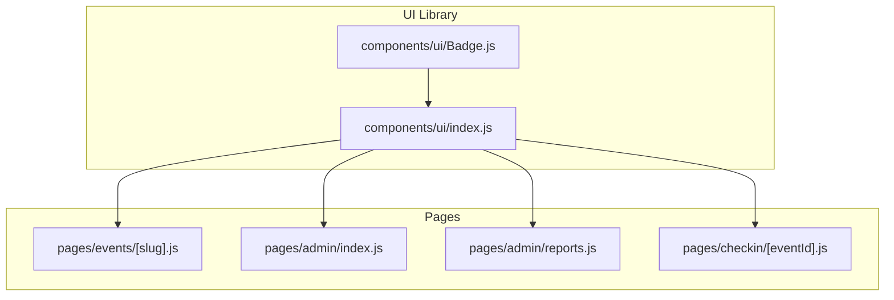
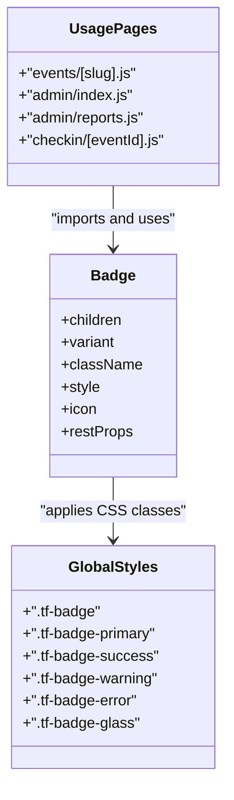
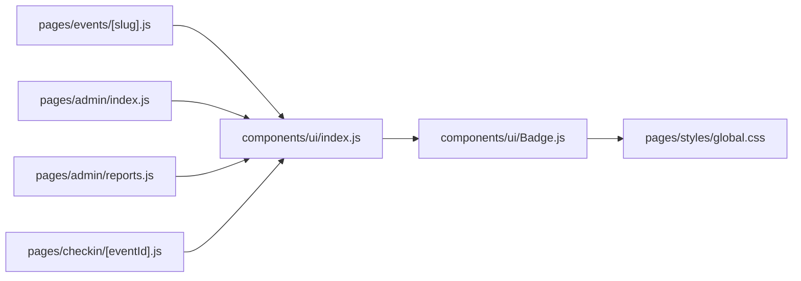

# Badge Component

<cite>
**Referenced Files in This Document**
- [Badge.js](file://components/ui/Badge.js)
- [index.js](file://components/ui/index.js)
- [global.css](file://pages/styles/global.css)
- [events/[slug].js](file://pages/events/[slug].js)
- [admin/index.js](file://pages/admin/index.js)
- [admin/reports.js](file://pages/admin/reports.js)
- [checkin/[eventId].js](file://pages/checkin/[eventId].js)
</cite>

## Table of Contents
1. [Introduction](#introduction)
2. [Project Structure](#project-structure)
3. [Core Components](#core-components)
4. [Architecture Overview](#architecture-overview)
5. [Detailed Component Analysis](#detailed-component-analysis)
6. [Dependency Analysis](#dependency-analysis)
7. [Performance Considerations](#performance-considerations)
8. [Troubleshooting Guide](#troubleshooting-guide)
9. [Conclusion](#conclusion)
10. [Appendices](#appendices)

## Introduction
The Badge component is a lightweight, theme-aware status indicator and label used across the TicketFlow application to communicate event states, categories, notifications, and quick metadata. It renders as an inline-flex pill with consistent spacing, typography, and border radius, and supports multiple visual variants for semantic meaning (primary, success, warning, danger/info, glass/ghost). The component composes well with other UI elements such as cards, tables, and dashboards commonly found in event management workflows.

## Project Structure
The Badge component lives under the shared UI library and is re-exported via a central index for convenient imports across pages and components.

**Diagram sources**
- [Badge.js:1-30](file://components/ui/Badge.js#L1-L30)
- [index.js:1-10](file://components/ui/index.js#L1-L10)
- [events/[slug].js](file://pages/events/[slug].js#L297-L311)
- [admin/index.js:186-220](file://pages/admin/index.js#L186-L220)
- [admin/reports.js:316-330](file://pages/admin/reports.js#L316-L330)
- [checkin/[eventId].js](file://pages/checkin/[eventId].js#L690-L710)

**Section sources**
- [Badge.js:1-30](file://components/ui/Badge.js#L1-L30)
- [index.js:1-10](file://components/ui/index.js#L1-L10)

## Core Components
- Badge component: Renders a span-based badge with variant-driven styling, optional icon slot, and pass-through props.
- Global styles: Define base .tf-badge class and variant classes (.tf-badge-primary, .tf-badge-success, .tf-badge-warning, .tf-badge-error, .tf-badge-glass).
- Re-export: Centralized export from components/ui/index.js for consistent imports.

Key responsibilities:
- Apply semantic color semantics via variant mapping.
- Provide a small icon slot for visual cues.
- Allow className and style overrides for customization.
- Pass through any additional attributes (e.g., aria-*).

**Section sources**
- [Badge.js:11-29](file://components/ui/Badge.js#L11-L29)
- [global.css:725-769](file://pages/styles/global.css#L725-L769)
- [index.js:1-10](file://components/ui/index.js#L1-L10)

## Architecture Overview
The Badge component is a presentational component that relies on global CSS for appearance. Variants are mapped to CSS classes, enabling theme consistency and easy customization. Pages import Badge via the UI index and use it to annotate content with contextual information.

**Diagram sources**
- [Badge.js:1-30](file://components/ui/Badge.js#L1-L30)
- [global.css:725-769](file://pages/styles/global.css#L725-L769)
- [events/[slug].js:297-L311](file://pages/events/[slug].js#L297-L311)
- [admin/index.js:186-220](file://pages/admin/index.js#L186-L220)
- [admin/reports.js:316-330](file://pages/admin/reports.js#L316-L330)
- [checkin/[eventId].js:690-L710](file://pages/checkin/[eventId].js#L690-L710)

## Detailed Component Analysis

### Props API
- children: Node content displayed inside the badge.
- variant: Visual theme selector. Supported values: primary, success, warning, danger, info, glass, ghost.
- className: Additional CSS classes to append.
- style: Inline style object applied to the root element.
- icon: Optional node rendered before children when provided.
- rest: Any additional props passed through to the root span (e.g., data-* or aria-*).

Behavioral notes:
- Default variant is primary.
- Unknown variants produce no extra class; safe fallback behavior.
- Icon is wrapped in its own span to maintain layout and spacing.

**Section sources**
- [Badge.js:1-29](file://components/ui/Badge.js#L1-L29)

### Visual Appearance
- Base shape: Pill-shaped inline-flex with rounded corners and compact padding.
- Typography: Small, bold text with subtle letter-spacing for readability at small sizes.
- Borders: Subtle borders per variant to enhance contrast against backgrounds.
- Glass variant: Semi-transparent background with backdrop blur and light border for overlay contexts.

**Section sources**
- [global.css:725-769](file://pages/styles/global.css#L725-L769)

### Variant Mapping and Semantics
- primary: Accent-colored badge suitable for general labels and highlights.
- success: Green-toned badge for positive statuses (e.g., published, completed).
- warning: Amber-toned badge for cautionary states (e.g., draft, pending).
- danger/error: Red-toned badge for errors or critical states (e.g., cancelled, sold out).
- info: Uses primary styling; appropriate for informational labels.
- glass/ghost: Transparent, blurred backgrounds ideal for overlays and hero sections.

Usage patterns observed:
- Status badges: Event statuses like published, draft, sold_out, completed, cancelled.
- Category badges: Event categories and urgency labels on event pages.
- Notification badges: Counts and indicators in dashboards and reports.
- Check-in badges: Ticket type names and usage states.

**Section sources**
- [admin/index.js:186-220](file://pages/admin/index.js#L186-L220)
- [admin/reports.js:316-330](file://pages/admin/reports.js#L316-L330)
- [events/[slug].js:297-L311](file://pages/events/[slug].js#L297-L311)
- [checkin/[eventId].js:690-L710](file://pages/checkin/[eventId].js#L690-L710)

### Styling Customization Options
- Override via className: Add custom classes to extend or replace default styles.
- Inline style prop: Adjust padding, font size, or colors for specific contexts.
- Theme variables: Colors and radii are driven by CSS variables, ensuring consistency across themes.
- Glass effect: Use glass variant for overlays; can be enhanced with additional backdrop-filter if needed.

**Section sources**
- [global.css:725-769](file://pages/styles/global.css#L725-L769)
- [events/[slug].js:297-L311](file://pages/events/[slug].js#L297-L311)

### Accessibility Guidelines
- Semantic role: Badge is a span; avoid using it for interactive elements. For actionable items, prefer Button or Link.
- Meaningful content: Ensure children convey clear status or category information.
- Color contrast: Variants are designed for adequate contrast; verify when overriding styles.
- Screen readers: If adding icons, ensure they do not duplicate meaningful text; consider aria-labels where necessary.
- Keyboard focus: Badges are non-interactive; do not add tabIndex unless implementing custom behavior.

[No sources needed since this section provides general guidance]

### Responsive Design Considerations
- Inline-flex layout adapts naturally to container widths.
- Use flex-wrap in parent containers to prevent overflow on narrow screens.
- Reduce font size and padding via className overrides for mobile-specific layouts.
- Combine with responsive design utilities (e.g., clamp-based typography) in parent components.

[No sources needed since this section provides general guidance]

### Common Use Cases in Event Management
- Status badges: Indicate event lifecycle stages (draft, published, sold out, completed, cancelled).
- Category badges: Display event categories and urgency labels on event detail pages.
- Notification badges: Show counts or indicators in dashboards and reports.
- Check-in badges: Label ticket types and usage states during gate operations.

Examples by file:
- Status badges in admin dashboard and reports.
- Category and urgency badges on event pages.
- Notification and count badges in dashboards.
- Check-in result and ticket-type badges in check-in flows.

**Section sources**
- [admin/index.js:186-220](file://pages/admin/index.js#L186-L220)
- [admin/reports.js:316-330](file://pages/admin/reports.js#L316-L330)
- [events/[slug].js:297-L311](file://pages/events/[slug].js#L297-L311)
- [checkin/[eventId].js:690-L710](file://pages/checkin/[eventId].js#L690-L710)

## Dependency Analysis
The Badge component has minimal dependencies:
- No runtime libraries beyond React.
- Styles are defined globally; no CSS modules or styled-jsx usage within the component.
- Imported via the UI index for centralized access.

**Diagram sources**
- [Badge.js:1-30](file://components/ui/Badge.js#L1-L30)
- [index.js:1-10](file://components/ui/index.js#L1-L10)
- [global.css:725-769](file://pages/styles/global.css#L725-L769)
- [events/[slug].js:297-L311](file://pages/events/[slug].js#L297-L311)
- [admin/index.js:186-220](file://pages/admin/index.js#L186-L220)
- [admin/reports.js:316-330](file://pages/admin/reports.js#L316-L330)
- [checkin/[eventId].js:690-L710](file://pages/checkin/[eventId].js#L690-L710)

**Section sources**
- [Badge.js:1-30](file://components/ui/Badge.js#L1-L30)
- [index.js:1-10](file://components/ui/index.js#L1-L10)
- [global.css:725-769](file://pages/styles/global.css#L725-L769)

## Performance Considerations
- Lightweight: Renders a single span with conditional icon rendering.
- No state or side effects: Pure presentational component.
- CSS-driven styling: Avoids heavy JS-based styling libraries.
- Recommended practices:
  - Keep badge content concise to minimize layout shifts.
  - Avoid excessive nesting; place badges directly in flex containers.
  - Use className overrides sparingly to reduce CSS bloat.

[No sources needed since this section provides general guidance]

## Troubleshooting Guide
Common issues and resolutions:
- Variant not applying: Ensure variant value matches supported keys (primary, success, warning, danger, info, glass, ghost). Unknown variants fall back gracefully without error.
- Icon not visible: Verify icon prop is provided; icon is only rendered when truthy.
- Overridden styles: Check className and style props for conflicts; inspect computed styles in browser dev tools.
- Contrast problems: When overriding colors, ensure sufficient contrast against background; rely on theme variables for consistency.

**Section sources**
- [Badge.js:1-29](file://components/ui/Badge.js#L1-L29)
- [global.css:725-769](file://pages/styles/global.css#L725-L769)

## Conclusion
The Badge component offers a simple, flexible, and theme-consistent way to display status indicators and labels throughout TicketFlow. Its variant system aligns with common event management semantics, while its minimal implementation ensures performance and ease of customization. By following accessibility guidelines and leveraging global theme variables, teams can maintain a cohesive visual language across the application.

[No sources needed since this section summarizes without analyzing specific files]

## Appendices

### Usage Examples by Context
- Status badges: Use success/warning/danger/info variants to reflect event lifecycle states.
- Category badges: Use glass or primary variants to label categories and urgency on event pages.
- Notification badges: Use primary/glass variants to show counts or indicators in dashboards and reports.
- Check-in badges: Use primary/warning variants to label ticket types and usage states.

Reference paths:
- Status badges: [admin/index.js:186-220](file://pages/admin/index.js#L186-L220), [admin/reports.js:316-330](file://pages/admin/reports.js#L316-L330)
- Category badges: [events/[slug].js:297-L311](file://pages/events/[slug].js#L297-L311)
- Notification badges: [admin/reports.js:316-330](file://pages/admin/reports.js#L316-L330)
- Check-in badges: [checkin/[eventId].js:690-L710](file://pages/checkin/[eventId].js#L690-L710)

[No sources needed since this section aggregates references already cited above]