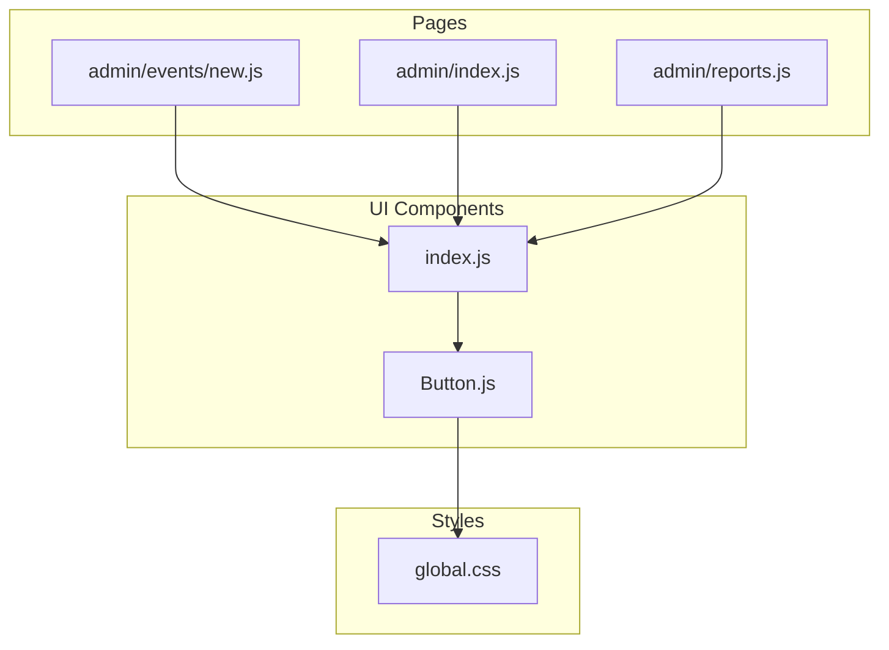
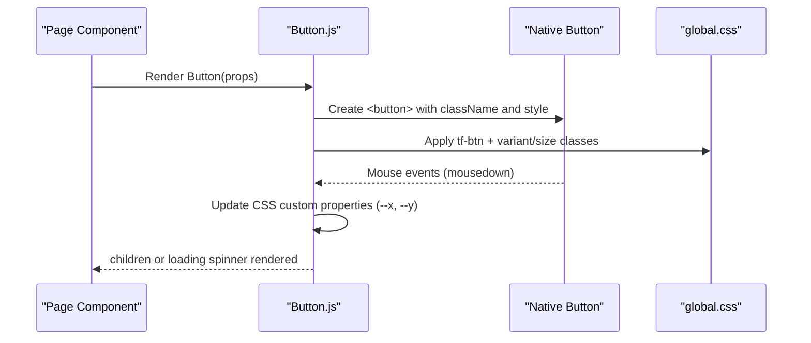
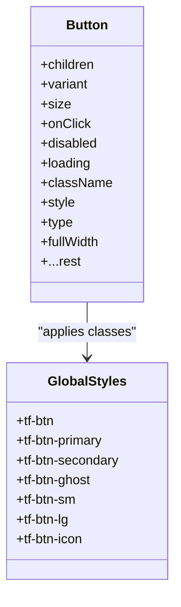

# Button Component

<cite>
**Referenced Files in This Document**
- [Button.js](file://components/ui/Button.js)
- [index.js](file://components/ui/index.js)
- [global.css](file://pages/styles/global.css)
- [new.js](file://pages/admin/events/new.js)
- [reports.js](file://pages/admin/reports.js)
- [admin index.js](file://pages/admin/index.js)
</cite>

## Table of Contents
1. [Introduction](#introduction)
2. [Project Structure](#project-structure)
3. [Core Components](#core-components)
4. [Architecture Overview](#architecture-overview)
5. [Detailed Component Analysis](#detailed-component-analysis)
6. [Dependency Analysis](#dependency-analysis)
7. [Performance Considerations](#performance-considerations)
8. [Troubleshooting Guide](#troubleshooting-guide)
9. [Conclusion](#conclusion)
10. [Appendices](#appendices)

## Introduction
This document provides comprehensive documentation for the Button component used across the TicketFlow application. It covers visual appearance, behavior, interaction patterns, props, accessibility guidance, styling customization, theming support, responsive considerations, and performance tips. The goal is to help developers implement consistent, accessible, and performant buttons throughout the app.

## Project Structure
The Button component lives under the shared UI components folder and is re-exported via a central index file. Global styles define the visual design system and button variants. Pages import the Button from the UI index and use it with various props to achieve different looks and behaviors.

**Diagram sources**
- [Button.js:1-74](file://components/ui/Button.js#L1-L74)
- [index.js:1-10](file://components/ui/index.js#L1-L10)
- [global.css:426-506](file://pages/styles/global.css#L426-L506)
- [new.js:302-325](file://pages/admin/events/new.js#L302-L325)
- [admin index.js:519-526](file://pages/admin/index.js#L519-L526)
- [reports.js:138-147](file://pages/admin/reports.js#L138-L147)

**Section sources**
- [Button.js:1-74](file://components/ui/Button.js#L1-L74)
- [index.js:1-10](file://components/ui/index.js#L1-L10)
- [global.css:426-506](file://pages/styles/global.css#L426-L506)

## Core Components
- Button component: A React functional component that renders a native <button> element with built-in variant and size classes, loading state indicator, disabled handling, and mouse-down ripple coordinate tracking.
- Style system: CSS classes prefixed with tf-btn-* define base styles and variants (primary, secondary, ghost, danger, success), sizes (sm, md, lg, icon), and interactive states.

Key responsibilities:
- Map props to CSS class names for consistent styling.
- Manage disabled state when either disabled or loading is true.
- Render an inline spinner when loading is true.
- Expose standard button attributes via rest props.

**Section sources**
- [Button.js:18-73](file://components/ui/Button.js#L18-L73)
- [global.css:426-506](file://pages/styles/global.css#L426-L506)

## Architecture Overview
The Button component composes a simple React function with CSS-driven styling. It does not depend on external libraries beyond React’s useRef. Styling is centralized in global.css using CSS variables for theming. Usage spans multiple pages, demonstrating common patterns like primary actions, secondary actions, full-width forms, and disabled states.

**Diagram sources**
- [Button.js:33-40](file://components/ui/Button.js#L33-L40)
- [Button.js:44-71](file://components/ui/Button.js#L44-L71)
- [global.css:426-506](file://pages/styles/global.css#L426-L506)

## Detailed Component Analysis

### Props API
- children: Node content displayed inside the button. When loading is true, children are hidden and replaced by a spinner.
- variant: Controls color scheme and semantic meaning. Supported values: primary, secondary, ghost, danger, success.
- size: Controls dimensions and typography. Supported values: sm, md, lg, icon.
- onClick: Event handler for click interactions.
- disabled: Boolean; disables the button. Also applies reduced opacity.
- loading: Boolean; shows a spinner and disables the button.
- className: Additional class names appended to the base classes.
- style: Inline styles merged into the button element.
- type: HTML button type attribute (default: button).
- fullWidth: Boolean; sets width to 100% when true.
- ...rest: Any additional props passed through to the underlying <button>.

Behavioral notes:
- Disabled state is computed as disabled || loading.
- Loading state hides children and renders a small animated spinner.
- Mouse down updates CSS custom properties for potential ripple effects.

Accessibility considerations:
- Uses a native <button>, ensuring keyboard focusability and activation.
- No explicit ARIA attributes are set by default; consumers should add aria-label or aria-describedby when needed.
- Ensure sufficient color contrast for text and icons within each variant.

Usage examples across pages:
- Primary action buttons in admin dashboard and event creation flows.
- Secondary buttons for navigation or non-primary actions.
- Ghost buttons for subtle actions.
- Full-width buttons in form layouts.
- Disabled buttons for unavailable actions.

**Section sources**
- [Button.js:18-73](file://components/ui/Button.js#L18-L73)
- [new.js:302-325](file://pages/admin/events/new.js#L302-L325)
- [reports.js:138-147](file://pages/admin/reports.js#L138-L147)
- [admin index.js:519-526](file://pages/admin/index.js#L519-L526)

### Visual Appearance and Behavior
- Base styles: Flexbox centering, font family, weight, size, padding, border radius, cursor pointer, transition, overflow hidden.
- Variants:
  - primary: Gradient background with shadow and hover lift.
  - secondary: Subtle background with border and hover elevation.
  - ghost: Transparent background with text color change on hover.
  - danger/success: Semantic colors defined by CSS classes.
- Sizes:
  - sm: Smaller padding and font size.
  - md: Default size.
  - lg: Larger padding and font size.
  - icon: Square shape optimized for icon-only usage.
- Hover and active states: Smooth transitions, transform lift, enhanced shadows.
- Loading state: Inline spinner with rotation animation.

**Section sources**
- [global.css:426-506](file://pages/styles/global.css#L426-L506)
- [Button.js:59-71](file://components/ui/Button.js#L59-L71)

### Interaction Patterns
- Click handling: onClick prop forwards to the native button.
- Mouse-down ripple coordinates: On mousedown, the component computes the click position relative to the button and sets CSS custom properties --x and --y, enabling CSS-based ripple effects if styled accordingly.
- Disabled and loading: Both disable user interaction; loading additionally displays a spinner and hides children.

**Section sources**
- [Button.js:33-40](file://components/ui/Button.js#L33-L40)
- [Button.js:48-50](file://components/ui/Button.js#L48-L50)
- [Button.js:59-71](file://components/ui/Button.js#L59-L71)

### Accessibility Guidelines
- Keyboard navigation: Native <button> ensures focus and activation via Enter/Space.
- ARIA attributes: Add aria-label for icon-only buttons; use aria-describedby for contextual hints.
- Focus management: Ensure visible focus styles are maintained; avoid removing outline without providing an alternative.
- Color contrast: Verify contrast ratios for text and icons against backgrounds for all variants.
- Screen readers: Provide meaningful labels; avoid relying solely on color to convey meaning.

[No sources needed since this section provides general guidance]

### Styling Customization and Theming
- CSS variables: Colors, spacing, radii, shadows, and gradients are defined via CSS variables, enabling theme switching.
- Theme modes: Multiple themes are supported via data-theme attributes (e.g., dark-concert, midnight-blue, royal-purple, emerald, elegant-white).
- Overriding styles: Use className to append custom classes; merge style props for inline overrides.
- Ripple effect: The component sets --x and --y on mousedown; CSS can leverage these variables for ripple animations.

**Section sources**
- [global.css:8-195](file://pages/styles/global.css#L8-L195)
- [global.css:426-506](file://pages/styles/global.css#L426-L506)
- [Button.js:33-40](file://components/ui/Button.js#L33-L40)

### Responsive Design Considerations
- Fluid typography and spacing: Use clamp() and CSS variables for scalable sizing.
- Full-width mode: Set fullWidth to ensure buttons span container width in narrow screens.
- Icon-only buttons: Use size="icon" for compact controls in toolbars or dense interfaces.
- Touch targets: Ensure minimum touch target size (at least 44px) for mobile usability.

[No sources needed since this section provides general guidance]

### Performance Optimization Tips
- Avoid unnecessary re-renders: Memoize handlers and pass stable references where possible.
- Minimize inline styles: Prefer className for static styles; use style only for dynamic values.
- Debounce heavy operations: If onClick triggers expensive work, debounce or throttle as appropriate.
- Lazy load dependencies: Keep Button lightweight; defer heavy logic outside the component.

[No sources needed since this section provides general guidance]

## Dependency Analysis
The Button component has minimal dependencies:
- React: For useRef and functional component structure.
- CSS: Styles are applied via global.css classes.

Usage across pages demonstrates consistent integration patterns and prop usage.

**Diagram sources**
- [Button.js:18-73](file://components/ui/Button.js#L18-L73)
- [global.css:426-506](file://pages/styles/global.css#L426-L506)

**Section sources**
- [Button.js:1-74](file://components/ui/Button.js#L1-L74)
- [global.css:426-506](file://pages/styles/global.css#L426-L506)

## Performance Considerations
- Rendering: Button renders a single native button element; overhead is minimal.
- State: Only local ref and CSS custom properties are updated on mouse events; no re-renders triggered by mouse movement.
- Styling: CSS transitions and transforms are GPU-accelerated; keep animations simple for smooth performance.
- Accessibility: Ensure focus styles do not trigger layout shifts.

[No sources needed since this section provides general guidance]

## Troubleshooting Guide
Common issues and resolutions:
- Button not clickable: Check if disabled or loading is true; verify onClick is provided.
- Spinner not visible: Ensure loading is true and children are not forced to render; confirm CSS animation keyframes exist.
- Incorrect variant or size: Validate variant and size values; ensure corresponding CSS classes exist.
- Full-width not applied: Confirm fullWidth prop is set; check parent container constraints.
- Focus styles missing: Inspect CSS outline or box-shadow for focus states; ensure no global rules remove outlines.

**Section sources**
- [Button.js:48-50](file://components/ui/Button.js#L48-L50)
- [Button.js:59-71](file://components/ui/Button.js#L59-L71)
- [global.css:426-506](file://pages/styles/global.css#L426-L506)

## Conclusion
The Button component provides a flexible, accessible, and visually consistent foundation for user interactions across TicketFlow. With clear props for variants, sizes, loading, and disabled states, it integrates seamlessly with the global design system and supports theming and responsive design. By following the accessibility guidelines and performance tips outlined here, developers can create intuitive and high-quality user experiences.

[No sources needed since this section summarizes without analyzing specific files]

## Appendices

### Usage Examples by Type
- Primary button: Use variant="primary" for main actions such as submitting forms or navigating forward.
- Secondary button: Use variant="secondary" for supportive actions like canceling or going back.
- Ghost button: Use variant="ghost" for low-emphasis actions within dense interfaces.
- Danger/SUCCESS: Use variant="danger" or variant="success" for destructive or positive feedback actions.
- Sizes: Use size="sm" for compact controls, size="lg" for prominent actions, and size="icon" for icon-only buttons.
- Full-width: Use fullWidth in forms to span container width.
- Loading: Use loading to show progress during async operations.
- Disabled: Use disabled to prevent interaction when necessary.

[No sources needed since this section provides general guidance]