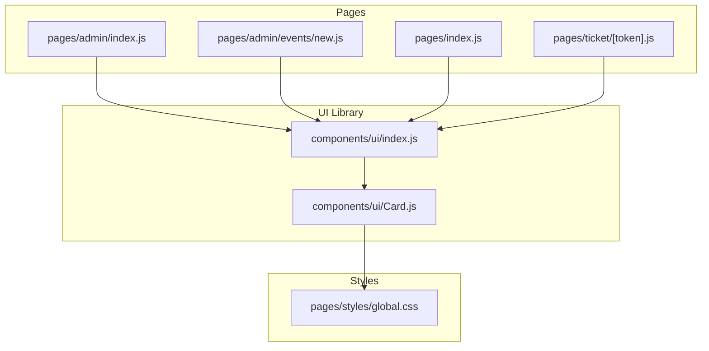
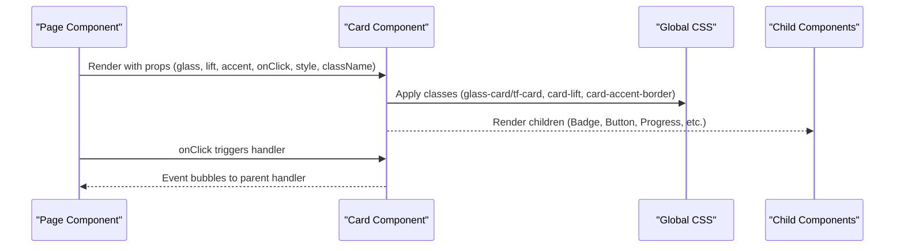
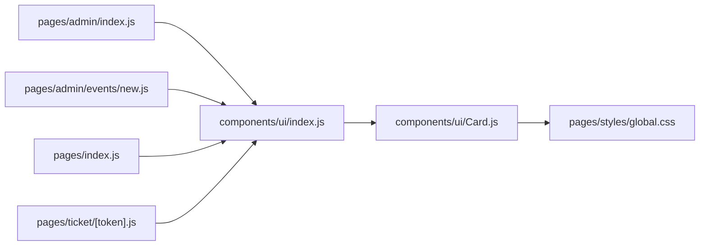
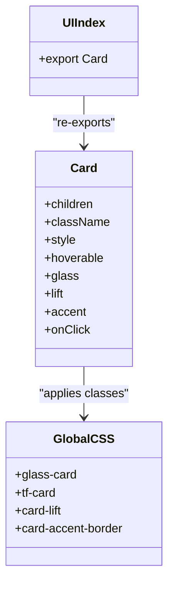

# Card Component

<cite>
**Referenced Files in This Document**
- [Card.js](file://components/ui/Card.js)
- [index.js](file://components/ui/index.js)
- [global.css](file://pages/styles/global.css)
- [admin/index.js](file://pages/admin/index.js)
- [admin/events/new.js](file://pages/admin/events/new.js)
- [pages/index.js](file://pages/index.js)
- [ticket/[token].js](file://pages/ticket/[token].js)
</cite>

## Table of Contents
1. [Introduction](#introduction)
2. [Project Structure](#project-structure)
3. [Core Components](#core-components)
4. [Architecture Overview](#architecture-overview)
5. [Detailed Component Analysis](#detailed-component-analysis)
6. [Dependency Analysis](#dependency-analysis)
7. [Performance Considerations](#performance-considerations)
8. [Troubleshooting Guide](#troubleshooting-guide)
9. [Conclusion](#conclusion)
10. [Appendices](#appendices)

## Introduction
The Card component is a lightweight, theme-aware container used across the application to group and present content with consistent visual styling and interaction patterns. It supports glassmorphism, lift animations, accent borders, and clickability. The component composes well with other UI primitives such as Badge, Button, Progress, Skeleton, and Toast, enabling flexible layouts for event listings, admin dashboards, and ticket displays.

## Project Structure
The Card component lives under the shared UI library and is re-exported via an index file for convenient imports throughout pages and components. Global styles define the card’s base appearance, hover effects, and variants.

**Diagram sources**
- [Card.js:1-32](file://components/ui/Card.js#L1-L32)
- [index.js:1-10](file://components/ui/index.js#L1-L10)
- [global.css:349-362](file://pages/styles/global.css#L349-L362)
- [admin/index.js:116-146](file://pages/admin/index.js#L116-L146)
- [admin/events/new.js:234-257](file://pages/admin/events/new.js#L234-L257)
- [pages/index.js:620-753](file://pages/index.js#L620-L753)
- [ticket/[token].js](file://pages/ticket/[token].js#L80-L156)

**Section sources**
- [Card.js:1-32](file://components/ui/Card.js#L1-L32)
- [index.js:1-10](file://components/ui/index.js#L1-L10)
- [global.css:349-362](file://pages/styles/global.css#L349-L362)

## Core Components
- Card: A generic container that applies glass or solid background, optional lift animation, accent border, and pointer cursor when interactive.
- Supporting UI primitives (used alongside Card):
  - Badge: For labels like category, status, or “Sold Out”.
  - Button: For actions inside cards.
  - Progress: For capacity or completion indicators.
  - Skeleton: For loading states.
  - Toast: For notifications triggered by card interactions.

Key props of Card:
- children: Any React nodes to render inside the card.
- className: Additional CSS classes to append.
- style: Inline styles object merged into the root element.
- hoverable: Enables hover transitions (default true).
- glass: Applies glassmorphism style (default true).
- lift: Adds lift animation class (default true).
- accent: Adds an accent left border (default false).
- onClick: Click handler; also sets cursor to pointer when provided.
- ...rest: Spread to pass through any additional DOM attributes.

Behavior highlights:
- When onClick is provided, the root div becomes clickable and shows a pointer cursor.
- glass toggles between glass-card and tf-card base styles.
- lift adds a subtle translateY and shadow on hover.
- accent adds a colored left border using the theme’s accent color.

**Section sources**
- [Card.js:1-32](file://components/ui/Card.js#L1-L32)
- [global.css:349-362](file://pages/styles/global.css#L349-L362)
- [global.css:1572-1583](file://pages/styles/global.css#L1572-L1583)

## Architecture Overview
The Card component is a presentational wrapper that delegates all visual behavior to global CSS classes. Pages compose Card with other components to build complex layouts such as event cards, admin quick actions, and ticket views.

**Diagram sources**
- [Card.js:1-32](file://components/ui/Card.js#L1-L32)
- [global.css:349-362](file://pages/styles/global.css#L349-L362)
- [admin/index.js:116-146](file://pages/admin/index.js#L116-L146)
- [pages/index.js:620-753](file://pages/index.js#L620-L753)

## Detailed Component Analysis

### Visual Appearance and Layout
- Base styles:
  - Glass variant (glass-card): translucent background, backdrop blur, subtle border, rounded corners, smooth transition.
  - Solid variant (tf-card): solid secondary background, border, rounded corners, transition.
- Hover effects:
  - Accent border highlight and elevated shadow on hover for both variants.
  - Lift effect (card-lift) adds translateY(-4px) and stronger shadow on hover.
- Accent border:
  - Left accent border using theme accent color when accent prop is true.

These behaviors are defined in global CSS and applied conditionally by the Card component based on props.

**Section sources**
- [global.css:349-362](file://pages/styles/global.css#L349-L362)
- [global.css:528-540](file://pages/styles/global.css#L528-L540)
- [global.css:1572-1583](file://pages/styles/global.css#L1572-L1583)

### Props Reference
- children: Node(s) rendered inside the card container.
- className: String of additional classes appended to the root element.
- style: Object of inline styles merged onto the root element.
- hoverable: Boolean controlling whether hover transitions are enabled (default true).
- glass: Boolean to switch between glass-card and tf-card base styles (default true).
- lift: Boolean to add card-lift class for hover elevation (default true).
- accent: Boolean to add card-accent-border left accent line (default false).
- onClick: Function invoked on click; also sets cursor to pointer.
- ...rest: Any additional HTML attributes passed through to the root div.

Usage examples (by reference only):
- Admin dashboard quick action card: uses hoverable, accent, onClick, padding, and card-lift.
- Admin event row: uses hoverable, accent, onClick, padding, and card-lift.
- Admin wizard step: wraps form sections with accent and fade-in-up animation.
- Home page premium event card: uses CSS-based tf-event-card structure with badges, progress, and pricing footer.
- Ticket view: uses a themed ticket card layout with header, body, and footer sections.

**Section sources**
- [Card.js:1-32](file://components/ui/Card.js#L1-L32)
- [admin/index.js:116-146](file://pages/admin/index.js#L116-L146)
- [admin/index.js:197-266](file://pages/admin/index.js#L197-L266)
- [admin/events/new.js:234-257](file://pages/admin/events/new.js#L234-L257)
- [pages/index.js:620-753](file://pages/index.js#L620-L753)
- [ticket/[token].js](file://pages/ticket/[token].js#L80-L156)

### Interactive States
- Pointer cursor is set when onClick is provided.
- Hover state transitions include border color change, shadow elevation, and optional lift translation.
- Accent border provides a persistent visual cue for emphasis.

Accessibility considerations:
- Cards themselves are semantic containers; ensure interactive cards have appropriate roles and labels if they act as buttons.
- Use aria-label on child buttons within cards (e.g., favorite/share actions) for screen readers.

**Section sources**
- [Card.js:19-27](file://components/ui/Card.js#L19-L27)
- [global.css:349-362](file://pages/styles/global.css#L349-L362)
- [global.css:1572-1583](file://pages/styles/global.css#L1572-L1583)
- [pages/index.js:652-659](file://pages/index.js#L652-L659)

### Content Organization Patterns
Common patterns observed across usage:
- Header area: Title, subtitle, and status badges.
- Body area: Descriptive text, metadata (date, venue), progress bars, and ticket tier pills.
- Footer area: Price, availability, and call-to-action buttons.

Examples:
- Event cards: Poster image, overlay, badges, title, location, countdown, progress, ticket tiers, price, and remaining tickets.
- Admin cards: Icon, title, subtitle, and navigation arrow.
- Ticket card: Branding header, type badge, QR code, token, barcode, details rows, and footer instructions.

**Section sources**
- [pages/index.js:620-753](file://pages/index.js#L620-L753)
- [admin/index.js:116-146](file://pages/admin/index.js#L116-L146)
- [ticket/[token].js](file://pages/ticket/[token].js#L80-L156)

### Styling Customization Options
- Theme variables: Colors, spacing, shadows, and radii are controlled via CSS custom properties.
- Variants:
  - glass-card: Translucent with backdrop blur.
  - tf-card: Solid background with border.
- Enhancements:
  - card-lift: Hover elevation and shadow.
  - card-accent-border: Left accent border.
- Inline overrides: Use style prop for padding, margins, backgrounds, and typography adjustments.
- Animation utilities: Combine with fade-in-up, stagger-children, and other utility classes for entrance effects.

**Section sources**
- [global.css:8-61](file://pages/styles/global.css#L8-L61)
- [global.css:349-362](file://pages/styles/global.css#L349-L362)
- [global.css:1572-1583](file://pages/styles/global.css#L1572-L1583)
- [admin/events/new.js:257-257](file://pages/admin/events/new.js#L257-L257)

### Integration with Other Components
- Badge: Used for categories, statuses, and counts.
- Button: Primary/secondary/ghost variants for actions inside cards.
- Progress: Shows capacity sold or completion percentage.
- Skeleton: Placeholder while data loads.
- Toast: Notifications after user actions from card interactions.

**Section sources**
- [index.js:1-10](file://components/ui/index.js#L1-L10)
- [admin/index.js:116-146](file://pages/admin/index.js#L116-L146)
- [pages/index.js:620-753](file://pages/index.js#L620-L753)

### Usage Examples (by reference)
- Event card layout:
  - Poster, overlay, badges, title, location, countdown, progress, ticket tiers, price, and remaining tickets.
  - See: [pages/index.js:620-753](file://pages/index.js#L620-L753)
- Admin quick action card:
  - Icon, title, subtitle, and arrow indicator with hoverable and accent.
  - See: [admin/index.js:116-146](file://pages/admin/index.js#L116-L146)
- Admin event row:
  - Grid layout with status badge, date, venue, progress, and sales count.
  - See: [admin/index.js:197-266](file://pages/admin/index.js#L197-L266)
- Wizard step card:
  - Step header, progress bar, and form sections wrapped in accent card.
  - See: [admin/events/new.js:234-257](file://pages/admin/events/new.js#L234-L257)
- Ticket card:
  - Header with branding and type, QR code, token, barcode, details, and footer.
  - See: [ticket/[token].js](file://pages/ticket/[token].js#L80-L156)

**Section sources**
- [pages/index.js:620-753](file://pages/index.js#L620-L753)
- [admin/index.js:116-146](file://pages/admin/index.js#L116-L146)
- [admin/index.js:197-266](file://pages/admin/index.js#L197-L266)
- [admin/events/new.js:234-257](file://pages/admin/events/new.js#L234-L257)
- [ticket/[token].js](file://pages/ticket/[token].js#L80-L156)

### Responsive Behavior Guidelines
- Use fluid spacing and clamp() for padding where appropriate.
- Employ flexbox and grid to adapt layouts across breakpoints.
- Ensure images use aspect-ratio and object-fit for consistent poster display.
- Keep touch targets large enough for mobile interactions.

[No sources needed since this section provides general guidance]

### Accessibility Considerations
- Provide descriptive aria-labels for interactive elements inside cards (e.g., favorite/share buttons).
- Ensure sufficient color contrast for text and accents.
- Use semantic headings and labels to convey hierarchy.
- Avoid relying solely on color to communicate status; combine with icons or text.

**Section sources**
- [pages/index.js:652-659](file://pages/index.js#L652-L659)

## Dependency Analysis
The Card component has minimal internal dependencies and relies heavily on global CSS for presentation. Pages import Card via the UI index and compose it with other UI primitives.

**Diagram sources**
- [Card.js:1-32](file://components/ui/Card.js#L1-L32)
- [index.js:1-10](file://components/ui/index.js#L1-L10)
- [global.css:349-362](file://pages/styles/global.css#L349-L362)
- [admin/index.js:116-146](file://pages/admin/index.js#L116-L146)
- [admin/events/new.js:234-257](file://pages/admin/events/new.js#L234-L257)
- [pages/index.js:620-753](file://pages/index.js#L620-L753)
- [ticket/[token].js](file://pages/ticket/[token].js#L80-L156)

**Section sources**
- [Card.js:1-32](file://components/ui/Card.js#L1-L32)
- [index.js:1-10](file://components/ui/index.js#L1-L10)
- [global.css:349-362](file://pages/styles/global.css#L349-L362)

## Performance Considerations
- Prefer glass-card sparingly on large lists due to backdrop-filter cost; consider tf-card for performance-critical areas.
- Use lazy loading for images within cards to reduce initial payload.
- Avoid excessive inline styles; prefer className combinations for better caching and reduced reflows.
- Debounce or throttle expensive handlers attached to card clicks if necessary.
- Keep hover animations GPU-friendly (transform and opacity) to maintain smooth interactions.

[No sources needed since this section provides general guidance]

## Troubleshooting Guide
- Hover not visible:
  - Ensure hoverable is true and card-lift class is applied.
  - Check that CSS variables for shadows and borders are correctly defined in the active theme.
- Accent border not showing:
  - Verify accent prop is set to true and theme accent variable is defined.
- Click not working:
  - Confirm onClick is provided; without it, cursor remains default and no click handling occurs.
- Glass effect too heavy:
  - Switch to tf-card for better performance on low-end devices.
- Inconsistent spacing:
  - Use consistent padding via style prop and align with design system spacing tokens.

**Section sources**
- [Card.js:1-32](file://components/ui/Card.js#L1-L32)
- [global.css:349-362](file://pages/styles/global.css#L349-L362)
- [global.css:1572-1583](file://pages/styles/global.css#L1572-L1583)

## Conclusion
The Card component offers a flexible, theme-driven container that integrates seamlessly with the design system’s CSS classes and other UI primitives. By leveraging its props and global styles, developers can create consistent, accessible, and performant cards for events, admin interfaces, and ticket displays. Adhering to the outlined guidelines ensures predictable behavior, responsive layouts, and optimal user experience.

[No sources needed since this section summarizes without analyzing specific files]

## Appendices

### Class Diagram (Component Relationships)

**Diagram sources**
- [Card.js:1-32](file://components/ui/Card.js#L1-L32)
- [index.js:1-10](file://components/ui/index.js#L1-L10)
- [global.css:349-362](file://pages/styles/global.css#L349-L362)
- [global.css:1572-1583](file://pages/styles/global.css#L1572-L1583)