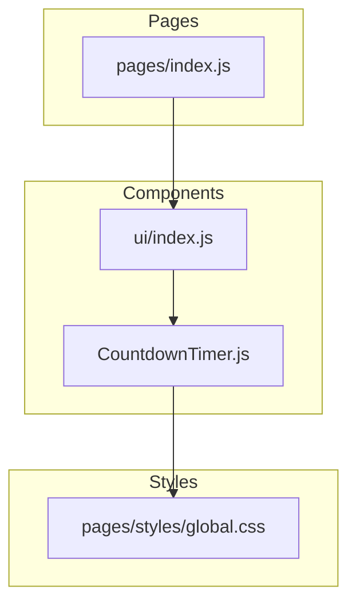
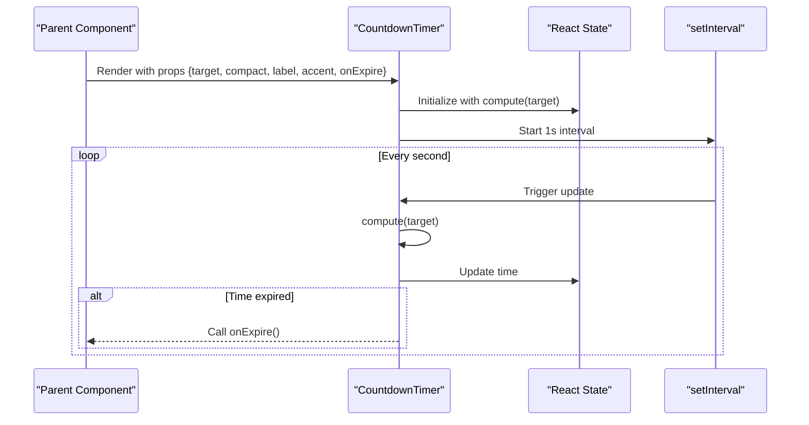
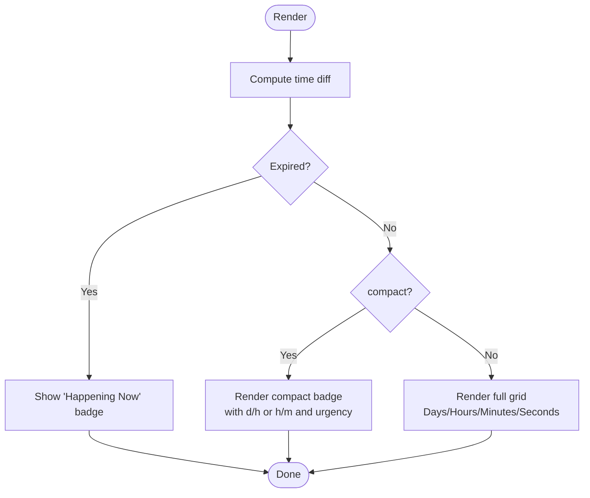
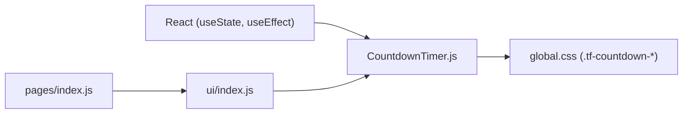

# CountdownTimer Component

<cite>
**Referenced Files in This Document**
- [CountdownTimer.js](file://components/ui/CountdownTimer.js)
- [index.js (UI exports)](file://components/ui/index.js)
- [index.js (Home page usage)](file://pages/index.js)
- [global.css](file://pages/styles/global.css)
</cite>

## Table of Contents
1. [Introduction](#introduction)
2. [Project Structure](#project-structure)
3. [Core Components](#core-components)
4. [Architecture Overview](#architecture-overview)
5. [Detailed Component Analysis](#detailed-component-analysis)
6. [Dependency Analysis](#dependency-analysis)
7. [Performance Considerations](#performance-considerations)
8. [Accessibility Guidelines](#accessibility-guidelines)
9. [Styling and Customization](#styling-and-customization)
10. [Usage Examples](#usage-examples)
11. [Troubleshooting Guide](#troubleshooting-guide)
12. [Conclusion](#conclusion)

## Introduction
The CountdownTimer component renders a real-time countdown to a specified target date/time. It supports two visual modes:
- Compact mode: a small inline badge showing days/hours or hours/minutes, with an urgent color shift when the deadline is near.
- Full mode: a labeled grid displaying Days, Hours, Minutes, and Seconds.

It updates every second using a timer and triggers an optional callback when the target time has passed. The component integrates with the project’s design system via CSS variables and utility classes for consistent styling across themes.

## Project Structure
The CountdownTimer is part of the shared UI components and is re-exported through the UI barrel file. It is used on the home page to show “starts in” information for upcoming events.

**Diagram sources**
- [CountdownTimer.js:15-32](file://components/ui/CountdownTimer.js#L15-L32)
- [index.js (UI exports):9](file://components/ui/index.js#L9)
- [index.js (Home page usage):320](file://pages/index.js#L320)
- [global.css:701-723](file://pages/styles/global.css#L701-L723)

**Section sources**
- [CountdownTimer.js:15-32](file://components/ui/CountdownTimer.js#L15-L32)
- [index.js (UI exports):9](file://components/ui/index.js#L9)
- [index.js (Home page usage):320](file://pages/index.js#L320)
- [global.css:701-723](file://pages/styles/global.css#L701-L723)

## Core Components
- CountdownTimer: A React functional component that computes remaining time and renders either a compact badge or a full countdown grid. It manages internal state and a 1-second interval for live updates.

Key behaviors:
- Computes days, hours, minutes, seconds, and total milliseconds until the target.
- Renders a success-style “Happening Now” message when the target has passed.
- In compact mode, shows a condensed string and switches to an urgent style when within three days.
- Supports an accent color override for values in full mode.
- Invokes an onExpire callback exactly once when the countdown reaches zero.

**Section sources**
- [CountdownTimer.js:3-13](file://components/ui/CountdownTimer.js#L3-L13)
- [CountdownTimer.js:15-32](file://components/ui/CountdownTimer.js#L15-L32)
- [CountdownTimer.js:34-50](file://components/ui/CountdownTimer.js#L34-L50)
- [CountdownTimer.js:52-81](file://components/ui/CountdownTimer.js#L52-L81)
- [CountdownTimer.js:83-108](file://components/ui/CountdownTimer.js#L83-L108)

## Architecture Overview
At runtime, the component:
- Initializes state with the computed time difference.
- Sets up a 1-second interval to recalculate and update state.
- Renders different UI based on whether the target has passed and whether compact mode is enabled.
- Uses CSS classes and CSS variables from the global stylesheet to match the app’s theme.

**Diagram sources**
- [CountdownTimer.js:22-32](file://components/ui/CountdownTimer.js#L22-L32)
- [CountdownTimer.js:3-13](file://components/ui/CountdownTimer.js#L3-L13)

## Detailed Component Analysis

### Props API
- target: Required. Date string or timestamp representing the countdown target. Internally parsed via new Date(target).
- compact: Boolean. When true, renders a compact badge; otherwise, renders the full grid. Default false.
- label: String. Optional text displayed above the full grid or used as the “Happening Now” message in compact mode.
- accent: Color value. Overrides the default accent color for the numeric values in full mode.
- onExpire: Function. Called once when the countdown reaches zero.

Notes:
- No explicit formatting options are provided by the component; it formats numbers with leading zeros and uses fixed labels (“Days”, “Hrs”, “Min”, “Sec”).
- Timezone handling relies on the client’s local timezone since Date.now() and new Date(target) are used without conversion utilities.

**Section sources**
- [CountdownTimer.js:15-21](file://components/ui/CountdownTimer.js#L15-L21)
- [CountdownTimer.js:3-13](file://components/ui/CountdownTimer.js#L3-L13)
- [CountdownTimer.js:83-108](file://components/ui/CountdownTimer.js#L83-L108)

### Rendering Modes
- Expired state: Displays a success-colored badge with label or “Happening Now”.
- Compact mode: Shows a concise string like “Xd Yh” or “Yh Zm”, with an urgent red-tinted style when less than three days remain.
- Full mode: Displays four tiles for Days, Hours, Minutes, Seconds with labels and styled values.

**Diagram sources**
- [CountdownTimer.js:34-50](file://components/ui/CountdownTimer.js#L34-L50)
- [CountdownTimer.js:52-81](file://components/ui/CountdownTimer.js#L52-L81)
- [CountdownTimer.js:83-108](file://components/ui/CountdownTimer.js#L83-L108)

### Lifecycle and Memory Management
- On mount, initializes state and starts a 1-second interval.
- On unmount or prop changes, clears the interval to prevent memory leaks.
- Recomputes initial state whenever target changes.

**Section sources**
- [CountdownTimer.js:22-32](file://components/ui/CountdownTimer.js#L22-L32)

## Dependency Analysis
- Internal dependencies: React hooks useState and useEffect.
- Styling dependencies: Global CSS classes .tf-countdown-item, .tf-countdown-value, .tf-countdown-label and CSS variables for colors and spacing.
- Usage dependency: Exported via ui/index.js and consumed by pages/index.js.

**Diagram sources**
- [CountdownTimer.js:1](file://components/ui/CountdownTimer.js#L1)
- [index.js (UI exports):9](file://components/ui/index.js#L9)
- [index.js (Home page usage):320](file://pages/index.js#L320)
- [global.css:701-723](file://pages/styles/global.css#L701-L723)

**Section sources**
- [CountdownTimer.js:1](file://components/ui/CountdownTimer.js#L1)
- [index.js (UI exports):9](file://components/ui/index.js#L9)
- [index.js (Home page usage):320](file://pages/index.js#L320)
- [global.css:701-723](file://pages/styles/global.css#L701-L723)

## Performance Considerations
- Update frequency: The component updates every second via setInterval. For most event countdowns this is appropriate. If many instances render simultaneously, consider throttling updates or batching state updates at the parent level.
- Re-renders: Each tick triggers a state update. Keep the number of active timers reasonable. Unmounting components will clear intervals automatically.
- Target changes: Changing target resets the interval and recomputes time. Avoid frequent target prop churn to minimize unnecessary recalculations.
- Accessibility-friendly updates: Announce changes only when necessary to avoid excessive screen reader noise. See Accessibility Guidelines below.

[No sources needed since this section provides general guidance]

## Accessibility Guidelines
- Live regions: To ensure assistive technologies announce countdown changes, wrap the rendered output in an ARIA live region with an appropriate politeness level. For example, use aria-live="polite" for non-urgent updates or aria-live="assertive" for critical deadlines.
- Labels: Provide meaningful labels via the label prop so screen readers can describe the context (e.g., “Event starts in”).
- Keyboard focus: If the countdown is interactive (e.g., clickable), ensure proper focus management and roles. As-is, the component is informational and does not require focus.
- Color contrast: Ensure accent colors meet contrast requirements against backgrounds, especially in compact urgent mode.

Implementation tip: Wrap the component’s root element with a container that includes aria-live attributes and an accessible label.

[No sources needed since this section provides general guidance]

## Styling and Customization
- CSS classes:
  - .tf-countdown-item: Container for each time unit tile.
  - .tf-countdown-value: Numeric display with tabular numerals for stable alignment.
  - .tf-countdown-label: Small uppercase label beneath each value.
- CSS variables: Colors and spacing are driven by theme variables (e.g., --accent-primary, --text-tertiary, --bg-tertiary). Override these variables to adapt to your theme.
- Accent color: Pass the accent prop to change the value color in full mode.
- Compact mode styling: Urgency is indicated by background and border color shifts when the deadline is within three days.

To customize:
- Override CSS variables in your theme configuration.
- Add custom styles targeting .tf-countdown-* classes if you need layout or typography adjustments.

**Section sources**
- [global.css:701-723](file://pages/styles/global.css#L701-L723)
- [CountdownTimer.js:83-108](file://components/ui/CountdownTimer.js#L83-L108)

## Usage Examples
Below are common scenarios demonstrating how to use CountdownTimer. Replace placeholders with your actual data.

- Event start countdown (full mode):
  - Use target set to the event start date/time.
  - Optionally provide a label such as “Doors Open In”.
  - Example usage path: [pages/index.js:320](file://pages/index.js#L320)

- Ticket sale deadline (compact mode):
  - Set compact to true to show a compact badge.
  - Provide an accent color matching your brand.
  - Use onExpire to trigger a “Sale Ended” action.

- Registration period (with expiration handling):
  - Set target to the registration closing time.
  - Use onExpire to disable the registration button or redirect users.

Note: Do not copy code directly; refer to the linked source paths for concrete examples in the repository.

**Section sources**
- [index.js (Home page usage):320](file://pages/index.js#L320)
- [CountdownTimer.js:15-21](file://components/ui/CountdownTimer.js#L15-L21)

## Troubleshooting Guide
- Time appears incorrect:
  - Ensure target is a valid ISO date string or timestamp. The component parses it with new Date(target).
  - Remember that calculations use the client’s local timezone. If you need UTC, convert the target before passing it in.
- onExpire not firing:
  - Verify that the target time is in the past relative to the current time.
  - Check that onExpire is defined and not overridden by stale closures.
- Excessive re-renders:
  - Avoid creating new target objects every render; pass stable references or memoized values.
  - Consider debouncing parent updates if multiple timers are present.
- Styling issues:
  - Confirm that global.css is loaded and CSS variables are defined.
  - Inspect computed styles for .tf-countdown-* classes.

**Section sources**
- [CountdownTimer.js:3-13](file://components/ui/CountdownTimer.js#L3-L13)
- [CountdownTimer.js:22-32](file://components/ui/CountdownTimer.js#L22-L32)
- [global.css:701-723](file://pages/styles/global.css#L701-L723)

## Conclusion
CountdownTimer provides a simple, theme-aware, and responsive countdown display suitable for event promotions, ticket deadlines, and registration windows. It offers two rendering modes, a clean API, and integration with the project’s design system. For production use, consider adding accessibility enhancements (ARIA live regions) and ensuring robust timezone handling at the application layer.

[No sources needed since this section summarizes without analyzing specific files]