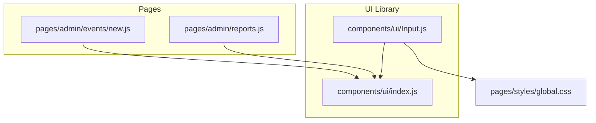
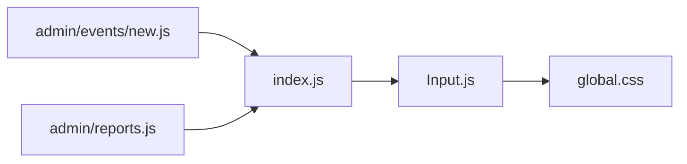

# Input Component

<cite>
**Referenced Files in This Document**
- [Input.js](file://components/ui/Input.js)
- [index.js](file://components/ui/index.js)
- [global.css](file://pages/styles/global.css)
- [new.js](file://pages/admin/events/new.js)
- [reports.js](file://pages/admin/reports.js)
</cite>

## Table of Contents
1. [Introduction](#introduction)
2. [Project Structure](#project-structure)
3. [Core Components](#core-components)
4. [Architecture Overview](#architecture-overview)
5. [Detailed Component Analysis](#detailed-component-analysis)
6. [Dependency Analysis](#dependency-analysis)
7. [Performance Considerations](#performance-considerations)
8. [Troubleshooting Guide](#troubleshooting-guide)
9. [Conclusion](#conclusion)
10. [Appendices](#appendices)

## Introduction
The Input component is a controlled, accessible form field wrapper that renders a labeled input with optional helper text and inline error messaging. It delegates all native input behavior to the underlying HTML input element while providing consistent styling, validation feedback, and accessibility attributes. It is designed for use across forms in the application’s admin pages and supports all standard input types via props.

## Project Structure
The Input component lives under the shared UI library and is re-exported through a barrel file for convenient imports across pages.

**Diagram sources**
- [Input.js:1-48](file://components/ui/Input.js#L1-L48)
- [index.js:1-10](file://components/ui/index.js#L1-L10)
- [global.css:770-820](file://pages/styles/global.css#L770-L820)
- [new.js:1-120](file://pages/admin/events/new.js#L1-L120)
- [reports.js:1-120](file://pages/admin/reports.js#L1-L120)

**Section sources**
- [Input.js:1-48](file://components/ui/Input.js#L1-L48)
- [index.js:1-10](file://components/ui/index.js#L1-L10)

## Core Components
- Input: A React functional component that renders a labeled input with optional helper/error text and applies consistent styles and accessibility attributes.

Key responsibilities:
- Render label, input, and helper/error message
- Apply error state styling and aria-invalid attribute
- Pass through all other props to the native input (e.g., type, placeholder, onChange, value)
- Support custom className and style overrides at both wrapper and input levels

Props supported by the component:
- label: string — displayed above the input
- error: string | undefined — when present, shows error message and applies error styling
- helper: string | undefined — displays below the input as helper text when no error is present
- className: string — additional classes applied to the input element
- style: object — inline styles applied to the input element
- wrapperStyle: object — inline styles applied to the wrapper div
- id: string — used to associate the label with the input via htmlFor
- ...rest: any — forwarded to the underlying <input> (e.g., type, placeholder, value, onChange, disabled, required, min, max, step)

Behavioral highlights:
- When error is truthy, the input receives an error class and its border color changes to the theme’s error color; aria-invalid is set to true
- Helper text is shown only when there is no error
- All native input behaviors are preserved because extra props are spread onto the input element

Usage examples (described):
- Text input with label, placeholder, and helper text
- Date input with label and error handling
- Number input with min/step constraints and helper text
- URL input with placeholder and helper guidance

These usage patterns are demonstrated in the admin pages where the Input component is imported from the UI library and used with various types and validation states.

**Section sources**
- [Input.js:1-48](file://components/ui/Input.js#L1-L48)
- [new.js:383-441](file://pages/admin/events/new.js#L383-L441)
- [reports.js:230-267](file://pages/admin/reports.js#L230-L267)

## Architecture Overview
At runtime, the Input component composes a small DOM tree and relies on global CSS for visual styling. Consumers pass controlled values and handlers via props, enabling predictable form state management.

```mermaid
sequenceDiagram
participant Page as "Consumer Page"
participant UI as "Input Component"
participant DOM as "Native Input"
participant CSS as "Global Styles"
Page->>UI : Render with props (label, type, value, onChange, error, helper, etc.)
UI->>DOM : Create <input> with attributes and forwarded props
UI->>CSS : Apply .tf-input and conditional .tf-input-error
DOM-->>UI : User interaction events (onChange, focus, blur)
UI-->>Page : Controlled updates via onChange handler
UI->>DOM : Update aria-invalid based on error prop
```

**Diagram sources**
- [Input.js:1-48](file://components/ui/Input.js#L1-L48)
- [global.css:770-820](file://pages/styles/global.css#L770-L820)

## Detailed Component Analysis

### Visual Appearance
- Wrapper: A container div with class tf-field and optional wrapperStyle
- Label: Optional block-level label styled with secondary text color and medium font weight
- Input: Styled with base class tf-input; includes padding, rounded corners, background, and border
- Focus state: Border color switches to accent color with a subtle glow ring
- Error state: Adds tf-input-error class and sets border color to error color; aria-invalid becomes true
- Helper/Error text: Small paragraph beneath the input; helper uses tertiary text color, error uses error color

Styling references:
- Base input styles and focus states are defined globally
- Error-specific border color is applied inline when error is present
- The tf-input-error class is added conditionally but not explicitly defined in the provided CSS; the inline borderColor handles the primary visual cue

Accessibility:
- Label is associated with the input via htmlFor/id
- aria-invalid reflects error state for screen readers
- Placeholder text is styled via ::placeholder selector

**Section sources**
- [Input.js:12-46](file://components/ui/Input.js#L12-L46)
- [global.css:773-793](file://pages/styles/global.css#L773-L793)

### Form Field Behavior
- Controlled inputs: Use value and onChange props to manage state in the parent component
- Native input types: Any valid HTML input type is supported (text, email, password, number, date, url, etc.)
- Validation integration: Parent components compute errors and pass them down; the Input component displays messages and applies visual cues
- Placeholder and helper text: Placeholder appears inside the input; helper appears below when no error is present

Examples from usage:
- Basic info fields (text, date) with labels and placeholders
- Number fields with min and step constraints
- URL fields with descriptive helper text

**Section sources**
- [new.js:383-441](file://pages/admin/events/new.js#L383-L441)
- [new.js:505-515](file://pages/admin/events/new.js#L505-L515)
- [new.js:446-453](file://pages/admin/events/new.js#L446-L453)
- [reports.js:235-246](file://pages/admin/reports.js#L235-L246)

### Validation Patterns
- Validation is performed in the parent component and passed to Input via the error prop
- When error is present, the Input component:
  - Applies an error class to the input
  - Sets aria-invalid to true
  - Displays an error message below the input
- Helper text is suppressed when error is present

This pattern keeps validation logic centralized in the page while delegating presentation to the Input component.

**Section sources**
- [Input.js:27-45](file://components/ui/Input.js#L27-L45)
- [new.js:104-126](file://pages/admin/events/new.js#L104-L126)

### Props Reference
- label: string — visible label for the field
- error: string | undefined — error message to display and apply error styling
- helper: string | undefined — helper text displayed when no error
- className: string — additional CSS classes for the input
- style: object — inline styles for the input
- wrapperStyle: object — inline styles for the wrapper div
- id: string — unique identifier used by the label’s htmlFor
- ...rest: any — forwarded to the underlying <input> (type, placeholder, value, onChange, disabled, required, min, max, step, etc.)

**Section sources**
- [Input.js:1-10](file://components/ui/Input.js#L1-L10)

### Accessibility Compliance
- Label association: htmlFor/id pairing ensures keyboard users can click the label to focus the input
- aria-invalid: Communicates invalid state to assistive technologies
- Focus visibility: Global focus styles provide clear visual indication
- Semantic structure: Label and input are semantically linked; helper/error text is presented as paragraphs

Best practices:
- Always provide a label for each Input
- Set id when using label to ensure proper association
- Keep error messages concise and actionable
- Use appropriate input types to leverage platform validation and mobile keyboards

**Section sources**
- [Input.js:14-35](file://components/ui/Input.js#L14-L35)
- [global.css:786-789](file://pages/styles/global.css#L786-L789)

### Styling Customization Options
- Override input styles via style prop
- Add or replace classes via className prop
- Customize wrapper layout via wrapperStyle prop
- Theme variables control colors, borders, and focus states globally

Notes:
- The tf-input-error class is appended when error is present; if you need custom error visuals beyond the border color, add corresponding CSS rules
- Focus ring and border color are theme-driven via CSS variables

**Section sources**
- [Input.js:27-36](file://components/ui/Input.js#L27-L36)
- [global.css:773-793](file://pages/styles/global.css#L773-L793)

### Mobile Input Considerations
- Use appropriate input types (email, number, url, date) to trigger correct mobile keyboards
- Ensure adequate touch targets via padding and sizing (already applied by base styles)
- Avoid overly long placeholder text; prefer helper text for guidance
- Test on devices to confirm virtual keyboard behavior and input alignment

[No sources needed since this section provides general guidance]

### Usage Examples (by scenario)
- Text input: Provide label, placeholder, value, onChange, and optional helper
- Email input: Use type="email" and include validation in the parent
- Password input: Use type="password" and consider helper text for requirements
- Number input: Use type="number" with min/step constraints and helper guidance
- Date input: Use type="date" with label and placeholder

These scenarios are reflected in the admin pages where the Input component is used with different types and validation states.

**Section sources**
- [new.js:383-441](file://pages/admin/events/new.js#L383-L441)
- [new.js:505-515](file://pages/admin/events/new.js#L505-L515)
- [new.js:446-453](file://pages/admin/events/new.js#L446-L453)
- [reports.js:235-246](file://pages/admin/reports.js#L235-L246)

## Dependency Analysis
The Input component has minimal dependencies:
- No external libraries; it is a pure React function
- Relies on global CSS for styling
- Consumed by pages via the UI barrel export

**Diagram sources**
- [Input.js:1-48](file://components/ui/Input.js#L1-L48)
- [index.js:1-10](file://components/ui/index.js#L1-L10)
- [global.css:770-820](file://pages/styles/global.css#L770-L820)
- [new.js:1-120](file://pages/admin/events/new.js#L1-L120)
- [reports.js:1-120](file://pages/admin/reports.js#L1-L120)

**Section sources**
- [index.js:1-10](file://components/ui/index.js#L1-L10)
- [Input.js:1-48](file://components/ui/Input.js#L1-L48)

## Performance Considerations
- Lightweight component: Renders a small DOM tree with conditional rendering for label and helper/error text
- Controlled inputs: Ensure onChange handlers are memoized or debounced if heavy computations are involved in the parent
- Avoid unnecessary re-renders: Pass stable references for callbacks and objects when possible
- Style performance: Inline styles are minimal; rely on CSS variables for efficient theme updates

[No sources needed since this section provides general guidance]

## Troubleshooting Guide
Common issues and resolutions:
- Error message not showing: Ensure the error prop is a non-empty string; helper text will be hidden when error is present
- Label not focusing input: Verify that id is provided and matches the label’s htmlFor
- Placeholder not visible: Check CSS overrides that might affect ::placeholder color or opacity
- Focus state not visible: Confirm global focus styles are loaded and not overridden by custom CSS
- Mobile keyboard mismatch: Use the correct input type to match expected data entry

Validation tips:
- Compute errors in the parent and update promptly on user input
- Clear errors when input becomes valid to avoid stale messages

**Section sources**
- [Input.js:27-45](file://components/ui/Input.js#L27-L45)
- [global.css:786-793](file://pages/styles/global.css#L786-L793)

## Conclusion
The Input component offers a simple, accessible, and customizable way to render form fields with consistent styling and validation feedback. By delegating validation logic to parent components and forwarding all native input props, it remains flexible and easy to integrate into existing forms. Its design aligns with the application’s theme system and accessibility standards, making it suitable for a wide range of input scenarios.

[No sources needed since this section summarizes without analyzing specific files]

## Appendices

### API Summary
- Props:
  - label: string
  - error: string | undefined
  - helper: string | undefined
  - className: string
  - style: object
  - wrapperStyle: object
  - id: string
  - ...rest: forwarded to <input>

- Behavior:
  - Conditional error styling and aria-invalid
  - Helper text shown when no error
  - Full support for native input types and attributes

**Section sources**
- [Input.js:1-48](file://components/ui/Input.js#L1-L48)