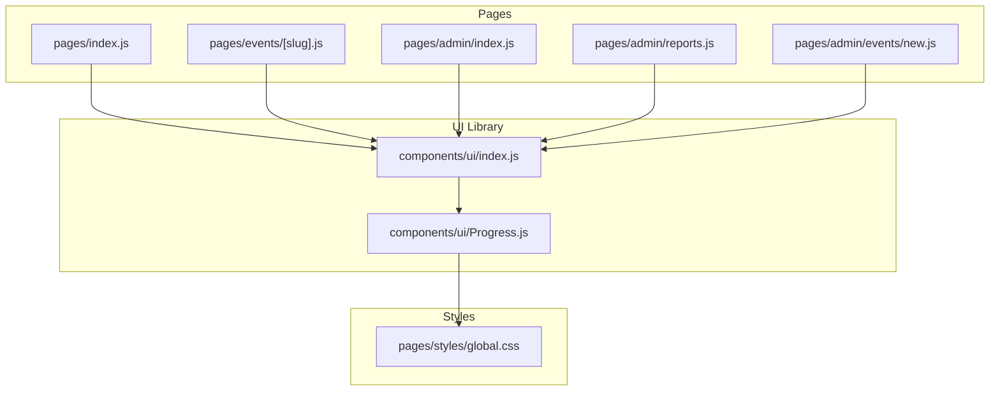
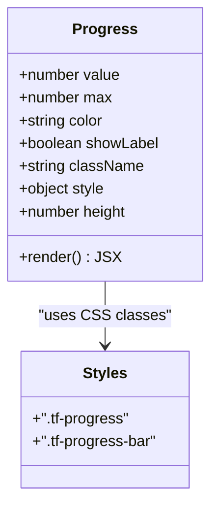
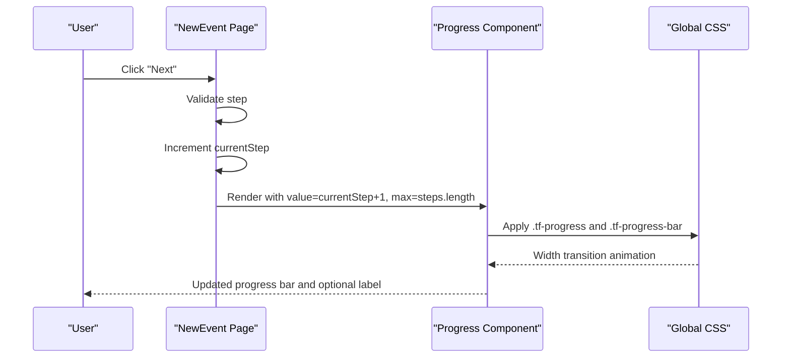
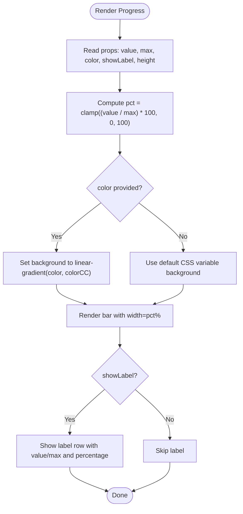
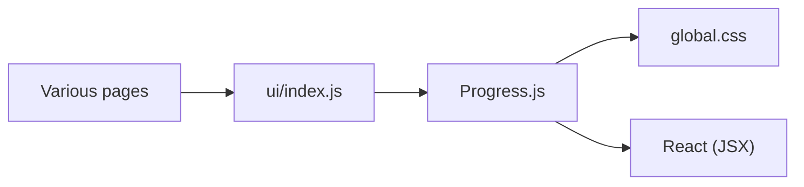

# Progress Component

<cite>
**Referenced Files in This Document**
- [Progress.js](file://components/ui/Progress.js)
- [index.js (UI exports)](file://components/ui/index.js)
- [global.css](file://pages/styles/global.css)
- [new.js (Admin New Event wizard)](file://pages/admin/events/new.js)
- [index.js (Admin dashboard)](file://pages/admin/index.js)
- [reports.js (Admin reports)](file://pages/admin/reports.js)
- [events/[slug].js (Event page)](file://pages/events/[slug].js)
- [index.js (Home page)](file://pages/index.js)
</cite>

## Table of Contents
1. [Introduction](#introduction)
2. [Project Structure](#project-structure)
3. [Core Components](#core-components)
4. [Architecture Overview](#architecture-overview)
5. [Detailed Component Analysis](#detailed-component-analysis)
6. [Dependency Analysis](#dependency-analysis)
7. [Performance Considerations](#performance-considerations)
8. [Troubleshooting Guide](#troubleshooting-guide)
9. [Conclusion](#conclusion)
10. [Appendices](#appendices)

## Introduction
The Progress component is a lightweight, accessible progress indicator used across the application to visualize completion and status. It renders a horizontal bar with an animated fill based on a value-to-max ratio, supports optional labels, customizable colors, and height variants. It is commonly used for:
- Ticket purchase flow progress (e.g., multi-step wizards)
- Check-in dashboards showing attendance vs capacity
- Loading states during data fetching or processing
- Sales and occupancy indicators on event pages

## Project Structure
The Progress component lives under the shared UI library and is re-exported for use throughout the app. Global styles define its visual appearance and transitions.

**Diagram sources**
- [Progress.js:1-39](file://components/ui/Progress.js#L1-L39)
- [index.js (UI exports):1-20](file://components/ui/index.js#L1-L20)
- [global.css:1475-1491](file://pages/styles/global.css#L1475-L1491)
- [index.js (Home page):1-20](file://pages/index.js#L1-L20)
- [events/[slug].js (Event page)](file://pages/events/[slug].js#L1-L20)
- [index.js (Admin dashboard):1-20](file://pages/admin/index.js#L1-L20)
- [reports.js (Admin reports):1-20](file://pages/admin/reports.js#L1-L20)
- [new.js (Admin New Event wizard):1-20](file://pages/admin/events/new.js#L1-L20)

**Section sources**
- [Progress.js:1-39](file://components/ui/Progress.js#L1-L39)
- [index.js (UI exports):1-20](file://components/ui/index.js#L1-L20)
- [global.css:1475-1491](file://pages/styles/global.css#L1475-L1491)

## Core Components
The Progress component is a functional React component that:
- Accepts props for value, max, color, label visibility, className, style, and height
- Calculates percentage safely by clamping between 0 and 100
- Renders a container div with a child bar whose width reflects the percentage
- Optionally shows a label row with current value/max and rounded percentage
- Applies inline gradient background when a color prop is provided; otherwise falls back to CSS variables

Key behaviors:
- Value range: normalized to [0, 100] regardless of input
- Height: controlled via the height prop (applied as pixel height)
- Color: if provided, applies a linear gradient using the given color; otherwise uses default theme variable
- Label: toggled via showLabel; displays both absolute values and percentage

Usage patterns in the app include:
- Wizard step progress (value = current step, max = total steps)
- Capacity utilization (value = sold or checked-in, max = capacity or sold)
- Real-time stats updates (frequent re-renders with smooth CSS transitions)

**Section sources**
- [Progress.js:1-39](file://components/ui/Progress.js#L1-L39)
- [global.css:1475-1491](file://pages/styles/global.css#L1475-L1491)

## Architecture Overview
At runtime, the component composes two nested divs:
- Outer container: accepts className and style from props
- Inner track: styled via CSS class .tf-progress with fixed height and overflow hidden
- Fill bar: styled via .tf-progress-bar with width set inline and transition applied via CSS

**Diagram sources**
- [Progress.js:1-39](file://components/ui/Progress.js#L1-L39)
- [global.css:1475-1491](file://pages/styles/global.css#L1475-L1491)

## Detailed Component Analysis

### Props API and Behavior
- value: number — current progress value; clamped to [0, max] before computing percentage
- max: number — maximum value; defaults to 100; must be positive for meaningful percentages
- color: string — optional color; when provided, sets a linear-gradient background using this color
- showLabel: boolean — toggles display of a label row with “value / max” and “percentage%”
- className: string — additional CSS class names for the root container
- style: object — inline styles applied to the root container
- height: number — pixel height of the progress track

Percentage calculation:
- pct = clamp((value / max) * 100, 0, 100)

Visual rendering:
- Track height comes from the height prop
- Bar width is pct%
- Background is either a gradient derived from color or the default CSS variable

Accessibility considerations:
- The component does not include ARIA attributes by default. For accessibility compliance, wrap the component in a labeled container or add aria-* attributes at the usage site (see Accessibility section).

**Section sources**
- [Progress.js:1-39](file://components/ui/Progress.js#L1-L39)

### Visual Appearance and Styling
- Default track background and border radius are defined in global CSS
- Transition timing and easing are applied to the bar width change for smooth animations
- When color is provided, a linear gradient is computed from the color to a semi-transparent variant

Customization options:
- Override height via the height prop
- Change color via the color prop
- Apply custom styling through className and style props
- Hide or show labels via showLabel

Global CSS highlights:
- .tf-progress sets track height, background, border-radius, and overflow
- .tf-progress-bar sets fill height, background, border-radius, and transition behavior

**Section sources**
- [global.css:1475-1491](file://pages/styles/global.css#L1475-L1491)
- [Progress.js:1-39](file://components/ui/Progress.js#L1-L39)

### Usage Examples Across the App
- Wizard step progress:
  - Shows current step out of total steps with a thin track
  - Example reference: [new.js (Admin New Event wizard):230-245](file://pages/admin/events/new.js#L230-L245)

- Capacity utilization:
  - Displays sold tickets against capacity with labels
  - Example references:
    - [index.js (Admin dashboard):170-185](file://pages/admin/index.js#L170-L185)
    - [index.js (Admin dashboard):220-240](file://pages/admin/index.js#L220-L240)

- Attendance rate:
  - Shows checked-in vs sold with dynamic color thresholds
  - Example reference: [reports.js (Admin reports):580-595](file://pages/admin/reports.js#L580-L595)

- Event sales progress:
  - Uses theme accent color for the bar
  - Example references:
    - [events/[slug].js (Event page)](file://pages/events/[slug].js#L440-L450)
    - [index.js (Home page):400-410](file://pages/index.js#L400-L410)
    - [index.js (Home page):685-695](file://pages/index.js#L685-L695)

These examples demonstrate different scenarios such as ticket purchase progress, check-in progress, and loading states.

**Section sources**
- [new.js (Admin New Event wizard):230-245](file://pages/admin/events/new.js#L230-L245)
- [index.js (Admin dashboard):170-185](file://pages/admin/index.js#L170-L185)
- [index.js (Admin dashboard):220-240](file://pages/admin/index.js#L220-L240)
- [reports.js (Admin reports):580-595](file://pages/admin/reports.js#L580-L595)
- [events/[slug].js (Event page)](file://pages/events/[slug].js#L440-L450)
- [index.js (Home page):400-410](file://pages/index.js#L400-L410)
- [index.js (Home page):685-695](file://pages/index.js#L685-L695)

### Sequence Diagram: Wizard Step Progress Update

**Diagram sources**
- [new.js (Admin New Event wizard):230-245](file://pages/admin/events/new.js#L230-L245)
- [Progress.js:1-39](file://components/ui/Progress.js#L1-L39)
- [global.css:1475-1491](file://pages/styles/global.css#L1475-L1491)

### Flowchart: Percentage Calculation and Rendering

**Diagram sources**
- [Progress.js:1-39](file://components/ui/Progress.js#L1-L39)

## Dependency Analysis
The Progress component has minimal dependencies:
- No external libraries; pure React function component
- Relies on global CSS classes for consistent styling
- Exported via the UI index file for centralized imports

**Diagram sources**
- [Progress.js:1-39](file://components/ui/Progress.js#L1-L39)
- [index.js (UI exports):1-20](file://components/ui/index.js#L1-L20)
- [global.css:1475-1491](file://pages/styles/global.css#L1475-L1491)

**Section sources**
- [Progress.js:1-39](file://components/ui/Progress.js#L1-L39)
- [index.js (UI exports):1-20](file://components/ui/index.js#L1-L20)

## Performance Considerations
- Smooth transitions: CSS transition on width ensures fluid updates without heavy JS animation loops
- Frequent updates: In real-time dashboards (e.g., check-in stats), ensure updates are throttled or debounced to avoid excessive re-renders
- Minimal DOM: Only two nested divs; low layout cost
- Color gradients: Inline gradient computation is lightweight; avoid recalculating unnecessarily by memoizing derived values in parent components
- Responsive design: Use relative units or clamp-based sizing in parent containers to maintain readability across devices

[No sources needed since this section provides general guidance]

## Troubleshooting Guide
Common issues and resolutions:
- Incorrect percentage: Ensure max is positive and greater than zero; clamp logic prevents negative or over-100 widths
- Missing label: Verify showLabel is true; label text depends on value and max being numbers
- Color not applied: Confirm color prop is a valid color string; otherwise default CSS variable is used
- Height mismatch: Adjust height prop to match desired track thickness; CSS default is 6px unless overridden
- Accessibility: Add appropriate ARIA attributes at the usage site (e.g., role="progressbar", aria-valuenow, aria-valuemin, aria-valuemax, aria-label)

**Section sources**
- [Progress.js:1-39](file://components/ui/Progress.js#L1-L39)
- [global.css:1475-1491](file://pages/styles/global.css#L1475-L1491)

## Conclusion
The Progress component offers a simple, flexible, and visually consistent way to represent progress and completion across the application. With props for value, max, color, label visibility, and height, it adapts to various contexts like wizards, dashboards, and event pages. Its reliance on CSS transitions ensures smooth performance, while its minimal structure keeps it easy to customize and integrate.

[No sources needed since this section summarizes without analyzing specific files]

## Appendices

### Accessibility Guidelines
- Wrap the component in a container with role="progressbar"
- Provide aria-valuenow equal to the current value
- Provide aria-valuemin and aria-valuemax (typically 0 and max)
- Include aria-label describing the progress context (e.g., “Ticket sales progress”)
- If showLabel is enabled, ensure the label text is descriptive and readable by assistive technologies

[No sources needed since this section provides general guidance]

### Styling Customization Options
- Override track height via the height prop
- Customize color via the color prop (linear gradient applied)
- Extend styles via className and style props on the root container
- Modify global styles in global.css for default look-and-feel (.tf-progress, .tf-progress-bar)

**Section sources**
- [Progress.js:1-39](file://components/ui/Progress.js#L1-L39)
- [global.css:1475-1491](file://pages/styles/global.css#L1475-L1491)

### Responsive Design Considerations
- Use responsive containers around the Progress component to ensure proper scaling on mobile and desktop
- Combine with clamp-based typography and spacing for consistent readability
- Avoid fixed widths; rely on percentage-based width for the bar itself

[No sources needed since this section provides general guidance]