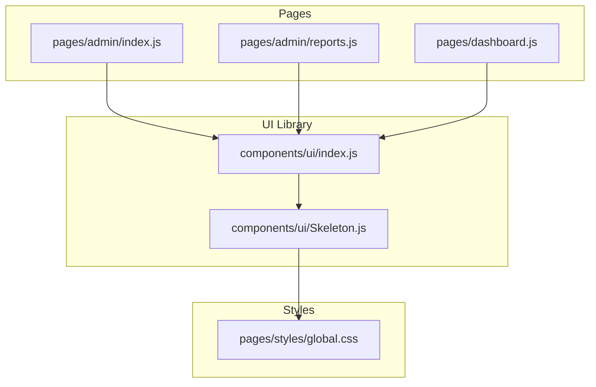
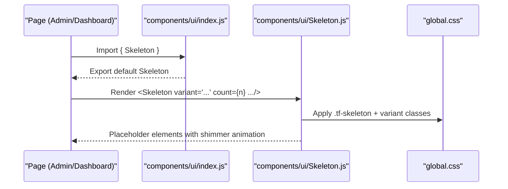
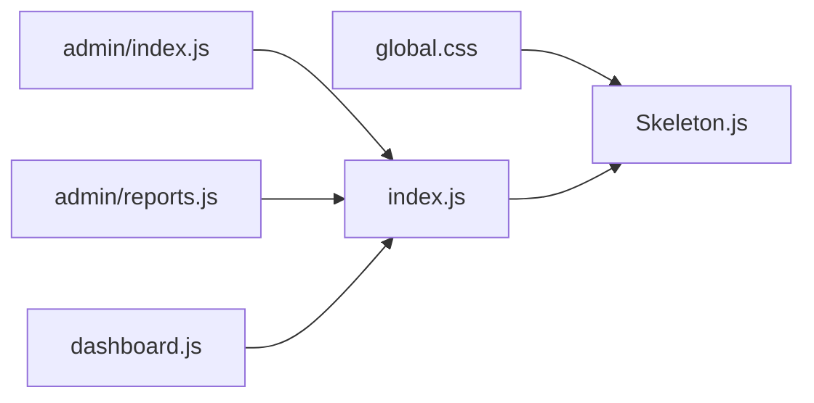

# Skeleton Component

<cite>
**Referenced Files in This Document**
- [Skeleton.js](file://components/ui/Skeleton.js)
- [index.js](file://components/ui/index.js)
- [global.css](file://pages/styles/global.css)
- [admin/index.js](file://pages/admin/index.js)
- [admin/reports.js](file://pages/admin/reports.js)
- [dashboard.js](file://pages/dashboard.js)
</cite>

## Table of Contents
1. [Introduction](#introduction)
2. [Project Structure](#project-structure)
3. [Core Components](#core-components)
4. [Architecture Overview](#architecture-overview)
5. [Detailed Component Analysis](#detailed-component-analysis)
6. [Dependency Analysis](#dependency-analysis)
7. [Performance Considerations](#performance-considerations)
8. [Troubleshooting Guide](#troubleshooting-guide)
9. [Conclusion](#conclusion)
10. [Appendices](#appendices)

## Introduction
The Skeleton component provides lightweight loading placeholders that mimic the shape and size of real content, improving perceived performance by showing structure before data arrives. It supports multiple visual variants (text, title, card, circle, button), sizing via width/height, and batch rendering with a count prop. The component is styled using CSS variables and a shimmer animation to create a smooth, modern loading experience consistent with the application’s design system.

## Project Structure
The Skeleton component lives under the shared UI library and is re-exported for convenient imports across pages. Its styling is defined globally, ensuring consistent appearance across the app.

**Diagram sources**
- [Skeleton.js:1-48](file://components/ui/Skeleton.js#L1-L48)
- [index.js:1-10](file://components/ui/index.js#L1-L10)
- [global.css:1432-1437](file://pages/styles/global.css#L1432-L1437)
- [admin/index.js:320-350](file://pages/admin/index.js#L320-L350)
- [admin/reports.js:150-175](file://pages/admin/reports.js#L150-L175)
- [dashboard.js:115-130](file://pages/dashboard.js#L115-L130)

**Section sources**
- [Skeleton.js:1-48](file://components/ui/Skeleton.js#L1-L48)
- [index.js:1-10](file://components/ui/index.js#L1-L10)
- [global.css:1432-1437](file://pages/styles/global.css#L1432-L1437)

## Core Components
- Skeleton component: Renders a placeholder div with variant-specific styles and optional dimensions. Supports batching via count.
- Global styles: Define the shimmer animation and base skeleton class, plus variant classes for text, title, card, circle, and button shapes.

Key behaviors:
- Default variant is text.
- minHeight is set per variant to ensure proper layout space.
- borderRadius adapts per variant (circle uses full radius; card uses large radius; others use small radius).
- When count > 1, renders multiple skeletons with consistent spacing between items.

**Section sources**
- [Skeleton.js:10-47](file://components/ui/Skeleton.js#L10-L47)
- [global.css:1432-1437](file://pages/styles/global.css#L1432-L1437)
- [global.css:1826-1830](file://pages/styles/global.css#L1826-L1830)

## Architecture Overview
The Skeleton component is a presentational element that composes CSS classes and inline styles to produce a consistent loading state. Pages import it through the UI index and render it conditionally while data loads.

**Diagram sources**
- [index.js:1-10](file://components/ui/index.js#L1-L10)
- [Skeleton.js:10-47](file://components/ui/Skeleton.js#L10-L47)
- [global.css:1432-1437](file://pages/styles/global.css#L1432-L1437)

## Detailed Component Analysis

### Props API
- variant: One of text, title, card, circle, btn, custom. Defaults to text.
- width: Inline width for the skeleton element.
- height: Inline height for the skeleton element.
- className: Additional class names appended to the base tf-skeleton and variant class.
- style: Inline style object merged with variant-based defaults.
- count: Number of skeleton instances to render. When greater than 1, siblings are spaced with a small bottom margin.

Behavioral notes:
- minHeight is applied based on variant to reserve vertical space.
- borderRadius is applied based on variant (circle: 50%, card: large radius, others: small radius).
- For count > 1, each sibling receives a small bottom margin except the last one.

**Section sources**
- [Skeleton.js:10-47](file://components/ui/Skeleton.js#L10-L47)

### Visual Variants
- text: Short horizontal line suitable for paragraph lines or metadata.
- title: Taller line suitable for headings or titles.
- card: Larger rectangle with rounded corners suitable for card placeholders.
- circle: Circular placeholder suitable for avatars or icons.
- btn: Button-sized rectangle with rounded corners suitable for action buttons.
- custom: No variant class added; rely on className/style for full control.

Styling details:
- Base class .tf-skeleton applies a gradient background and shimmer animation.
- Variant classes define heights and border radii.
- CSS variables drive colors and radii for theme consistency.

**Section sources**
- [Skeleton.js:1-8](file://components/ui/Skeleton.js#L1-L8)
- [global.css:1432-1437](file://pages/styles/global.css#L1432-L1437)
- [global.css:1826-1830](file://pages/styles/global.css#L1826-L1830)

### Usage Patterns and Examples

#### List Skeletons
Use text and title variants to simulate list rows or stat cards during loading. Combine with grid layouts and stagger animations for realistic loading sequences.

Example references:
- Admin dashboard stats grid with text/title skeletons during loading.
- Reports page with similar patterns for metric cards.

**Section sources**
- [admin/index.js:320-350](file://pages/admin/index.js#L320-L350)
- [admin/reports.js:150-175](file://pages/admin/reports.js#L150-L175)

#### Card Skeletons
Use the card variant to represent larger content blocks like charts, panels, or article previews. Set explicit height to match expected content area.

Example references:
- Admin dashboard shows a large card skeleton while fetching data.
- Reports page stacks two card skeletons for chart placeholders.

**Section sources**
- [admin/index.js:340](file://pages/admin/index.js#L340-L340)
- [admin/reports.js:167-168](file://pages/admin/reports.js#L167-L168)

#### Form Skeletons
Use text and btn variants to outline form fields and actions during load. Combine with spacing to mirror actual form structure.

Guidance:
- Use text skeletons for input labels and helper text.
- Use btn skeleton for submit buttons.
- Maintain consistent widths to reflect final field sizes.

Note: While not directly shown in the provided files, this pattern follows the same principles demonstrated in list and card examples.

#### Batch Rendering with count
Render multiple identical skeletons efficiently using the count prop. Useful for lists, galleries, or repeated sections.

Example reference:
- Dashboard tab section renders three card skeletons when loading.

**Section sources**
- [dashboard.js:120-125](file://pages/dashboard.js#L120-L125)

### Styling Customization
- Override base styles via className to add borders, shadows, or gradients.
- Use style prop to adjust width/height/minHeight/borderRadius beyond defaults.
- Leverage CSS variables (--bg-tertiary, --bg-elevated, --radius-sm, --radius-lg) to align with themes.
- Shimmer animation timing and direction are controlled by global keyframes; avoid overriding unless necessary.

Best practices:
- Keep skeleton dimensions close to actual content to prevent layout shifts.
- Avoid heavy effects (blur, complex shadows) on skeletons to maintain performance.
- Use consistent spacing between skeleton items to mirror final layout.

**Section sources**
- [Skeleton.js:36-46](file://components/ui/Skeleton.js#L36-L46)
- [global.css:1432-1437](file://pages/styles/global.css#L1432-L1437)
- [global.css:1826-1830](file://pages/styles/global.css#L1826-L1830)

### Accessibility Considerations
- Skeletons are purely visual placeholders and do not convey meaningful content.
- They should not be announced as interactive or important by screen readers.
- Ensure surrounding loading regions have appropriate roles and labels if needed (e.g., aria-busy on containers).
- Do not place focusable elements inside skeleton placeholders.
- Provide visible feedback elsewhere (e.g., progress indicators) for long-loading states.

Note: The Skeleton component itself does not include accessibility attributes; apply them at the container level where appropriate.

[No sources needed since this section provides general guidance]

## Dependency Analysis
The Skeleton component has minimal dependencies:
- It relies on global CSS for base and variant styles.
- It is imported via the UI index module for centralized exports.
- Pages consume it directly without additional libraries.

**Diagram sources**
- [Skeleton.js:1-48](file://components/ui/Skeleton.js#L1-L48)
- [index.js:1-10](file://components/ui/index.js#L1-L10)
- [global.css:1432-1437](file://pages/styles/global.css#L1432-L1437)
- [admin/index.js:320-350](file://pages/admin/index.js#L320-L350)
- [admin/reports.js:150-175](file://pages/admin/reports.js#L150-L175)
- [dashboard.js:115-130](file://pages/dashboard.js#L115-L130)

**Section sources**
- [Skeleton.js:1-48](file://components/ui/Skeleton.js#L1-L48)
- [index.js:1-10](file://components/ui/index.js#L1-L10)
- [global.css:1432-1437](file://pages/styles/global.css#L1432-L1437)

## Performance Considerations
- Skeletons are lightweight DOM nodes with CSS-driven animations; they are efficient for short-lived loading states.
- Avoid excessive counts; prefer virtualized lists for very large datasets.
- Keep animations subtle; the built-in shimmer is optimized for readability and performance.
- Minimize inline style churn; pass static width/height values when possible.
- Use count prop to reduce JSX overhead compared to manual loops.

[No sources needed since this section provides general guidance]

## Troubleshooting Guide
Common issues and resolutions:
- Skeletons appear too small: Ensure minHeight is respected by variant; override only if necessary.
- Layout shift after load: Match skeleton dimensions closely to final content sizes.
- Animation too fast/slow: Adjust global shimmer timing cautiously; prefer keeping defaults for consistency.
- Overlapping content: Verify parent container padding/margins align with skeleton spacing.
- Theme mismatch: Confirm CSS variables are correctly set for current theme.

**Section sources**
- [Skeleton.js:36-46](file://components/ui/Skeleton.js#L36-L46)
- [global.css:1432-1437](file://pages/styles/global.css#L1432-L1437)

## Conclusion
The Skeleton component offers a simple, flexible way to display loading placeholders aligned with the application’s design system. With built-in variants, sizing controls, and batch rendering, it supports common UX patterns such as list, card, and form skeletons. By following best practices around sizing, styling, and accessibility, teams can deliver smooth perceived performance improvements during data loading.

[No sources needed since this section summarizes without analyzing specific files]

## Appendices

### Quick Reference: Props and Variants
- Props:
  - variant: text | title | card | circle | btn | custom
  - width: string | number
  - height: string | number
  - className: string
  - style: object
  - count: number
- Variants:
  - text: short line
  - title: taller line
  - card: rounded rectangle
  - circle: circular avatar/icon
  - btn: button-sized rectangle
  - custom: no variant class

[No sources needed since this section aggregates previously analyzed information]