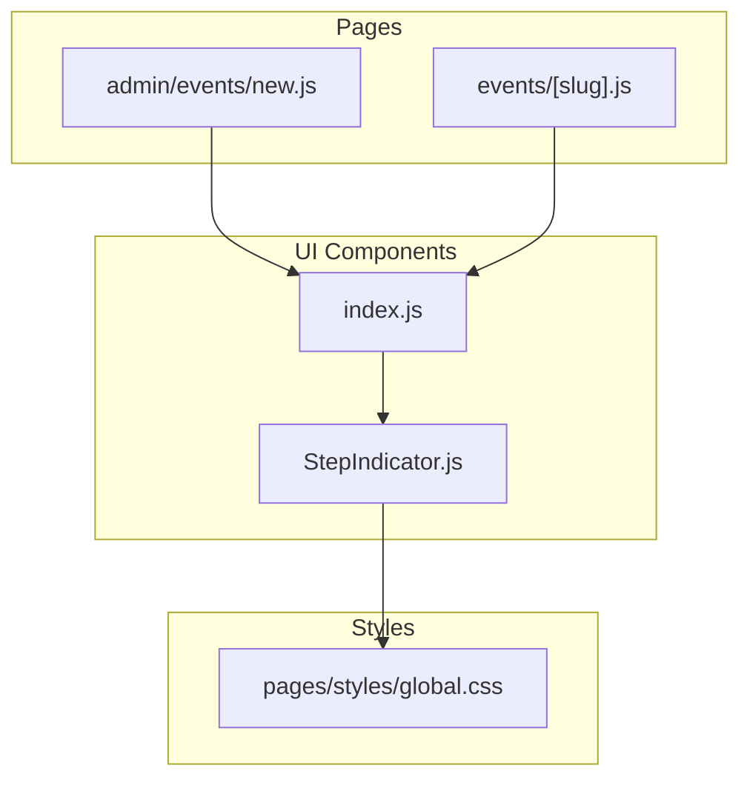
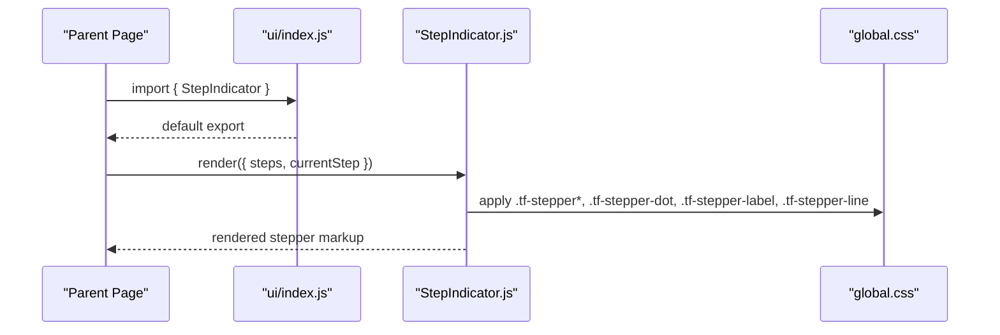
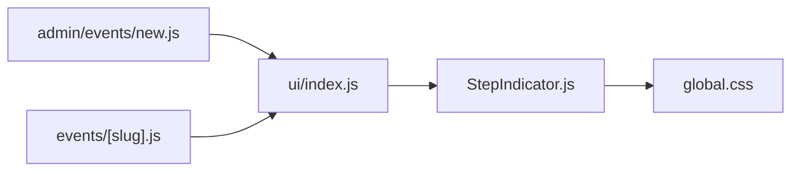

# Step Indicator Component

<cite>
**Referenced Files in This Document**
- [StepIndicator.js](file://components/ui/StepIndicator.js)
- [index.js](file://components/ui/index.js)
- [global.css](file://pages/styles/global.css)
- [new.js](file://pages/admin/events/new.js)
- [events/[slug].js](file://pages/events/[slug].js)
</cite>

## Table of Contents
1. [Introduction](#introduction)
2. [Project Structure](#project-structure)
3. [Core Components](#core-components)
4. [Architecture Overview](#architecture-overview)
5. [Detailed Component Analysis](#detailed-component-analysis)
6. [Dependency Analysis](#dependency-analysis)
7. [Performance Considerations](#performance-considerations)
8. [Troubleshooting Guide](#troubleshooting-guide)
9. [Conclusion](#conclusion)
10. [Appendices](#appendices)

## Introduction
The StepIndicator component is a visual multi-step navigation and progress tracker used across the application to guide users through sequential workflows such as event creation, ticket purchase, and check-in processes. It renders a horizontal stepper with numbered or completed steps, connecting lines between steps, and labels for each step. The component is lightweight, stateless, and driven entirely by props.

## Project Structure
The StepIndicator lives within the shared UI components and is consumed by multiple pages:
- Component definition: components/ui/StepIndicator.js
- Barrel export: components/ui/index.js
- Global styles: pages/styles/global.css (CSS classes for stepper visuals)
- Usage examples:
  - Admin event creation wizard: pages/admin/events/new.js
  - Public event page ticket purchase flow: pages/events/[slug].js

**Diagram sources**
- [StepIndicator.js:1-24](file://components/ui/StepIndicator.js#L1-L24)
- [index.js:1-10](file://components/ui/index.js#L1-L10)
- [global.css:1871-1947](file://pages/styles/global.css#L1871-L1947)
- [new.js:4-5](file://pages/admin/events/new.js#L4-L5)
- [events/[slug].js:4](file://pages/events/[slug].js#L4)

**Section sources**
- [StepIndicator.js:1-24](file://components/ui/StepIndicator.js#L1-L24)
- [index.js:1-10](file://components/ui/index.js#L1-L10)
- [global.css:1871-1947](file://pages/styles/global.css#L1871-L1947)
- [new.js:4-5](file://pages/admin/events/new.js#L4-L5)
- [events/[slug].js:4](file://pages/events/[slug].js#L4)

## Core Components
- StepIndicator: A presentational component that renders a stepper based on two props:
  - steps: Array of strings representing step labels
  - currentStep: Numeric index indicating the active step
- Behavior:
  - Steps before currentStep are marked “done” and display a checkmark
  - The current step is marked “active” and displays its number
  - Subsequent steps remain inactive
  - Connecting lines appear between steps and change color when preceding steps are done

Props summary:
- steps: string[] — Labels for each step
- currentStep: number — Index of the currently active step (0-based)

Usage patterns:
- Event creation wizard: passes an array of step titles and tracks current step via local state
- Ticket purchase flow: maps step objects to labels and computes current index from a step key

**Section sources**
- [StepIndicator.js:1-24](file://components/ui/StepIndicator.js#L1-L24)
- [new.js:235](file://pages/admin/events/new.js#L235)
- [events/[slug].js:696](file://pages/events/[slug].js#L696)

## Architecture Overview
The StepIndicator is a pure function component with no internal state. It receives data via props and renders styled elements using predefined CSS classes. Parent components manage step state and pass it down.

**Diagram sources**
- [index.js:8](file://components/ui/index.js#L8)
- [StepIndicator.js:1-24](file://components/ui/StepIndicator.js#L1-L24)
- [global.css:1871-1947](file://pages/styles/global.css#L1871-L1947)

## Detailed Component Analysis

### Visual Appearance
- Horizontal layout with equal-width steps
- Circular dots for each step:
  - Active: gradient background, white text, accent border, glow shadow
  - Done: success color background and border, white checkmark
  - Inactive: neutral background and border, tertiary text color
- Labels beneath each dot:
  - Active: accent color
  - Done: success color
  - Inactive: tertiary color
- Connecting lines between steps:
  - Default: subtle border color
  - Completed segments: success color

These visuals are controlled by CSS classes:
- .tf-stepper, .tf-stepper-step, .tf-stepper-dot, .tf-stepper-label, .tf-stepper-line

**Section sources**
- [StepIndicator.js:1-24](file://components/ui/StepIndicator.js#L1-L24)
- [global.css:1871-1947](file://pages/styles/global.css#L1871-L1947)

### Props and State Mapping
- steps: string[] — Each element becomes a label under the corresponding step dot
- currentStep: number — Determines which step is active; indices less than currentStep become “done”

Rendering logic:
- For each step at index i:
  - If i < currentStep → state = 'done'
  - If i === currentStep → state = 'active'
  - Else → state = '' (inactive)
- Dot content:
  - 'done' shows a checkmark
  - Otherwise shows i + 1 (1-based numbering)
- Label rendering:
  - Only if step string exists

**Section sources**
- [StepIndicator.js:1-24](file://components/ui/StepIndicator.js#L1-L24)

### Integration Examples

#### Event Setup Wizard (Admin)
- Steps: Basic Info, Branding, Tickets, Venue, Schedule, Payments, Publish
- Current step tracked via useState and updated by navigation handlers
- StepIndicator is placed above the form content and paired with a Progress bar

Key usage points:
- Import from barrel: components/ui/index.js
- Render with WIZARD_STEPS and currentStep state

**Section sources**
- [new.js:4](file://pages/admin/events/new.js#L4)
- [new.js:235](file://pages/admin/events/new.js#L235)

#### Ticket Purchase Flow (Public Event Page)
- Steps: Tickets, Details, Payment, Confirmed
- Current step determined by a step key mapped to an index
- StepIndicator is conditionally rendered except on the confirmation step

Key usage points:
- Import from barrel: components/ui/index.js
- Map step objects to labels and compute currentStepIdx

**Section sources**
- [events/[slug].js:4](file://pages/events/[slug].js#L4)
- [events/[slug].js:696](file://pages/events/[slug].js#L696)

### Accessibility and Keyboard Navigation
Current implementation:
- No interactive elements inside StepIndicator (no buttons or focusable nodes)
- No ARIA attributes or roles defined
- Purely visual indicator of progress

Recommendations for accessibility compliance:
- Add role="progressbar" to the root container
- Include aria-valuenow, aria-valuemin, aria-valuemax reflecting currentStep and total steps
- Provide aria-label describing the stepper purpose (e.g., “Event creation progress”)
- Ensure sufficient color contrast for all states (active, done, inactive)
- Optionally add keyboard support if steps become interactive in future versions

[No sources needed since this section provides general guidance]

### Styling Customization Options
- Colors and gradients are theme-driven via CSS variables:
  - Accent colors, borders, backgrounds, shadows
- To customize:
  - Override CSS variables in your theme scope
  - Extend or override .tf-stepper* classes in global.css or a scoped stylesheet
- Responsive behavior:
  - Flexbox layout adapts to available width
  - Labels wrap naturally; consider reducing font size or hiding labels on very small screens

**Section sources**
- [global.css:1871-1947](file://pages/styles/global.css#L1871-L1947)

### Multi-step Process Integration Guidelines
- Manage step state in parent component (useState or router state)
- Compute currentStep index from either:
  - Direct numeric state
  - Mapping from a step key to an index
- Validate each step before advancing
- Pair StepIndicator with complementary UI like Progress bars and step-specific forms

**Section sources**
- [new.js:235](file://pages/admin/events/new.js#L235)
- [events/[slug].js:696](file://pages/events/[slug].js#L696)

## Dependency Analysis
- StepIndicator depends on:
  - CSS classes defined in global.css
- Consumed by:
  - Admin event creation page
  - Public event page
- Exported via barrel index.js for consistent imports

**Diagram sources**
- [StepIndicator.js:1-24](file://components/ui/StepIndicator.js#L1-L24)
- [index.js:8](file://components/ui/index.js#L8)
- [global.css:1871-1947](file://pages/styles/global.css#L1871-L1947)
- [new.js:4](file://pages/admin/events/new.js#L4)
- [events/[slug].js:4](file://pages/events/[slug].js#L4)

**Section sources**
- [StepIndicator.js:1-24](file://components/ui/StepIndicator.js#L1-L24)
- [index.js:8](file://components/ui/index.js#L8)
- [global.css:1871-1947](file://pages/styles/global.css#L1871-L1947)
- [new.js:4](file://pages/admin/events/new.js#L4)
- [events/[slug].js:4](file://pages/events/[slug].js#L4)

## Performance Considerations
- Stateless and minimal DOM output ensures low re-render cost
- Rendering complexity is O(n) where n is the number of steps
- Avoid passing large arrays of steps frequently; memoize if necessary
- Keep currentStep updates efficient by batching related state changes

[No sources needed since this section provides general guidance]

## Troubleshooting Guide
Common issues and resolutions:
- Steps not updating:
  - Verify currentStep prop is correctly managed in parent state
  - Ensure steps array length matches expected workflow
- Visuals not applying:
  - Confirm global.css is loaded and CSS variables are set
  - Check for conflicting styles overriding .tf-stepper* classes
- Accessibility concerns:
  - Add ARIA attributes and roles as recommended above
  - Test with screen readers and keyboard-only navigation

**Section sources**
- [StepIndicator.js:1-24](file://components/ui/StepIndicator.js#L1-L24)
- [global.css:1871-1947](file://pages/styles/global.css#L1871-L1947)

## Conclusion
The StepIndicator component provides a clean, theme-aware visual stepper for multi-step flows. It is simple, declarative, and easy to integrate into both admin wizards and customer-facing purchase flows. With minor enhancements for accessibility and customization hooks, it can serve as a robust foundation for complex multi-step experiences.

[No sources needed since this section summarizes without analyzing specific files]

## Appendices

### Usage Examples Summary

- Event setup wizard:
  - Steps: Basic Info, Branding, Tickets, Venue, Schedule, Payments, Publish
  - Controlled by local state and validated per step
  - Paired with a Progress bar for additional feedback

- Ticket purchase flow:
  - Steps: Tickets, Details, Payment, Confirmed
  - Derived from step keys mapped to indices
  - Hidden on confirmation step to focus on results

[No sources needed since this section aggregates previously analyzed usage]