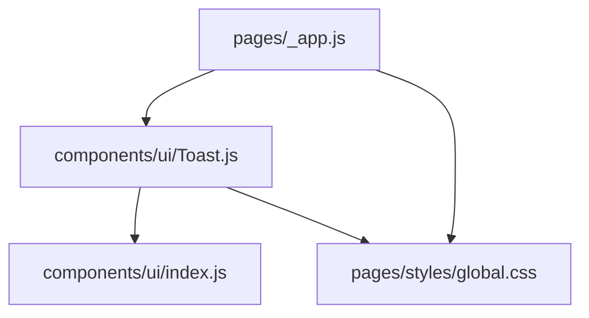
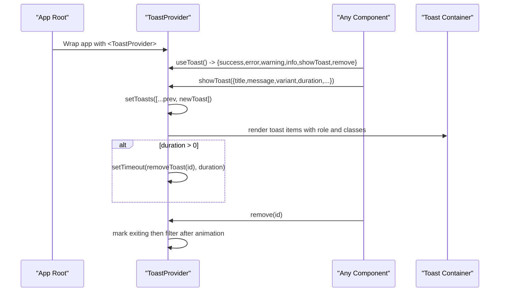
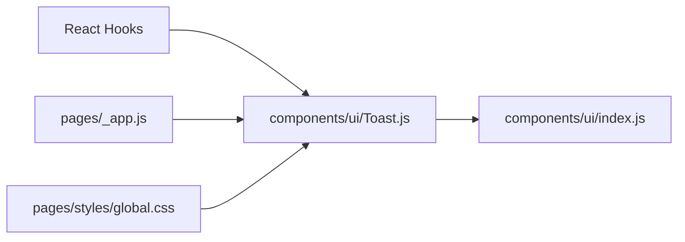

# Toast Component

<cite>
**Referenced Files in This Document**
- [Toast.js](file://components/ui/Toast.js)
- [index.js](file://components/ui/index.js)
- [_app.js](file://pages/_app.js)
- [global.css](file://pages/styles/global.css)
</cite>

## Table of Contents
1. [Introduction](#introduction)
2. [Project Structure](#project-structure)
3. [Core Components](#core-components)
4. [Architecture Overview](#architecture-overview)
5. [Detailed Component Analysis](#detailed-component-analysis)
6. [Dependency Analysis](#dependency-analysis)
7. [Performance Considerations](#performance-considerations)
8. [Troubleshooting Guide](#troubleshooting-guide)
9. [Conclusion](#conclusion)
10. [Appendices](#appendices)

## Introduction
This document explains the Toast notification system implemented with a React Context provider and a custom hook. It covers how to display messages, configure behavior (types, duration, auto-dismiss), manage stacking and positioning, and ensure accessibility for screen readers. It also provides practical usage patterns for common scenarios such as form submissions, API responses, and user actions.

## Project Structure
The toast feature is implemented as a small, self-contained component:
- Provider and hook live in a single file and are re-exported via the UI barrel index.
- The application wraps all routes with the provider at the root level.
- Styling is centralized in the global stylesheet.

**Diagram sources**
- [_app.js:1-14](file://pages/_app.js#L1-L14)
- [Toast.js:1-84](file://components/ui/Toast.js#L1-L84)
- [index.js:1-10](file://components/ui/index.js#L1-L10)
- [global.css:2344-2388](file://pages/styles/global.css#L2344-L2388)

**Section sources**
- [_app.js:1-14](file://pages/_app.js#L1-L14)
- [index.js:1-10](file://components/ui/index.js#L1-L10)

## Core Components
- ToastProvider: Provides toast state and methods through React Context and renders the toast container.
- useToast: Custom hook to access toast methods from any descendant component.

Key behaviors:
- Message types: success, error, warning, info
- Auto-dismiss based on duration; zero disables auto-dismiss
- Stackable notifications rendered in a fixed container
- Accessible roles and labels for screen readers

**Section sources**
- [Toast.js:5-77](file://components/ui/Toast.js#L5-L77)
- [Toast.js:79-83](file://components/ui/Toast.js#L79-L83)

## Architecture Overview
The toast system uses a top-level provider to own a list of active toasts. Consumers call convenience methods or the generic show method to enqueue a new toast. Each toast has an id, optional title/message, variant, and duration. Rendering applies animations and accessible attributes.

**Diagram sources**
- [Toast.js:5-77](file://components/ui/Toast.js#L5-L77)
- [Toast.js:79-83](file://components/ui/Toast.js#L79-L83)

## Detailed Component Analysis

### ToastProvider
Responsibilities:
- Maintain a toasts array in state
- Provide showToast and convenience helpers (success, error, warning, info)
- Manage removal with exit animation
- Render a fixed-position container with accessible attributes

Props:
- children: React nodes to be wrapped by the provider

State shape per toast:
- id: unique identifier
- title: string (optional)
- message: string (optional)
- variant: 'success' | 'error' | 'warning' | 'info'
- duration: number (ms); 0 disables auto-dismiss
- exiting: boolean (internal)
- icon: string or null (optional; defaults per variant when not null)

Methods exposed via context:
- showToast(toast): enqueue a toast and return its id
- success(title, message)
- error(title, message)
- warning(title, message)
- info(title, message)
- remove(id): dismiss a specific toast

Accessibility:
- Container uses role="region" and aria-label="Notifications"
- Each toast uses role="alert" for error variants and role="status" otherwise
- Close button includes aria-label="Dismiss"

Animation and lifecycle:
- Entry animation applied on mount
- Exit animation triggered before removal
- Removal occurs after animation completes

Positioning and stacking:
- Fixed position container aligned to the top-right
- Stacked vertically with gap spacing
- z-index managed via CSS variable

Mobile considerations:
- Max-width constrains width on smaller screens
- Fixed placement ensures visibility above content

**Section sources**
- [Toast.js:5-77](file://components/ui/Toast.js#L5-L77)
- [global.css:2344-2388](file://pages/styles/global.css#L2344-L2388)

### useToast Hook
Usage:
- Call within any component tree under ToastProvider
- Returns the context value containing showToast and convenience methods
- Throws if used outside the provider

Error handling:
- Throws a descriptive error when invoked without a provider

**Section sources**
- [Toast.js:79-83](file://components/ui/Toast.js#L79-L83)

### Integration Point
The application wraps the entire app with ToastProvider so that all pages and components can use the hook.

**Section sources**
- [_app.js:1-14](file://pages/_app.js#L1-L14)

### Styling and Visual Behavior
Container:
- Fixed position, top-right alignment
- Column layout with gap between items
- Glass-like background with backdrop blur and border

Toast item:
- Flex row with icon, content, and close button
- Title and message typography
- Variant-specific left border color

Animations:
- Slide-in on entry
- Slide-out on exit

Z-index:
- Controlled by a CSS variable for consistent layering

**Section sources**
- [global.css:2344-2388](file://pages/styles/global.css#L2344-L2388)

## Dependency Analysis
- Toast.js depends on React primitives: createContext, useCallback, useContext, useEffect, useState
- Re-exported via ui/index.js for clean imports across the app
- Integrated at the app root in _app.js
- Styled by global.css variables and keyframes

**Diagram sources**
- [Toast.js:1-3](file://components/ui/Toast.js#L1-L3)
- [index.js:1-10](file://components/ui/index.js#L1-L10)
- [_app.js:1-14](file://pages/_app.js#L1-L14)
- [global.css:2344-2388](file://pages/styles/global.css#L2344-L2388)

**Section sources**
- [Toast.js:1-3](file://components/ui/Toast.js#L1-L3)
- [index.js:1-10](file://components/ui/index.js#L1-L10)
- [_app.js:1-14](file://pages/_app.js#L1-L14)

## Performance Considerations
- Toaster state is minimal; each toast adds one object to the array
- Auto-dismiss uses timers; avoid excessive short-lived toasts to prevent timer churn
- Exit animation delays removal until after transition; consider capping concurrent toasts if needed
- Avoid frequent re-renders by batching related toasts where possible

[No sources needed since this section provides general guidance]

## Troubleshooting Guide
Common issues and resolutions:
- Hook used outside provider: Ensure the component is nested under ToastProvider. The hook throws when called without a provider.
- Toast not appearing: Verify showToast was called with valid props and that duration is greater than 0 for auto-dismiss.
- Toast not dismissing: Check duration value; setting it to 0 disables auto-dismiss. Use remove(id) to dismiss manually.
- Accessibility concerns: Confirm that error toasts use role="alert" and other variants use role="status". Ensure aria-labels are present on interactive elements.
- Z-index conflicts: Adjust --z-toast in global styles if other overlays overlap toasts.

**Section sources**
- [Toast.js:79-83](file://components/ui/Toast.js#L79-L83)
- [global.css:60](file://pages/styles/global.css#L60)

## Conclusion
The Toast system provides a simple, accessible, and flexible way to deliver transient feedback. With built-in variants, auto-dismiss, and clear APIs, it supports common UX patterns like success confirmations, error alerts, warnings, and informational updates. Proper integration at the app root and adherence to accessibility guidelines ensure a robust experience across devices and assistive technologies.

[No sources needed since this section summarizes without analyzing specific files]

## Appendices

### Props and API Reference
- ToastProvider
  - children: ReactNode
- useToast returns:
  - showToast(toast): void
    - toast properties:
      - id?: number (returned by showToast)
      - title?: string
      - message?: string
      - variant?: 'success' | 'error' | 'warning' | 'info'
      - duration?: number (ms; 0 disables auto-dismiss)
      - icon?: string | null (optional; default icons per variant when provided)
  - success(title, message): void
  - error(title, message): void
  - warning(title, message): void
  - info(title, message): void
  - remove(id): void

**Section sources**
- [Toast.js:15-39](file://components/ui/Toast.js#L15-L39)
- [Toast.js:79-83](file://components/ui/Toast.js#L79-L83)

### Usage Examples

Form submission success
- Trigger on successful form submit
- Show success variant with concise title and message
- Set appropriate duration for non-critical confirmation

API response handling
- On success: show info or success variant
- On error: show error variant with details
- On network failure: show warning or error with retry guidance

User action feedback
- Actions like toggling settings: show info variant briefly
- Destructive actions: show warning variant before proceeding

Note: These examples describe typical patterns. Implement them by calling the appropriate method from useToast in your components.

[No sources needed since this section provides general guidance]

### Accessibility Guidelines
- Use role="alert" for error toasts to prioritize announcements
- Use role="status" for non-error toasts
- Keep titles and messages concise and meaningful
- Ensure close buttons have descriptive labels
- Avoid overly long durations for critical messages

**Section sources**
- [Toast.js:44-72](file://components/ui/Toast.js#L44-L72)

### Positioning, Stacking, and Mobile
- Positioning: fixed top-right container
- Stacking: vertical column with gap
- Z-index: controlled by CSS variable
- Mobile: max-width limits width; ensure readability and touch targets

**Section sources**
- [global.css:2344-2388](file://pages/styles/global.css#L2344-L2388)