# UI Component Library

<cite>
**Referenced Files in This Document**
- [components/ui/index.js](file://components/ui/index.js)
- [components/ui/Button.js](file://components/ui/Button.js)
- [components/ui/Card.js](file://components/ui/Card.js)
- [components/ui/Badge.js](file://components/ui/Badge.js)
- [components/ui/Input.js](file://components/ui/Input.js)
- [components/ui/Progress.js](file://components/ui/Progress.js)
- [components/ui/Skeleton.js](file://components/ui/Skeleton.js)
- [components/ui/StepIndicator.js](file://components/ui/StepIndicator.js)
- [components/ui/Toast.js](file://components/ui/Toast.js)
- [components/ui/CountdownTimer.js](file://components/ui/CountdownTimer.js)
- [pages/styles/global.css](file://pages/styles/global.css)
- [pages/_app.js](file://pages/_app.js)
- [pages/index.js](file://pages/index.js)
- [pages/admin/events/new.js](file://pages/admin/events/new.js)
</cite>

## Table of Contents
1. Introduction
2. Project Structure
3. Core Components
4. Architecture Overview
5. Detailed Component Analysis
6. Dependency Analysis
7. Performance Considerations
8. Troubleshooting Guide
9. Conclusion
10. Appendices

## Introduction
This document provides comprehensive documentation for TicketFlow’s UI component library. It covers the visual appearance, behavior, and interaction patterns of each component, along with props, events, slots, customization options, responsive design guidelines, accessibility compliance, animations, transitions, theming support, cross-browser compatibility, performance optimization, composition patterns, and integration guidance. The components are implemented as React functional components styled via a centralized CSS design system.

## Project Structure
The UI library is organized under components/ui with an index barrel that re-exports all components for convenient imports across the application. Global styles, themes, and animations live in pages/styles/global.css. The ToastProvider is wrapped around the app in pages/_app.js to enable global toast notifications. Usage examples demonstrate how components are composed in real pages.

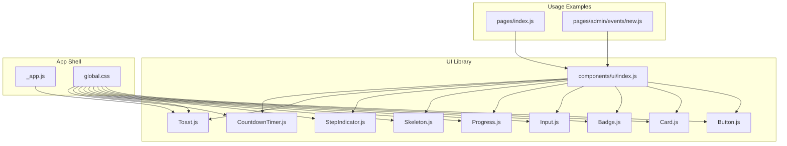

**Diagram sources**
- [components/ui/index.js:1-10](file://components/ui/index.js#L1-L10)
- [pages/_app.js:1-14](file://pages/_app.js#L1-L14)
- [pages/index.js:1-200](file://pages/index.js#L1-L200)
- [pages/admin/events/new.js:1-200](file://pages/admin/events/new.js#L1-L200)
- [pages/styles/global.css:1-800](file://pages/styles/global.css#L1-L800)

**Section sources**
- [components/ui/index.js:1-10](file://components/ui/index.js#L1-L10)
- [pages/_app.js:1-14](file://pages/_app.js#L1-L14)
- [pages/styles/global.css:1-800](file://pages/styles/global.css#L1-L800)

## Core Components
This section summarizes each component’s purpose, props, behavior, styling hooks, and usage patterns.

- Button
  - Purpose: Primary interactive element with variants, sizes, loading state, and ripple-like mouse tracking.
  - Props: children, variant (primary, secondary, ghost, danger, success), size (sm, md, lg, icon), onClick, disabled, loading, className, style, type, fullWidth, ...rest.
  - Behavior: Disables when loading or disabled; shows spinner when loading; supports custom class/style; computes mouse position for visual effects.
  - Styling: Uses tf-btn base class plus variant and size classes; supports gradient hover and elevation.
  - Accessibility: Passes through type and rest attributes; ensure meaningful labels when used as icon-only.
  - Example usage path: [pages/index.js:1-200](file://pages/index.js#L1-L200).

- Card
  - Purpose: Container for content with optional glassmorphism, lift, accent border, and hover interactions.
  - Props: children, className, style, hoverable, glass, lift, accent, onClick, ...rest.
  - Behavior: Applies glass-card or tf-card based on glass; toggles lift and accent border; pointer cursor when onClick provided.
  - Styling: Glassmorphism via backdrop-filter; hover elevation and border accent.
  - Accessibility: Use semantic elements inside; avoid clickable cards without keyboard handlers if needed.
  - Example usage path: [pages/index.js:1-200](file://pages/index.js#L1-L200).

- Badge
  - Purpose: Small label for status, category, or emphasis.
  - Props: children, variant (primary, success, warning, danger, info, glass, ghost), className, style, icon, ...rest.
  - Behavior: Renders inline-flex with optional icon slot; applies variant-specific styles.
  - Styling: Rounded pill shape; color-coded backgrounds and borders; glass/ghost variants.
  - Accessibility: Use aria-label when icon-only conveys meaning.
  - Example usage path: [pages/index.js:1-200](file://pages/index.js#L1-L200).

- Input
  - Purpose: Form input field with label, error, helper text, and accessible invalid state.
  - Props: label, error, helper, className, style, wrapperStyle, id, ...rest.
  - Behavior: Displays label, input, and either error message or helper text; sets aria-invalid when error present.
  - Styling: Focus ring and border color changes; error state styling.
  - Accessibility: htmlFor/id pairing; aria-invalid; screen-reader friendly messages.
  - Example usage path: [pages/admin/events/new.js:1-200](file://pages/admin/events/new.js#L1-L200).

- Progress
  - Purpose: Linear progress indicator with optional label showing value/max and percentage.
  - Props: value, max, color, showLabel, className, style, height.
  - Behavior: Clamps percentage between 0–100; renders bar width accordingly; optional label row.
  - Styling: Gradient background when color provided; customizable height.
  - Accessibility: Use role="progressbar" and aria attributes when wrapping externally.
  - Example usage path: [pages/index.js:1-200](file://pages/index.js#L1-L200).

- Skeleton
  - Purpose: Placeholder UI while content loads, supporting multiple variants and counts.
  - Props: variant (text, title, card, circle, btn, custom), width, height, className, style, count.
  - Behavior: Renders single or multiple skeletons; applies default min-heights and border-radius per variant.
  - Styling: Shimmer animation class available globally; supports custom sizing.
  - Accessibility: Avoid focusable elements; use aria-busy when wrapping loading regions.
  - Example usage path: [pages/admin/index.js](file://pages/admin/index.js) (imported from ui).

- StepIndicator
  - Purpose: Visual stepper for multi-step workflows.
  - Props: steps (array of labels), currentStep (index).
  - Behavior: Marks steps as done/active/inactive; draws connecting lines; displays checkmark for completed steps.
  - Styling: Dot and line styles; label typography.
  - Accessibility: Provide aria-current for active step; ensure keyboard navigation if interactive.
  - Example usage path: [pages/admin/events/new.js:1-200](file://pages/admin/events/new.js#L1-L200).

- Toast
  - Purpose: Global notification system with auto-dismiss, variants, icons, and close action.
  - Provider: ToastProvider wraps app context; exposes showToast and convenience methods (success, error, warning, info).
  - Hook: useToast returns context functions; throws if used outside provider.
  - Behavior: Adds toast to container; auto-remove after duration; exit animation; dismiss button.
  - Styling: Variants map to colors/icons; container uses z-index overlay.
  - Accessibility: region role for container; alert/status roles per variant; dismissible with aria-label.
  - Integration: Wrapped in _app.js to be available app-wide.
  - Example usage path: [pages/_app.js:1-14](file://pages/_app.js#L1-L14).

- CountdownTimer
  - Purpose: Live countdown to a target date/time with compact and full modes.
  - Props: target (Date string), compact, label, accent, onExpire callback.
  - Behavior: Updates every second; shows “Happening Now” when expired; triggers onExpire once; compact mode condenses units and highlights urgency.
  - Styling: Accent color override; urgent vs normal color scheme in compact mode.
  - Accessibility: Ensure label describes purpose; consider aria-live for dynamic updates.
  - Example usage path: [pages/index.js:1-200](file://pages/index.js#L1-L200).

**Section sources**
- [components/ui/Button.js:1-74](file://components/ui/Button.js#L1-L74)
- [components/ui/Card.js:1-33](file://components/ui/Card.js#L1-L33)
- [components/ui/Badge.js:1-30](file://components/ui/Badge.js#L1-L30)
- [components/ui/Input.js:1-49](file://components/ui/Input.js#L1-L49)
- [components/ui/Progress.js:1-39](file://components/ui/Progress.js#L1-L39)
- [components/ui/Skeleton.js:1-48](file://components/ui/Skeleton.js#L1-L48)
- [components/ui/StepIndicator.js:1-30](file://components/ui/StepIndicator.js#L1-L30)
- [components/ui/Toast.js:1-84](file://components/ui/Toast.js#L1-L84)
- [components/ui/CountdownTimer.js:1-109](file://components/ui/CountdownTimer.js#L1-L109)
- [pages/_app.js:1-14](file://pages/_app.js#L1-L14)
- [pages/index.js:1-200](file://pages/index.js#L1-L200)
- [pages/admin/events/new.js:1-200](file://pages/admin/events/new.js#L1-L200)

## Architecture Overview
The UI library follows a modular, theme-driven architecture:
- Components are pure React functions with minimal internal state, delegating most logic to props and CSS variables.
- Theming is centralized in global.css using CSS custom properties for colors, spacing, radii, shadows, and transitions.
- Toast is a context-based global service, injected at the app root.
- Components compose well together (e.g., Card + Badge + Button + Progress + CountdownTimer in event listings).

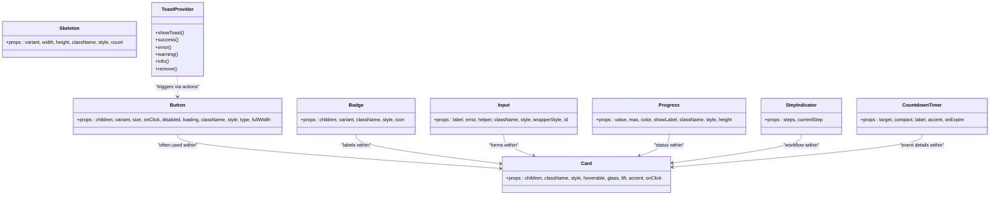

**Diagram sources**
- [components/ui/Button.js:1-74](file://components/ui/Button.js#L1-L74)
- [components/ui/Card.js:1-33](file://components/ui/Card.js#L1-L33)
- [components/ui/Badge.js:1-30](file://components/ui/Badge.js#L1-L30)
- [components/ui/Input.js:1-49](file://components/ui/Input.js#L1-L49)
- [components/ui/Progress.js:1-39](file://components/ui/Progress.js#L1-L39)
- [components/ui/Skeleton.js:1-48](file://components/ui/Skeleton.js#L1-L48)
- [components/ui/StepIndicator.js:1-30](file://components/ui/StepIndicator.js#L1-L30)
- [components/ui/Toast.js:1-84](file://components/ui/Toast.js#L1-L84)
- [components/ui/CountdownTimer.js:1-109](file://components/ui/CountdownTimer.js#L1-L109)

## Detailed Component Analysis

### Button
- Visual Appearance:
  - Base class tf-btn with rounded corners, font settings, and transition effects.
  - Variants: primary (gradient fill), secondary (elevated background), ghost (transparent), danger/success (semantic colors).
  - Sizes: sm, md (default), lg, icon (square).
- Behavior:
  - Mouse-down handler sets CSS variables for interactive effects.
  - Loading state shows a spinning indicator; disables button when loading or disabled.
  - Supports fullWidth for block layout.
- Interaction Patterns:
  - Hover lifts and shadow enhancement; focus states handled by browser defaults.
- Customization:
  - className and style allow overrides; pass any native button attributes via ...rest.
- Accessibility:
  - Ensure descriptive text or aria-label for icon-only buttons.
- Example usage path: [pages/index.js:1-200](file://pages/index.js#L1-L200).

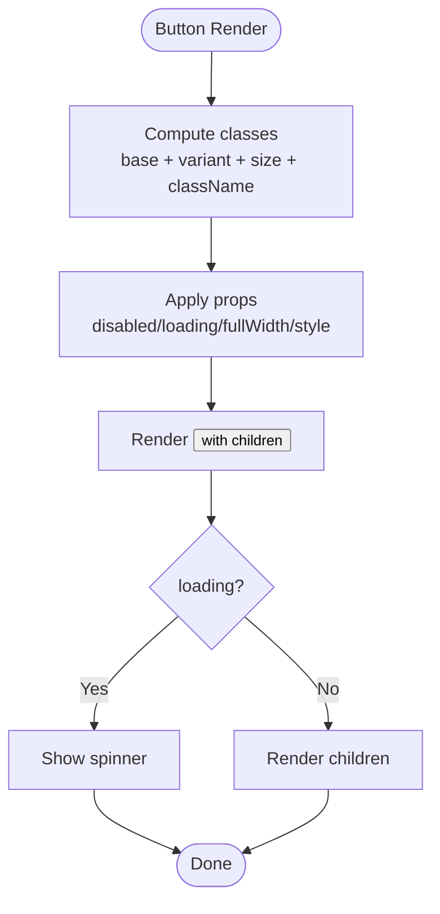

**Diagram sources**
- [components/ui/Button.js:1-74](file://components/ui/Button.js#L1-L74)

**Section sources**
- [components/ui/Button.js:1-74](file://components/ui/Button.js#L1-L74)
- [pages/styles/global.css:426-506](file://pages/styles/global.css#L426-L506)

### Card
- Visual Appearance:
  - tf-card or glass-card depending on glass prop; subtle borders and radius.
  - Optional lift adds hover elevation; accent adds colored border highlight.
- Behavior:
  - Clickable when onClick provided; cursor changes accordingly.
- Interaction Patterns:
  - Hover transitions with border accent and shadow glow.
- Customization:
  - className/style passthrough; toggle glass/lift/accent via props.
- Accessibility:
  - Use semantic elements inside; avoid making non-interactive cards clickable without proper semantics.
- Example usage path: [pages/index.js:1-200](file://pages/index.js#L1-L200).

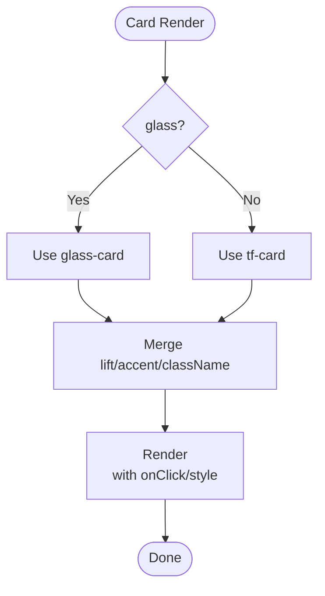

**Diagram sources**
- [components/ui/Card.js:1-33](file://components/ui/Card.js#L1-L33)

**Section sources**
- [components/ui/Card.js:1-33](file://components/ui/Card.js#L1-L33)
- [pages/styles/global.css:331-344](file://pages/styles/global.css#L331-L344)
- [pages/styles/global.css:510-522](file://pages/styles/global.css#L510-L522)

### Badge
- Visual Appearance:
  - Pill-shaped label with color-coded variants; optional icon slot.
- Behavior:
  - Inline-flex layout; supports custom className/style.
- Customization:
  - Variant mapping includes primary, success, warning, danger, info, glass, ghost.
- Accessibility:
  - Add aria-label when icon-only communicates meaning.
- Example usage path: [pages/index.js:1-200](file://pages/index.js#L1-L200).

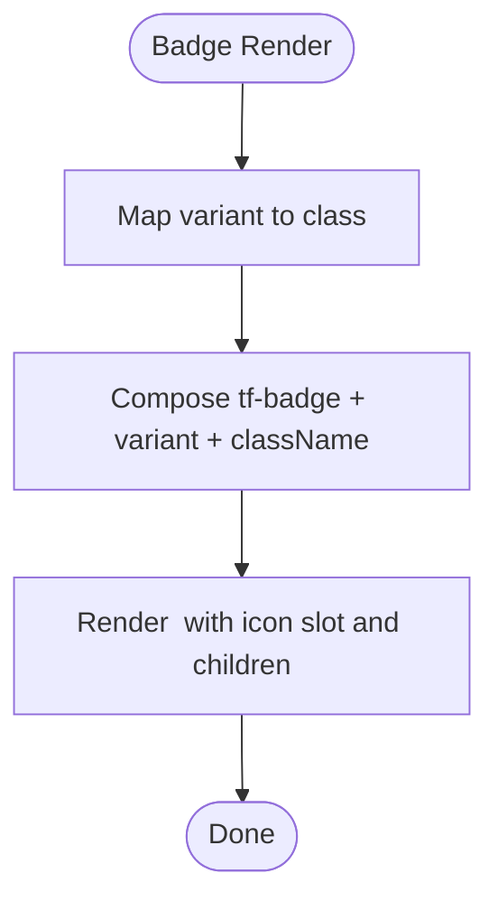

**Diagram sources**
- [components/ui/Badge.js:1-30](file://components/ui/Badge.js#L1-L30)

**Section sources**
- [components/ui/Badge.js:1-30](file://components/ui/Badge.js#L1-L30)
- [pages/styles/global.css:710-750](file://pages/styles/global.css#L710-L750)

### Input
- Visual Appearance:
  - Styled input with label, optional helper/error text; focus ring and border color changes.
- Behavior:
  - Error state applies red border and aria-invalid; helper text shown when no error.
- Customization:
  - className/style/wrapperStyle for fine-tuning; id for label association.
- Accessibility:
  - htmlFor/id pairing; aria-invalid for validation feedback.
- Example usage path: [pages/admin/events/new.js:1-200](file://pages/admin/events/new.js#L1-L200).

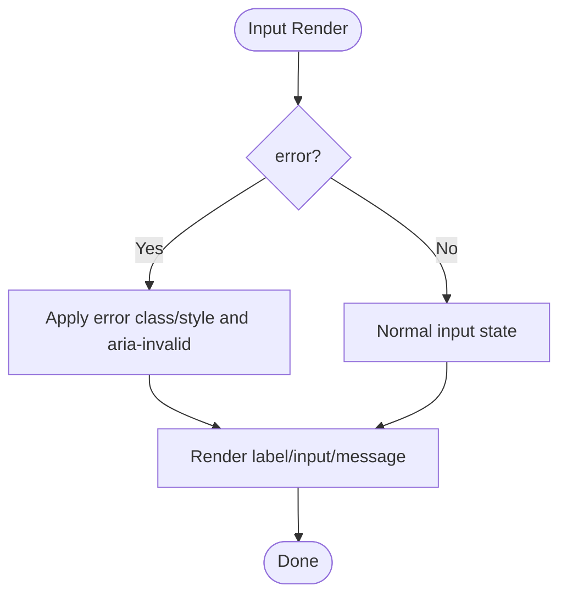

**Diagram sources**
- [components/ui/Input.js:1-49](file://components/ui/Input.js#L1-L49)

**Section sources**
- [components/ui/Input.js:1-49](file://components/ui/Input.js#L1-L49)
- [pages/styles/global.css:755-780](file://pages/styles/global.css#L755-L780)

### Progress
- Visual Appearance:
  - Thin bar with gradient color; optional label row showing value/max and percentage.
- Behavior:
  - Calculates percentage clamped to 0–100; updates width accordingly.
- Customization:
  - color for gradient; height for thickness; showLabel toggles text.
- Accessibility:
  - Wrap with role="progressbar" and aria attributes when used in critical flows.
- Example usage path: [pages/index.js:1-200](file://pages/index.js#L1-L200).

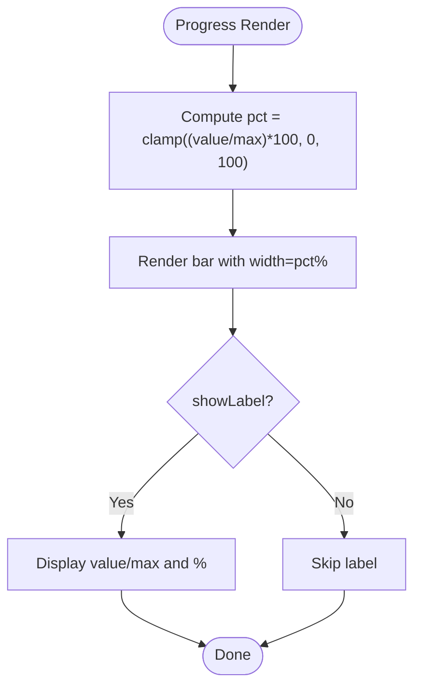

**Diagram sources**
- [components/ui/Progress.js:1-39](file://components/ui/Progress.js#L1-L39)

**Section sources**
- [components/ui/Progress.js:1-39](file://components/ui/Progress.js#L1-L39)

### Skeleton
- Visual Appearance:
  - Placeholder shapes with shimmer animation; variants for text/title/card/circle/btn/custom.
- Behavior:
  - Supports rendering multiple skeletons via count; applies default dimensions per variant.
- Customization:
  - width/height/style overrides; className for additional styles.
- Accessibility:
  - Use aria-busy when wrapping loading regions; avoid focusable placeholders.
- Example usage path: [pages/admin/index.js](file://pages/admin/index.js) (imported from ui).

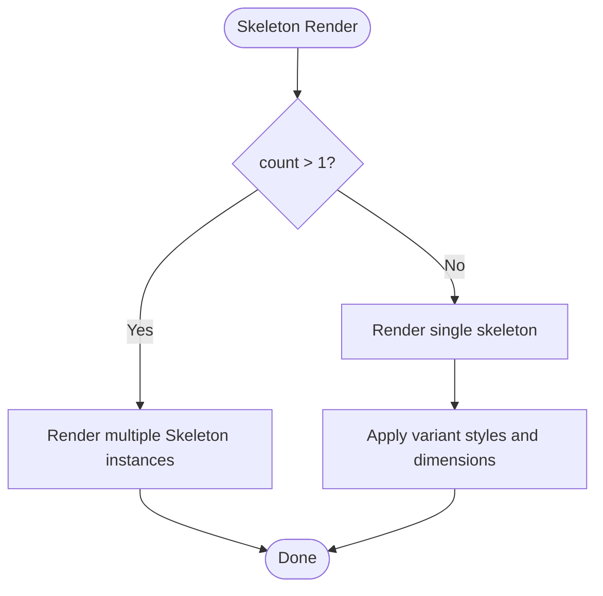

**Diagram sources**
- [components/ui/Skeleton.js:1-48](file://components/ui/Skeleton.js#L1-L48)

**Section sources**
- [components/ui/Skeleton.js:1-48](file://components/ui/Skeleton.js#L1-L48)
- [pages/styles/global.css:285-309](file://pages/styles/global.css#L285-L309)

### StepIndicator
- Visual Appearance:
  - Horizontal stepper with dots, labels, and connecting lines; checkmarks for completed steps.
- Behavior:
  - Determines state per step index relative to currentStep; last step has no connecting line.
- Customization:
  - steps array defines labels; currentStep controls active/done states.
- Accessibility:
  - Provide aria-current for active step; ensure keyboard navigation if interactive.
- Example usage path: [pages/admin/events/new.js:1-200](file://pages/admin/events/new.js#L1-L200).

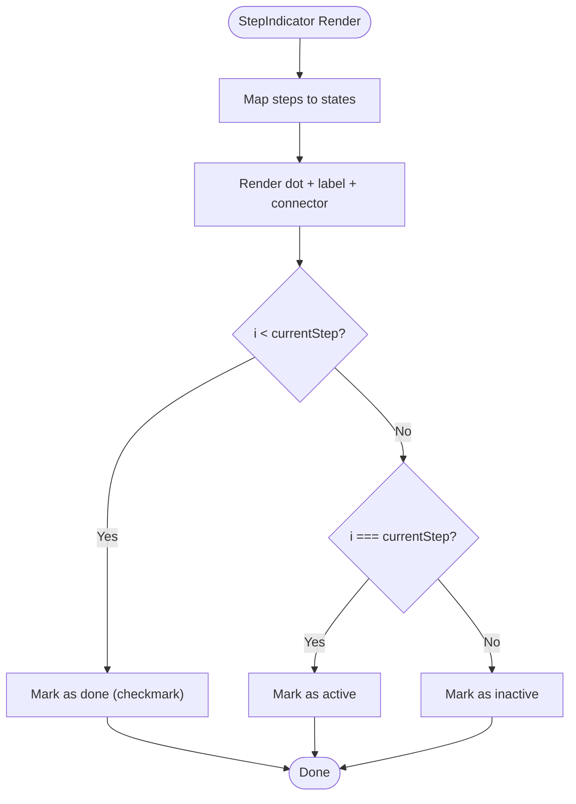

**Diagram sources**
- [components/ui/StepIndicator.js:1-30](file://components/ui/StepIndicator.js#L1-L30)

**Section sources**
- [components/ui/StepIndicator.js:1-30](file://components/ui/StepIndicator.js#L1-L30)

### Toast
- Visual Appearance:
  - Floating notifications with icons, titles, messages, and close button; variant-based colors.
- Behavior:
  - ToastProvider maintains state; auto-dismiss after duration; exit animation before removal.
- Integration:
  - useToast hook provides showToast and convenience methods; must be used within provider.
- Accessibility:
  - region role for container; alert/status roles per variant; dismissible with aria-label.
- Example usage path: [pages/_app.js:1-14](file://pages/_app.js#L1-L14).

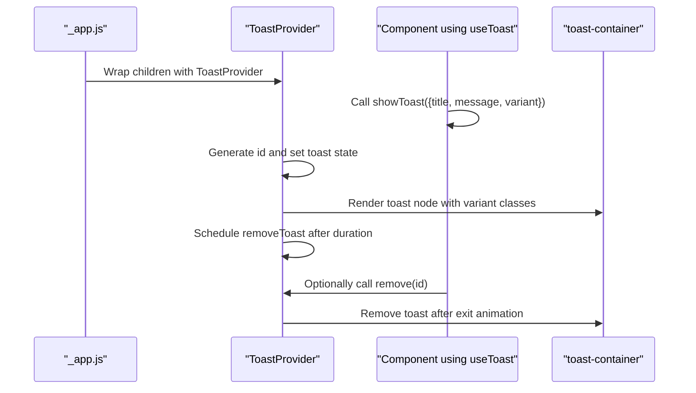

**Diagram sources**
- [components/ui/Toast.js:1-84](file://components/ui/Toast.js#L1-L84)
- [pages/_app.js:1-14](file://pages/_app.js#L1-L14)

**Section sources**
- [components/ui/Toast.js:1-84](file://components/ui/Toast.js#L1-L84)
- [pages/_app.js:1-14](file://pages/_app.js#L1-L14)

### CountdownTimer
- Visual Appearance:
  - Compact mode shows condensed time units with urgency coloring; full mode shows labeled blocks.
- Behavior:
  - Updates every second; shows “Happening Now” when expired; triggers onExpire callback once.
- Customization:
  - compact toggles display; accent overrides color; label for heading in full mode.
- Accessibility:
  - Ensure label describes purpose; consider aria-live for dynamic updates.
- Example usage path: [pages/index.js:1-200](file://pages/index.js#L1-L200).

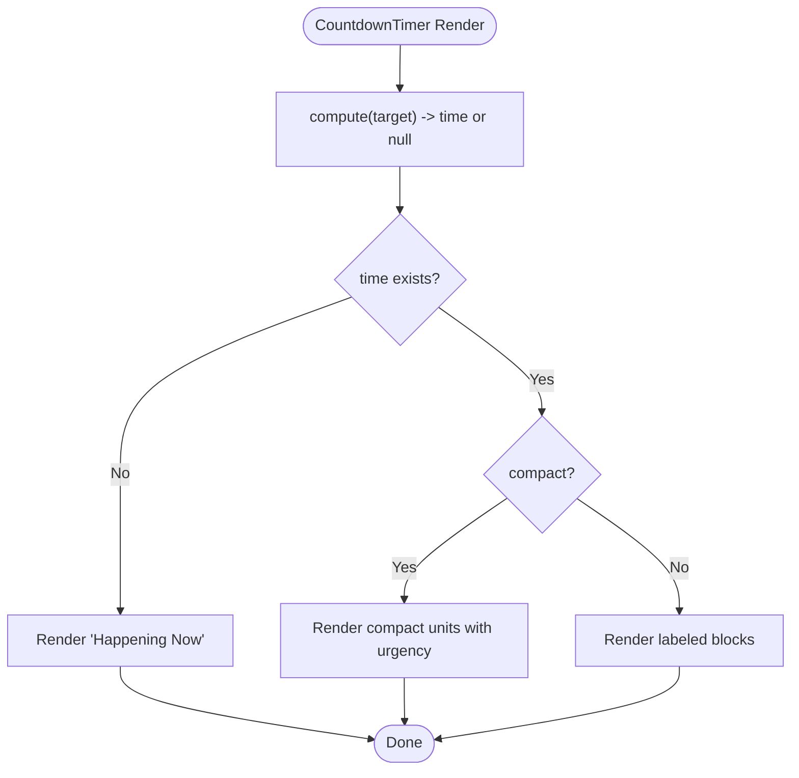

**Diagram sources**
- [components/ui/CountdownTimer.js:1-109](file://components/ui/CountdownTimer.js#L1-L109)

**Section sources**
- [components/ui/CountdownTimer.js:1-109](file://components/ui/CountdownTimer.js#L1-L109)

## Dependency Analysis
- Barrel exports centralize imports via components/ui/index.js.
- Global styles define all visual tokens and animations consumed by components.
- ToastProvider is required at the app root to expose useToast.
- Pages import components directly from the barrel for consistent usage.

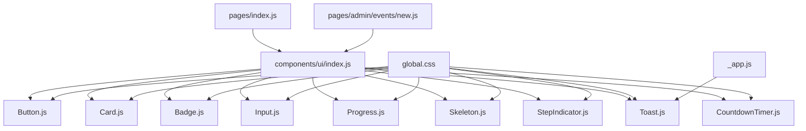

**Diagram sources**
- [components/ui/index.js:1-10](file://components/ui/index.js#L1-L10)
- [pages/styles/global.css:1-800](file://pages/styles/global.css#L1-L800)
- [pages/_app.js:1-14](file://pages/_app.js#L1-L14)
- [pages/index.js:1-200](file://pages/index.js#L1-L200)
- [pages/admin/events/new.js:1-200](file://pages/admin/events/new.js#L1-L200)

**Section sources**
- [components/ui/index.js:1-10](file://components/ui/index.js#L1-L10)
- [pages/styles/global.css:1-800](file://pages/styles/global.css#L1-L800)
- [pages/_app.js:1-14](file://pages/_app.js#L1-L14)

## Performance Considerations
- Prefer memoization for expensive computations in parent components; components themselves are lightweight.
- Avoid excessive re-renders by keeping state local and stable; ToastProvider manages its own state efficiently.
- Use Skeleton during data fetching to improve perceived performance.
- Limit heavy animations; rely on CSS transitions and transforms for GPU acceleration.
- For large lists, virtualize where possible and keep component instances minimal.
- Debounce user inputs and API calls in consuming pages.

[No sources needed since this section provides general guidance]

## Troubleshooting Guide
- Toast not appearing:
  - Ensure ToastProvider wraps the app in _app.js.
  - Verify useToast is called within a component tree under ToastProvider.
- Input validation not reflected:
  - Confirm error prop is passed; aria-invalid should reflect error presence.
- Progress incorrect percentage:
  - Validate value/max inputs; ensure max > 0.
- CountdownTimer not updating:
  - Check target format; ensure valid Date string; verify interval cleanup on unmount.
- Skeleton not visible:
  - Ensure CSS animations imported; verify variant and dimensions.
- Button not responding:
  - Check disabled/loading states; ensure onClick handler is provided.

**Section sources**
- [components/ui/Toast.js:1-84](file://components/ui/Toast.js#L1-L84)
- [components/ui/Input.js:1-49](file://components/ui/Input.js#L1-L49)
- [components/ui/Progress.js:1-39](file://components/ui/Progress.js#L1-L39)
- [components/ui/CountdownTimer.js:1-109](file://components/ui/CountdownTimer.js#L1-L109)
- [components/ui/Skeleton.js:1-48](file://components/ui/Skeleton.js#L1-L48)
- [components/ui/Button.js:1-74](file://components/ui/Button.js#L1-L74)

## Conclusion
TicketFlow’s UI component library offers a cohesive, theme-driven set of React components designed for clarity, accessibility, and performance. With centralized styling via CSS variables, robust theming, and thoughtful interaction patterns, the library enables rapid development of polished interfaces. Follow the guidelines for responsive design, accessibility, and performance to deliver consistent experiences across devices and browsers.

[No sources needed since this section summarizes without analyzing specific files]

## Appendices

### Responsive Design Guidelines
- Use fluid spacing and typography via CSS variables; leverage clamp() in page layouts.
- Ensure touch targets meet minimum sizes; Buttons and Inputs are sized appropriately.
- Test glassmorphism and backdrop-filter on mobile; fallbacks are implicit via CSS.

### Accessibility Compliance
- Maintain label-input associations with htmlFor/id.
- Use appropriate ARIA roles and attributes (aria-invalid, aria-current, role="progressbar", region/alert/status).
- Ensure keyboard navigability for interactive components.
- Provide sufficient color contrast using theme variables.

### Theming and Style Customization
- Override CSS variables in :root or [data-theme] selectors to switch themes.
- Extend component styles via className/style props; prefer utility classes over inline styles.
- Use variant props to select predefined styles; add new variants in CSS and component mappings.

### Cross-Browser Compatibility
- Backdrop-filter supported in modern browsers; provide fallbacks where necessary.
- Ensure smooth animations with transform and opacity; avoid layout-triggering properties.
- Test fonts and gradients across platforms; Inter and Plus Jakarta Sans loaded via Google Fonts.

### Component Composition Patterns
- Combine Card with Badge, Button, Progress, and CountdownTimer for rich content blocks.
- Use StepIndicator with Input fields for wizard flows; validate per step.
- Wrap sections with Skeleton during loading; replace with actual content when ready.
- Trigger Toast notifications from Button clicks or form submissions.

### Integration with Other UI Elements
- Import components from the barrel for consistency.
- Wrap app with ToastProvider to access useToast globally.
- Apply global animations and utilities from global.css.

**Section sources**
- [pages/styles/global.css:1-800](file://pages/styles/global.css#L1-L800)
- [components/ui/index.js:1-10](file://components/ui/index.js#L1-L10)
- [pages/_app.js:1-14](file://pages/_app.js#L1-L14)